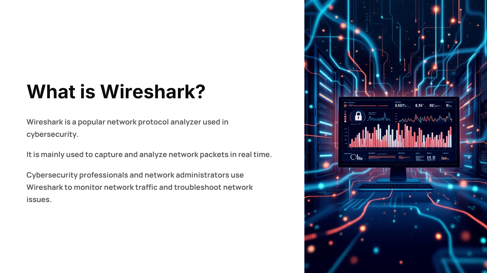
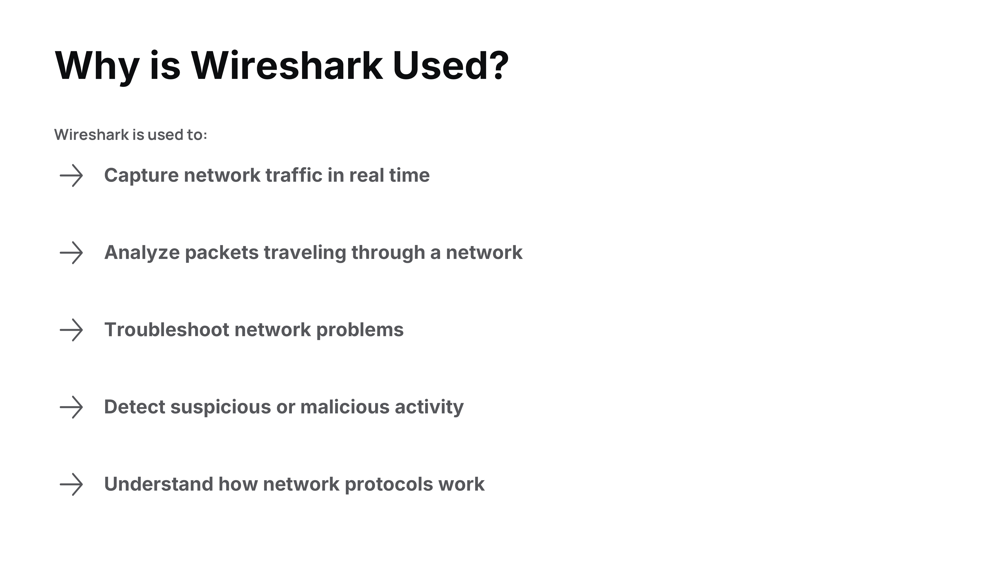
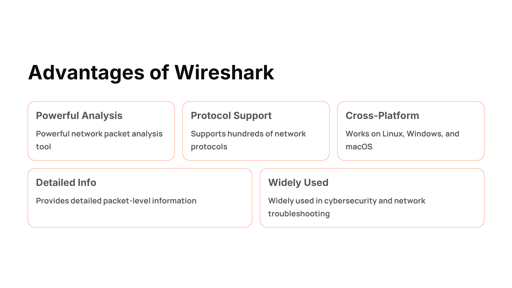
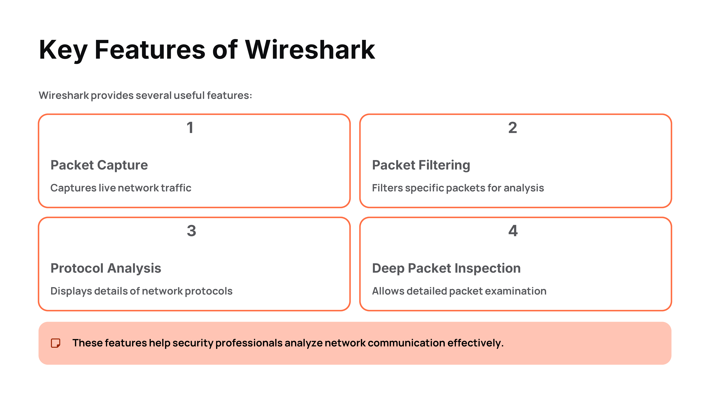
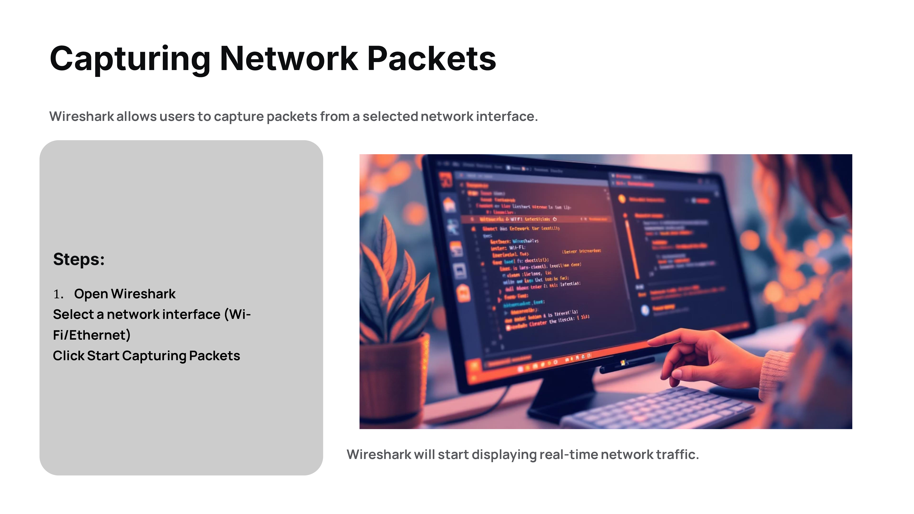
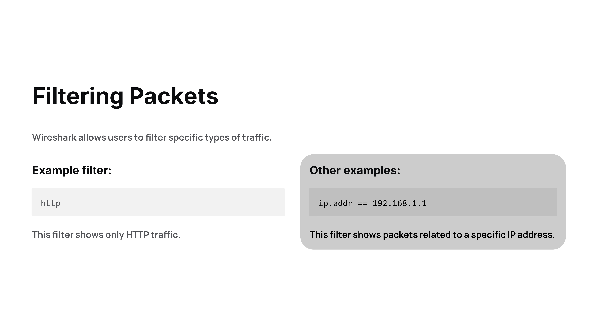
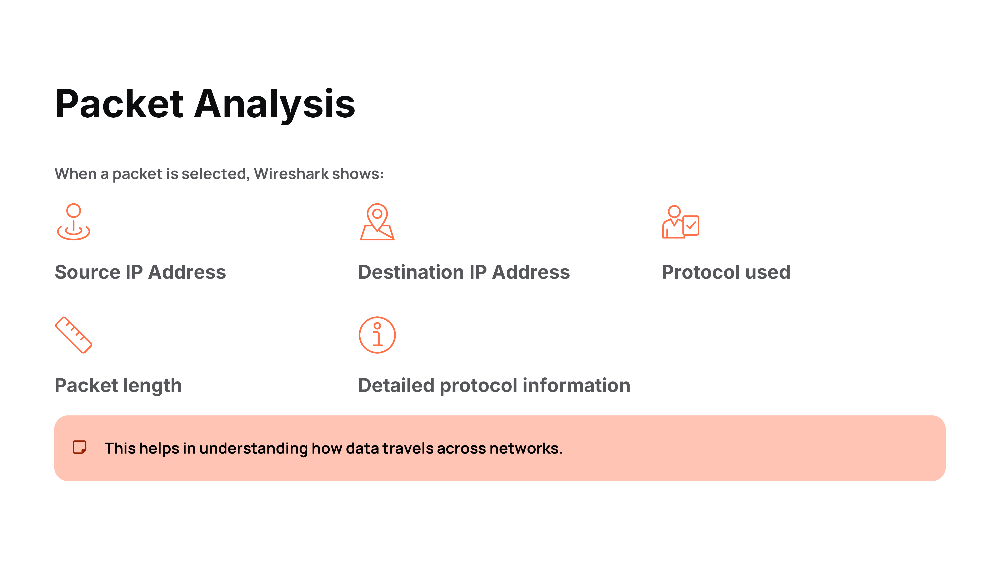
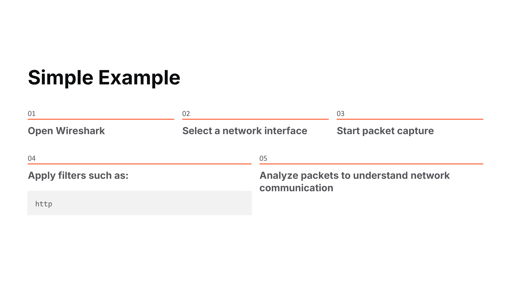

Day 83 – 100 Days Ethical Hacking Challenge

Today I explored Wireshark, a widely used tool for network packet analysis.

Wireshark allows users to capture live network traffic and analyze packets in detail. It helps in understanding network communication, troubleshooting network issues, and detecting suspicious or malicious activity.

Learning tools like Wireshark is important for developing a deeper understanding of network protocols and cybersecurity analysis.

Learning via Skills Uprise Mentored by Manoj Kumar                         

LinkedIn: https://www.linkedin.com/company/skills-uprise

CEO: https://www.linkedin.com/in/manoj-kumar

