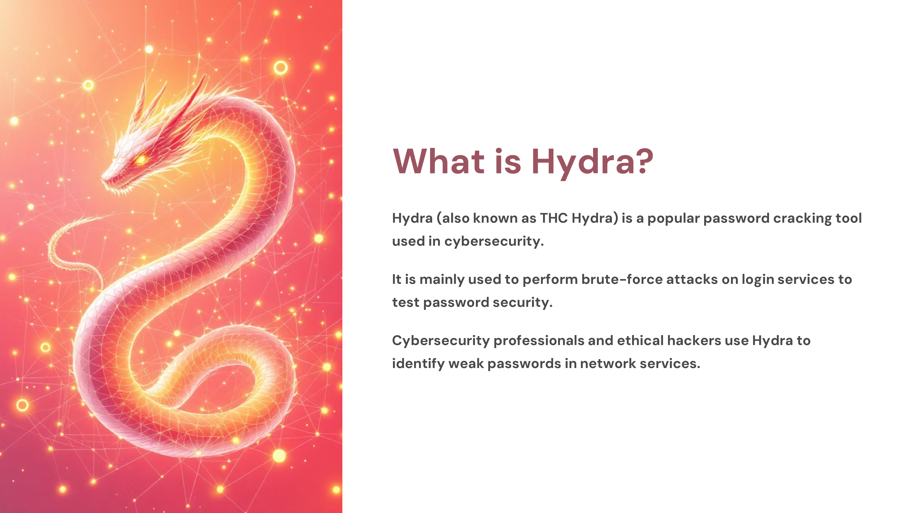
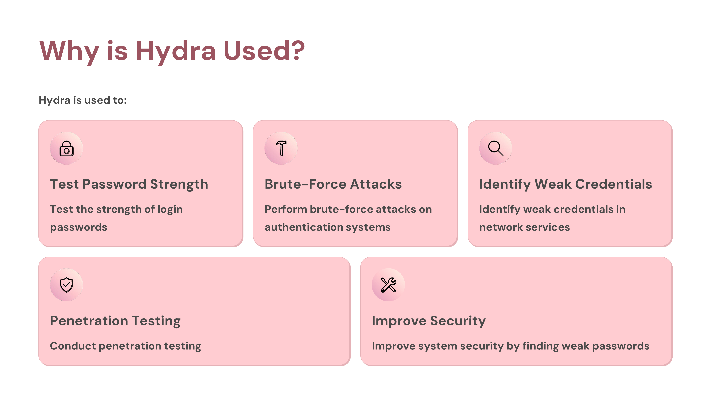
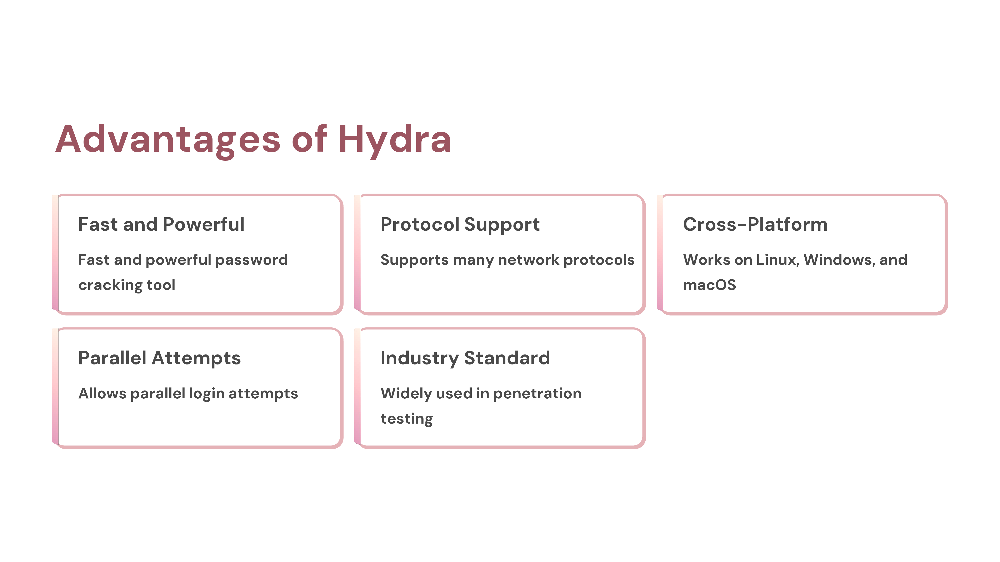
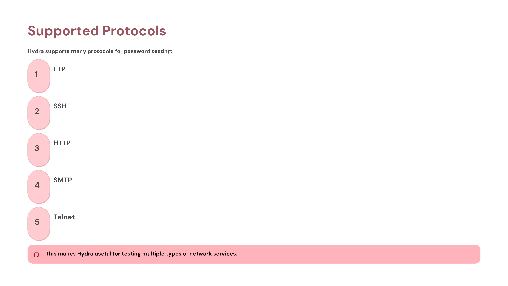
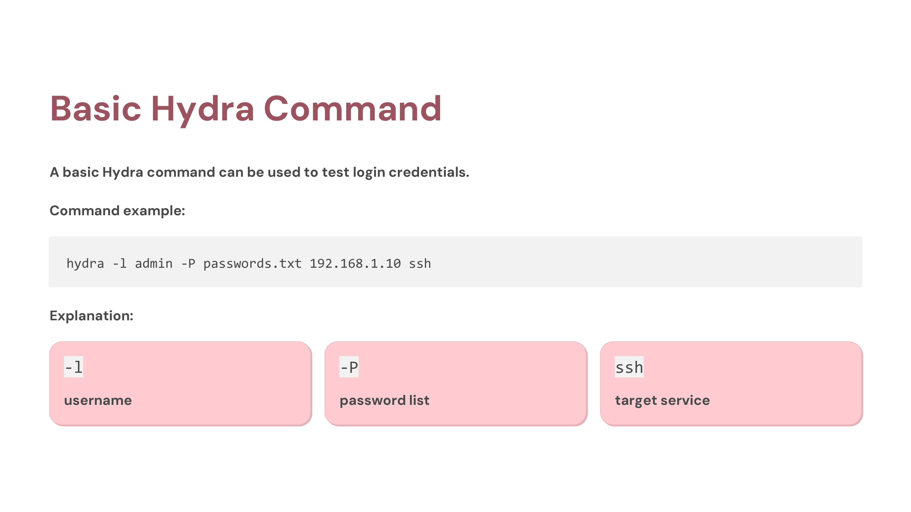
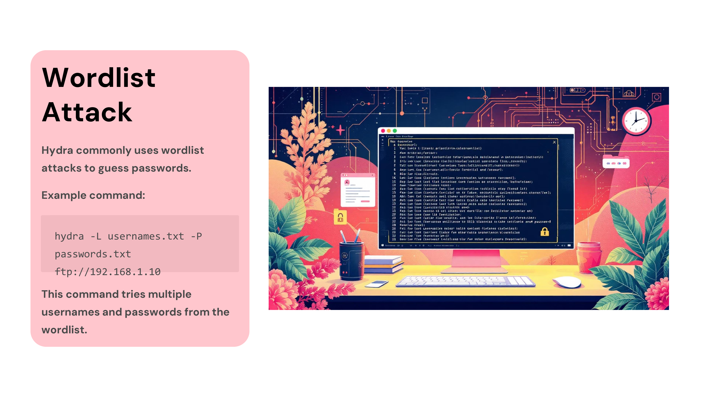
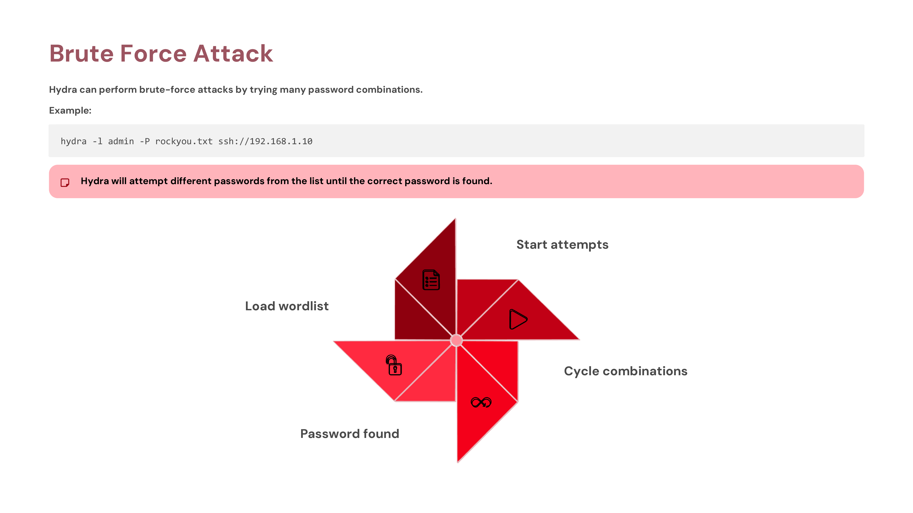
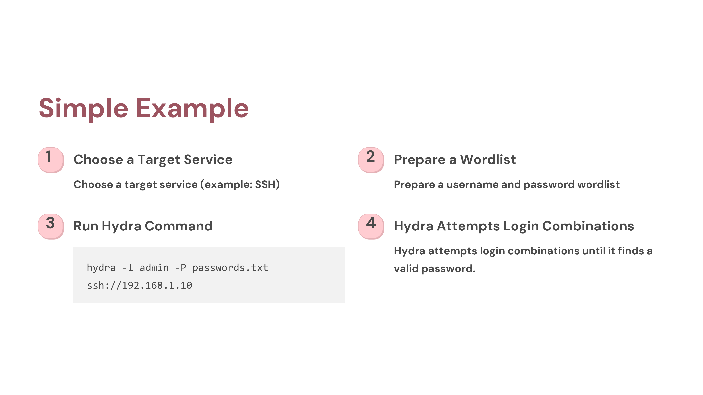

Day 84 – 100 Days Ethical Hacking Challenge

Today I explored THC Hydra, a widely used tool for password auditing and penetration testing.

Hydra is capable of performing brute-force attacks against many network protocols such as SSH, FTP, HTTP, and Telnet. It works by attempting multiple username and password combinations to identify weak credentials.

Learning tools like Hydra helps in understanding how authentication systems are tested for security weaknesses during penetration testing.

Learning via Skills Uprise Mentored by Manoj Kumar                         

LinkedIn: https://www.linkedin.com/company/skills-uprise

CEO: https://www.linkedin.com/in/manoj-kumar

