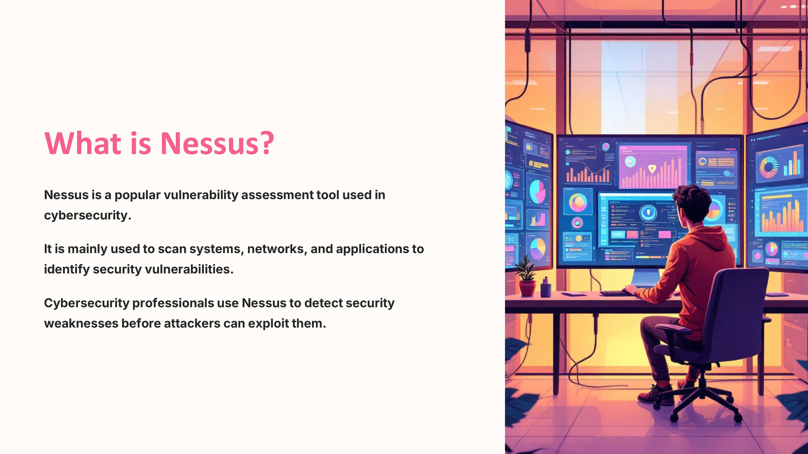
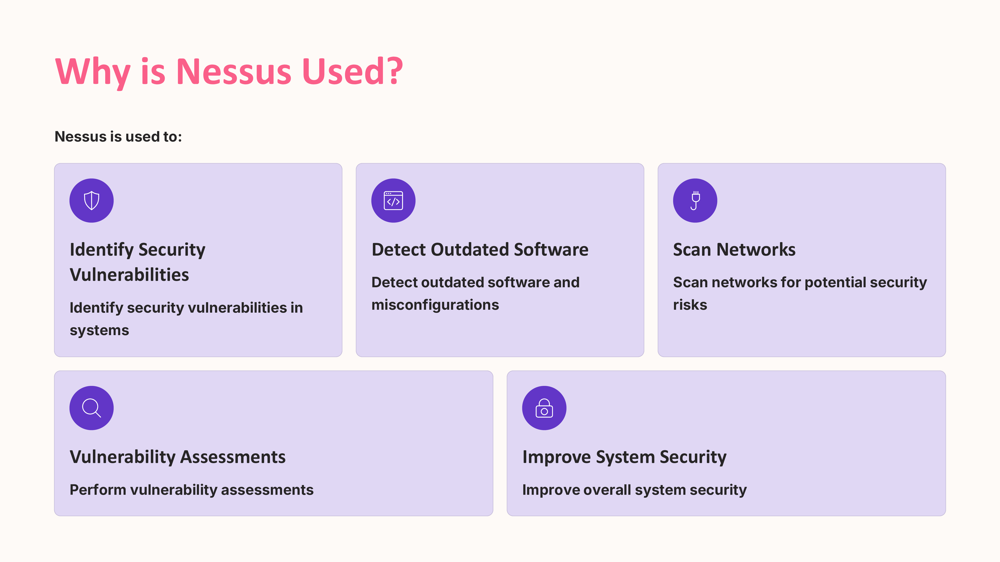
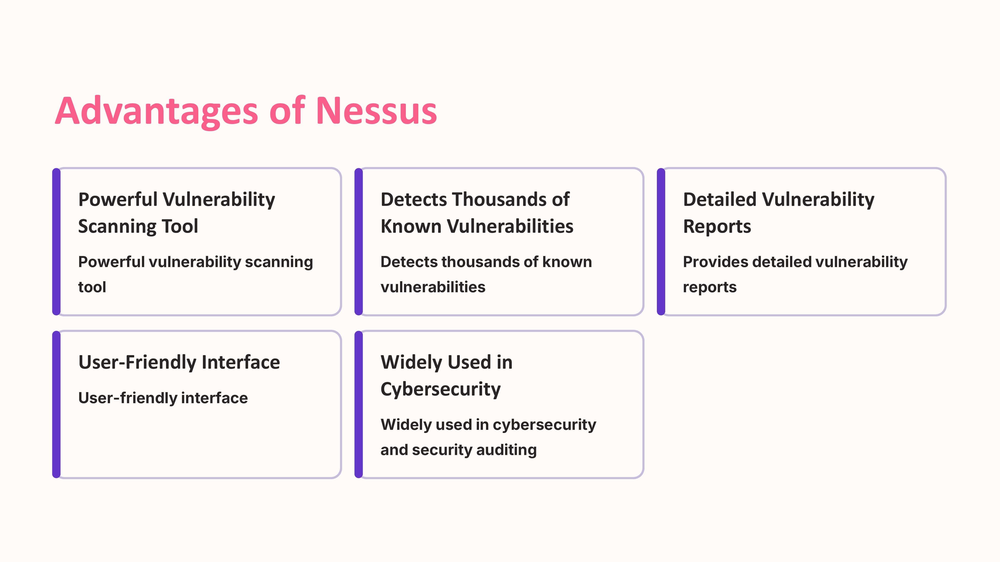
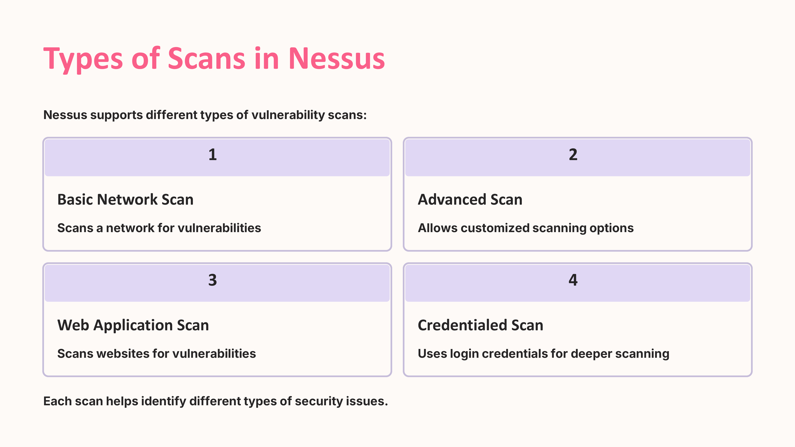
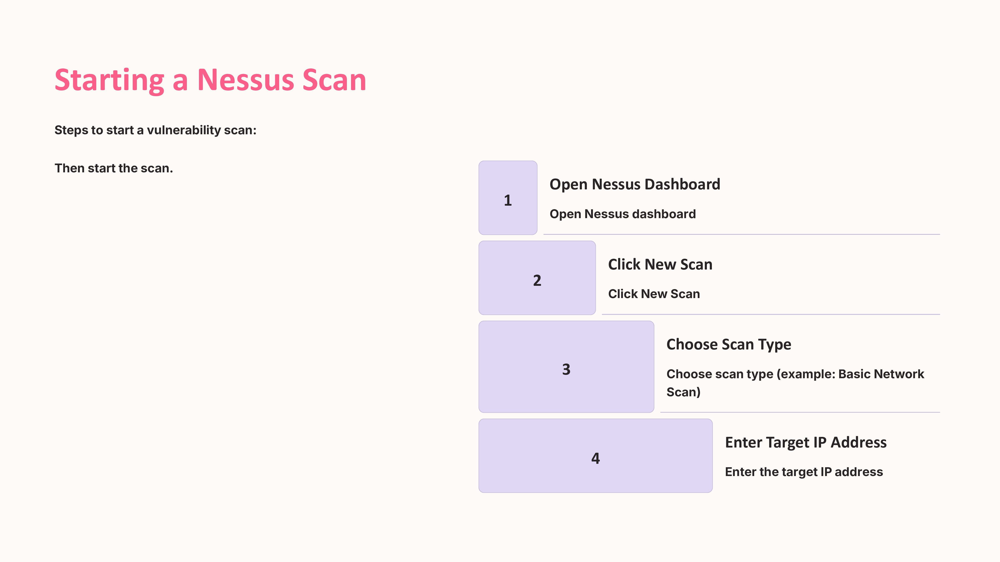
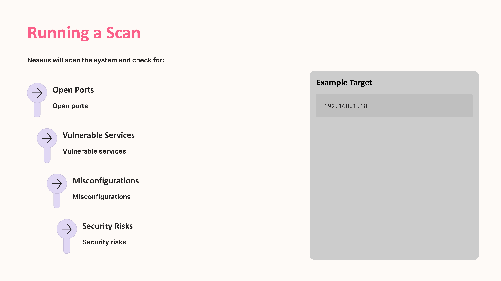
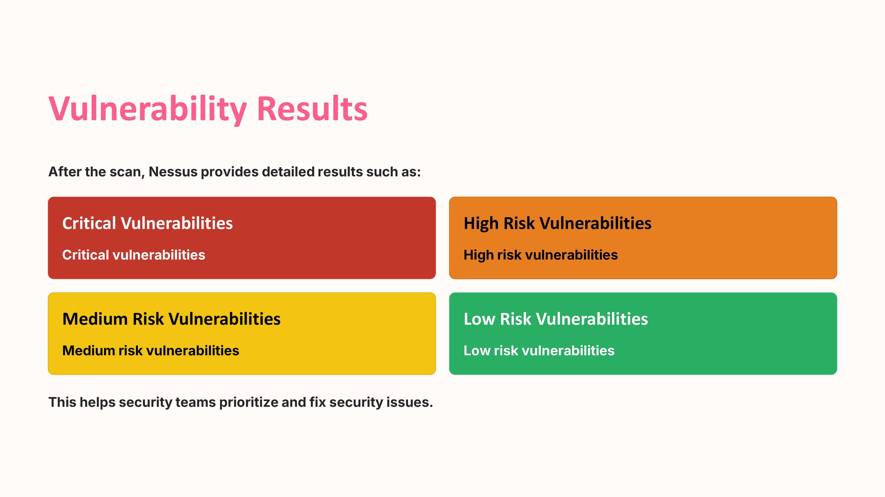
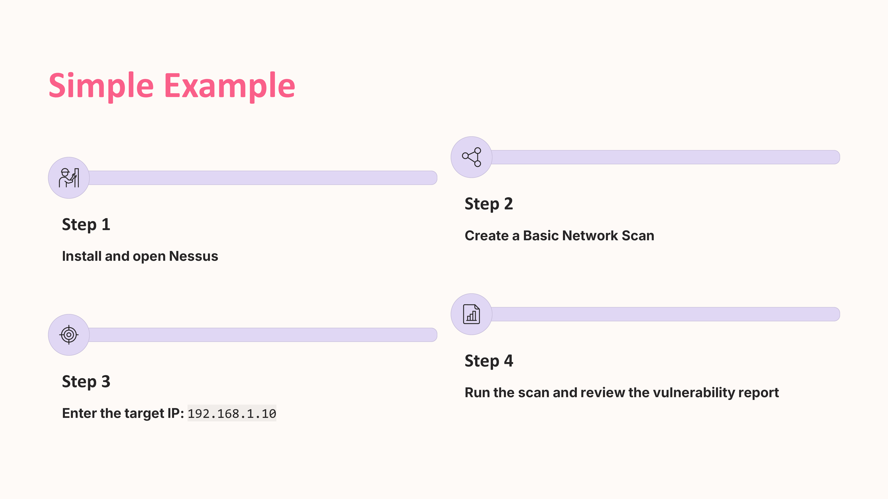

Day 85 – 100 Days Ethical Hacking Challenge

Today I explored Nessus, a widely used tool for vulnerability scanning and security assessment.

Nessus helps identify security weaknesses such as misconfigurations, outdated software, and known vulnerabilities in systems and networks. It provides detailed reports that help security teams prioritize and fix issues effectively.

Learning tools like Nessus helps in understanding how vulnerability management is performed in real-world cybersecurity environments.

Learning via Skills Uprise Mentored by Manoj Kumar                         

LinkedIn: https://www.linkedin.com/company/skills-uprise

CEO: https://www.linkedin.com/in/manoj-kumar

