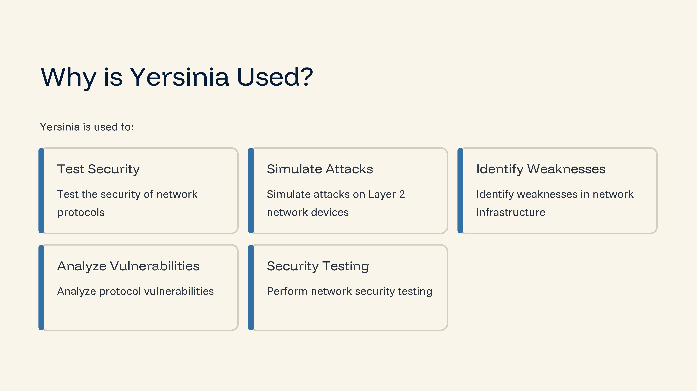
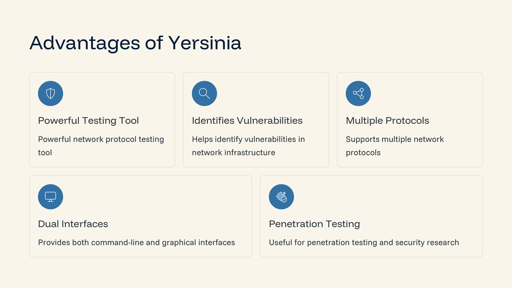
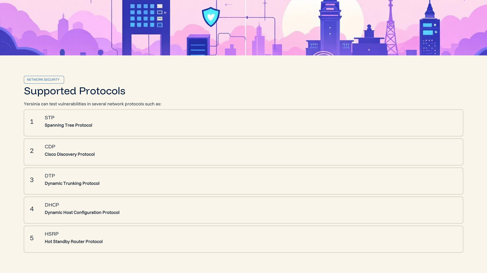
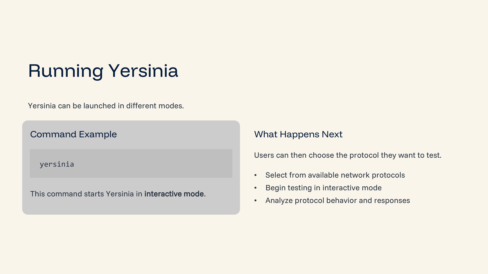
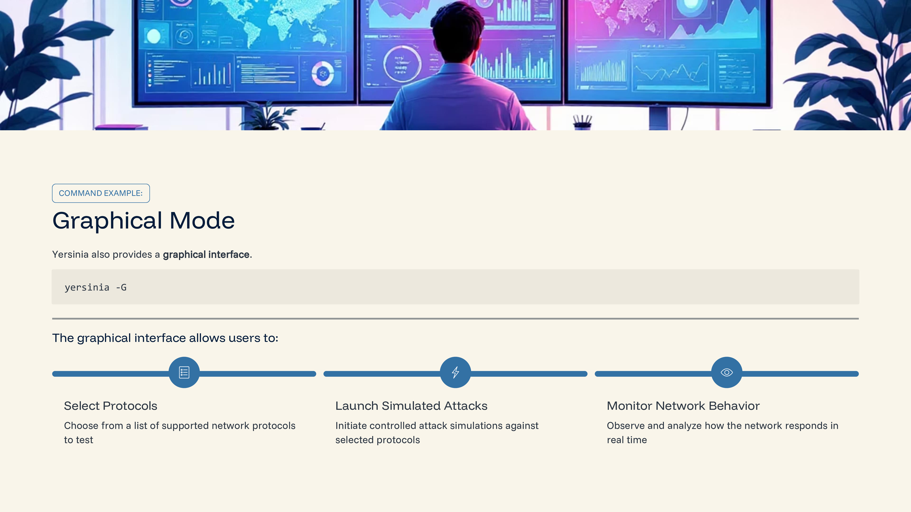
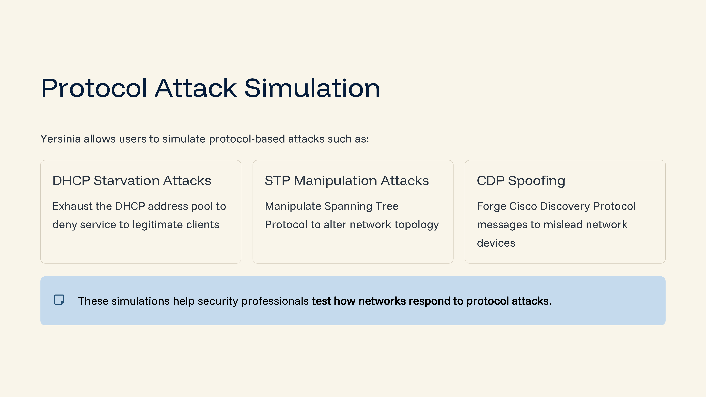
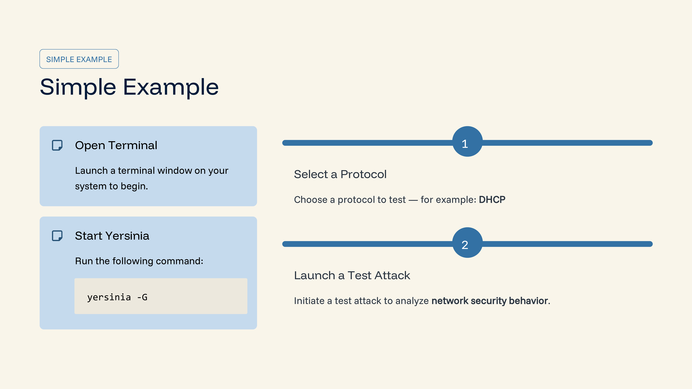

Day 86 – Yersinia

Today I learned about Yersinia, a tool used for testing vulnerabilities in network protocols.

Key Learnings
Yersinia is mainly used for Layer 2 network protocol testing
It supports protocols such as DHCP, STP, CDP, DTP, and HSRP
It allows security professionals to simulate protocol-based attacks
Helps identify weaknesses in network infrastructure
Example Command
yersinia -G

This command launches the graphical interface for testing network protocols.

Conclusion
Yersinia is a useful tool for understanding network protocol attacks and improving network security through vulnerability testing.

Learning via Skills Uprise Mentored by Manoj Kumar                         

LinkedIn: https://www.linkedin.com/company/skills-uprise

CEO: https://www.linkedin.com/in/manoj-kumar

