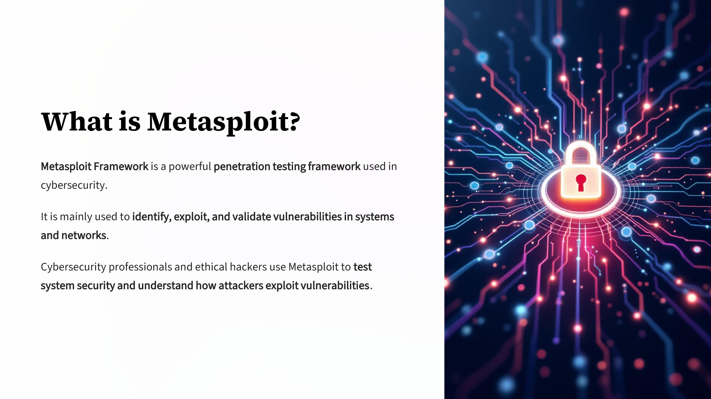
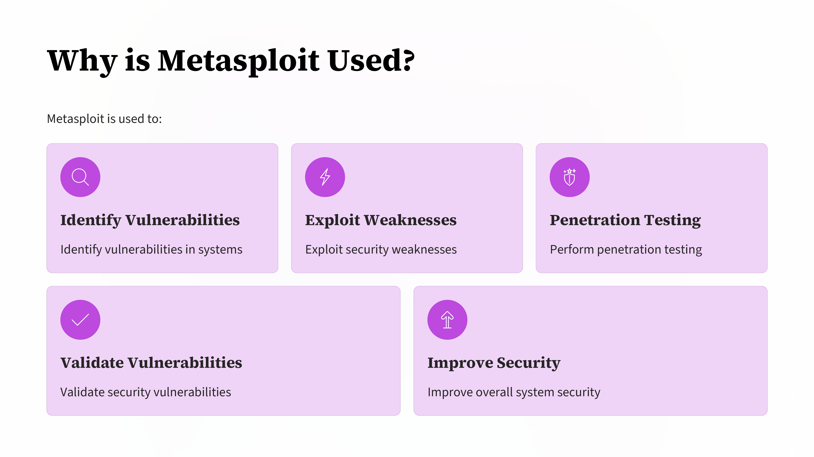
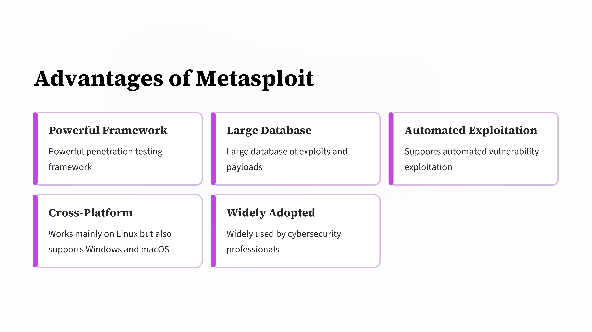
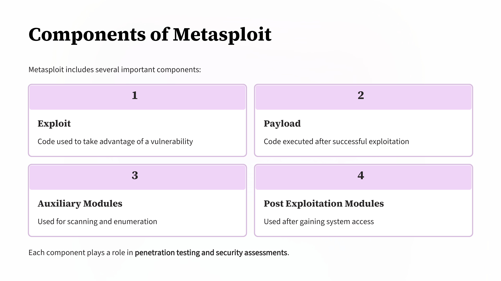
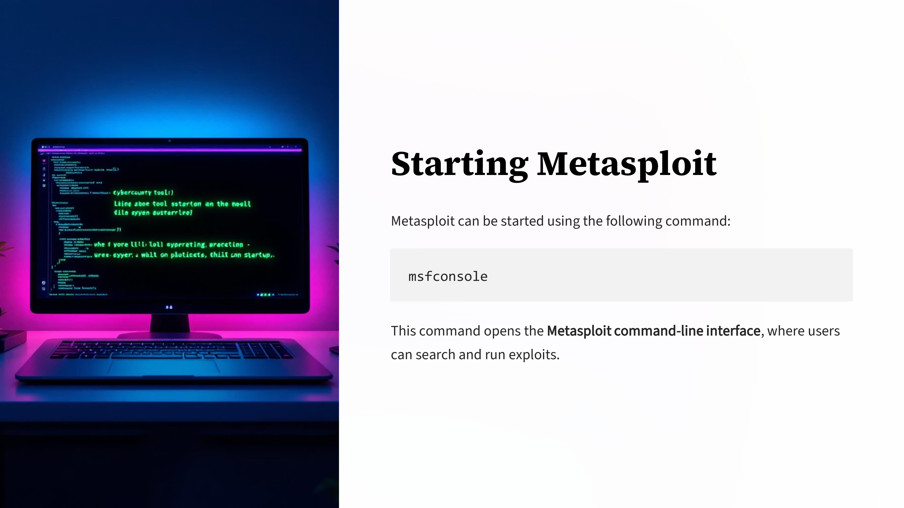
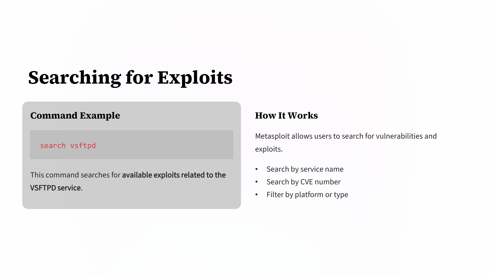
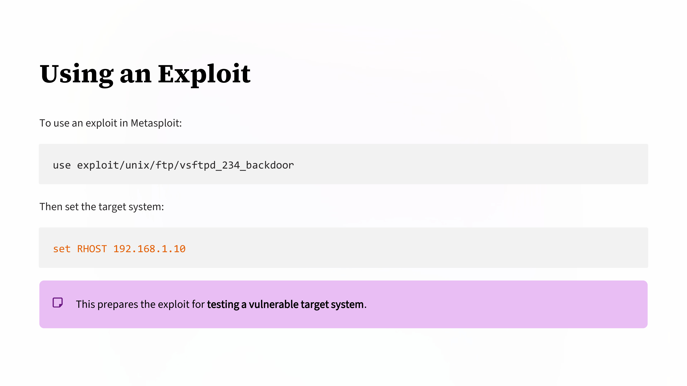
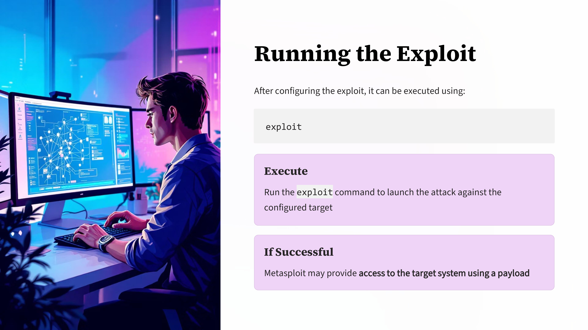

Day 87 – Metasploit

Today I explored Metasploit Framework, a powerful tool widely used in penetration testing and vulnerability assessment.

Metasploit provides a framework that allows security professionals to identify, exploit, and validate vulnerabilities in systems. It includes different modules such as exploits, payloads, auxiliary modules, and post-exploitation tools.

During this learning, I practiced how to start Metasploit, search for exploits, configure targets, and understand how exploitation works in a controlled environment.

Key Learnings
Metasploit is used for vulnerability exploitation and penetration testing
It contains a large database of exploits and payloads
Helps security professionals simulate real-world cyber attacks
Useful for security testing and vulnerability validation

This learning helped me gain better understanding of how vulnerabilities are tested and how systems can be secured against attacks.

Learning via Skills Uprise Mentored by Manoj Kumar                         

LinkedIn: https://www.linkedin.com/company/skills-uprise

CEO: https://www.linkedin.com/in/manoj-kumar

