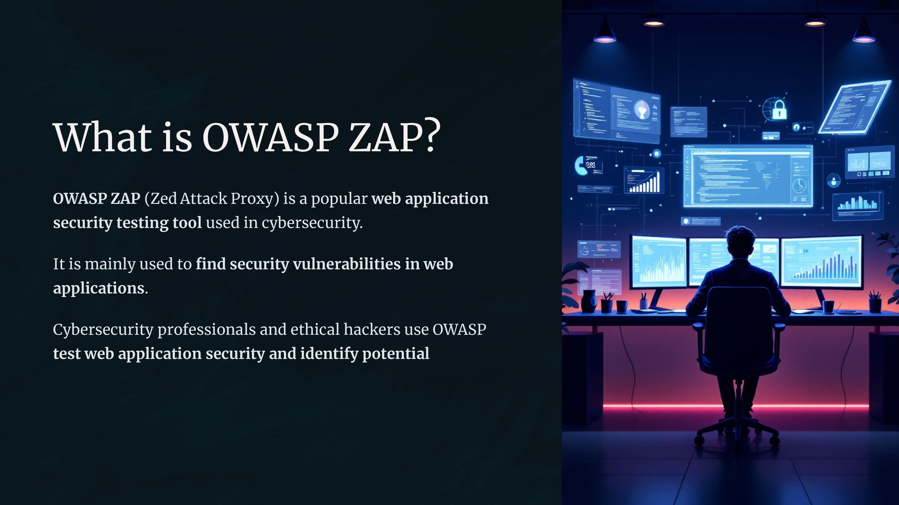
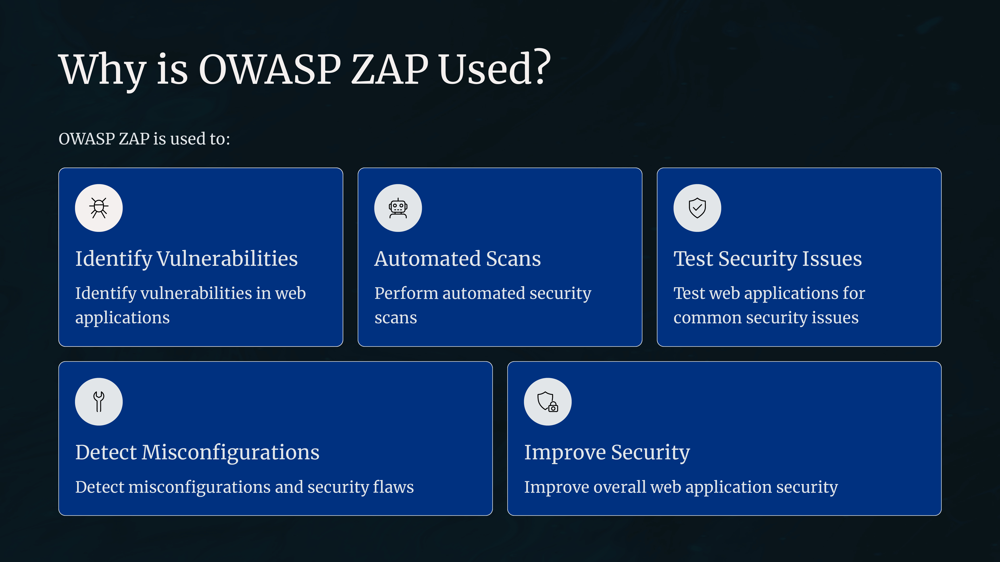
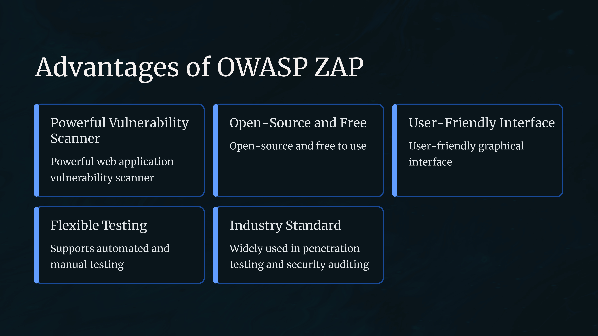
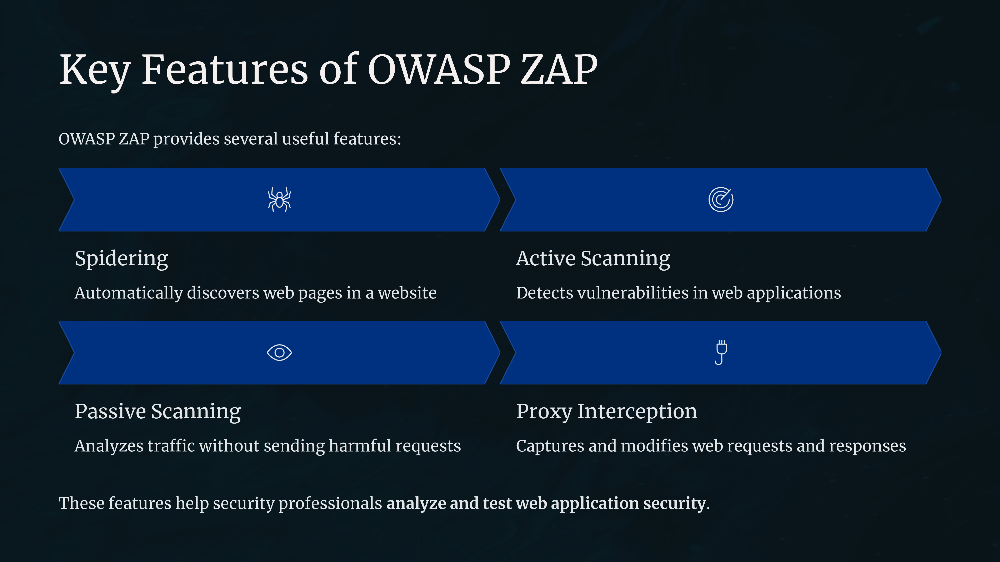
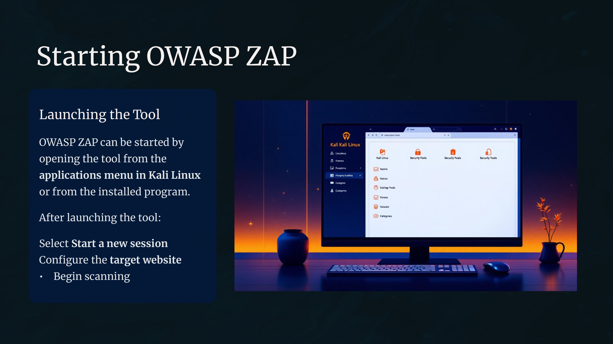
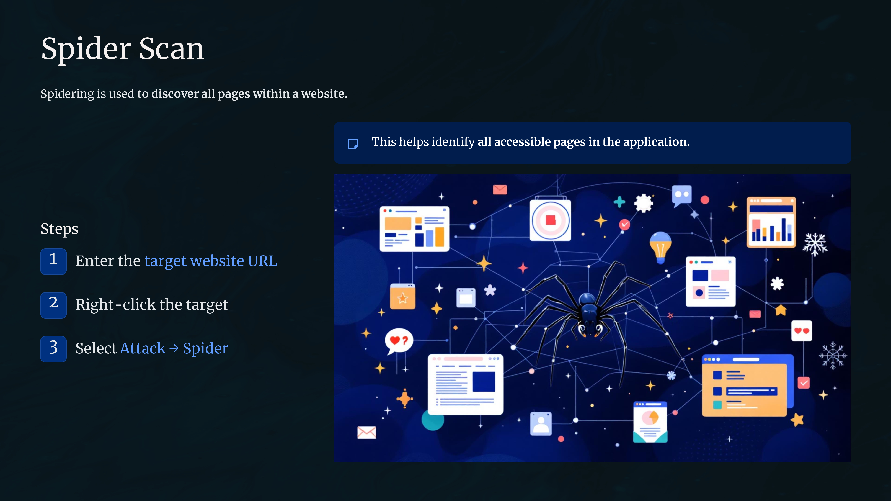
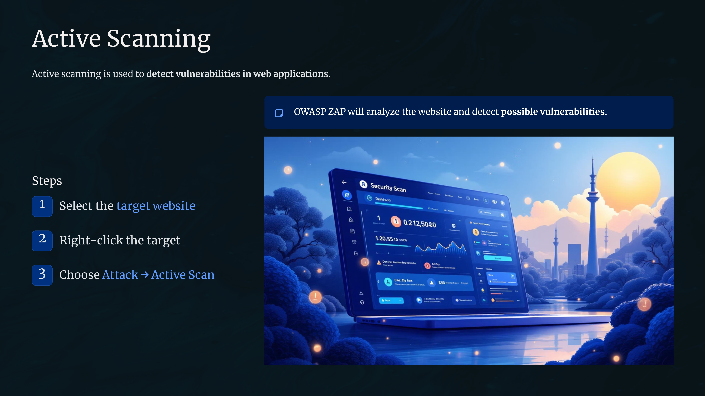
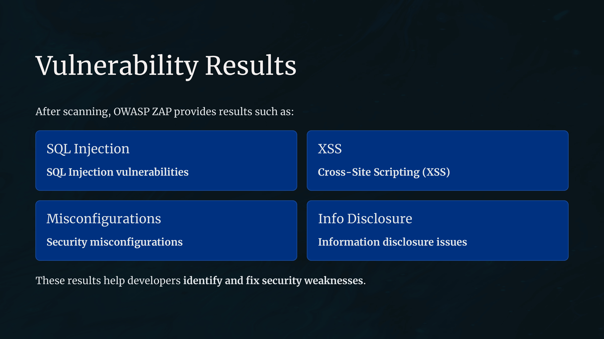

Day 88 – OWASP ZAP

Today I explored OWASP ZAP, a popular tool used for web application vulnerability scanning and security testing.

OWASP ZAP works as a proxy that intercepts web traffic, allowing security professionals to analyze requests and responses and detect vulnerabilities.

Key Learnings
Used for web application security testing
Supports automated and manual vulnerability scanning
Helps identify issues like SQL Injection and Cross-Site Scripting
Useful for penetration testing and security auditing

This learning helped me understand how web application vulnerabilities are discovered and analyzed in real-world security testing.

Learning via Skills Uprise Mentored by Manoj Kumar                         

LinkedIn: https://www.linkedin.com/company/skills-uprise

CEO: https://www.linkedin.com/in/manoj-kumar

