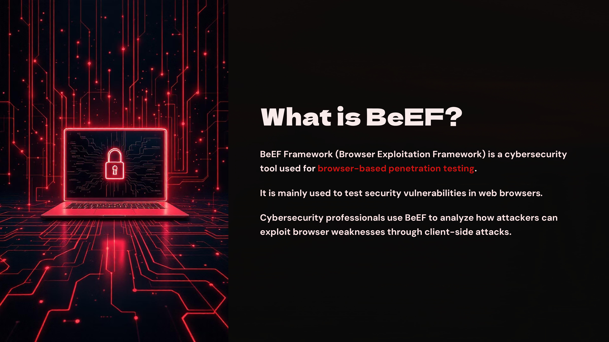
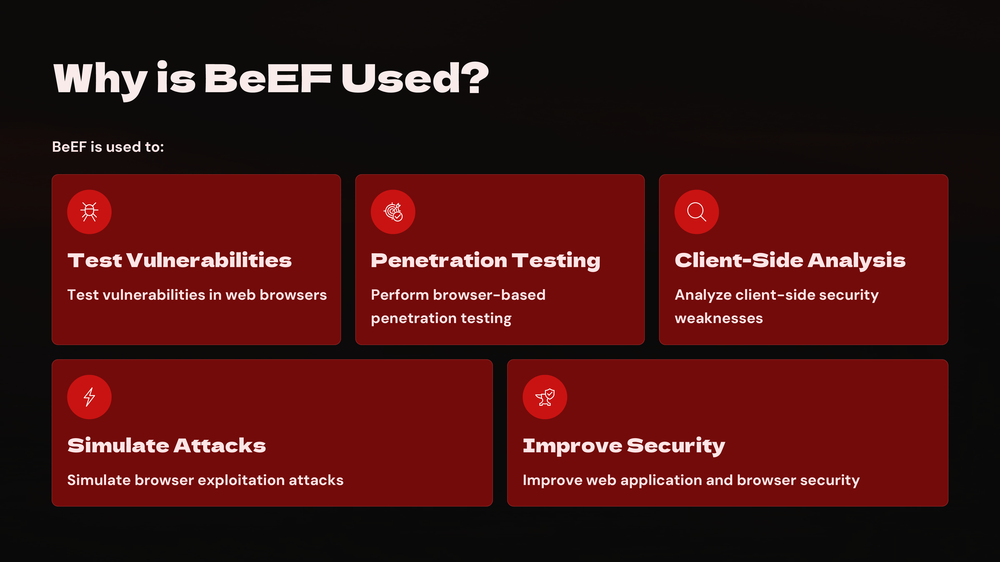
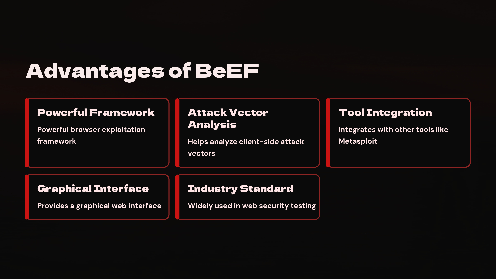
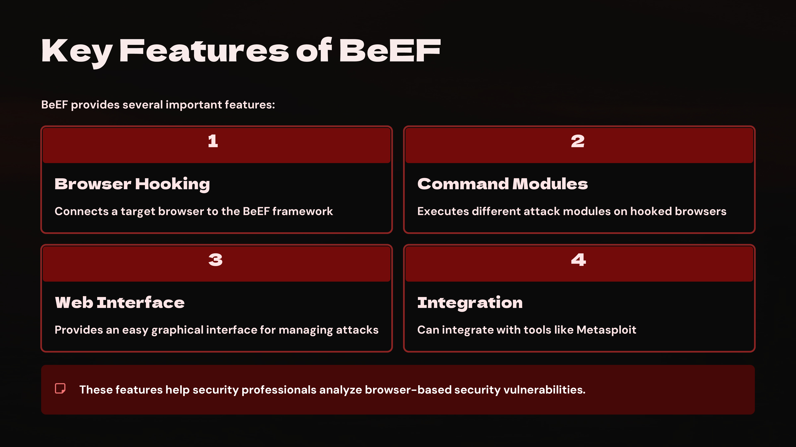
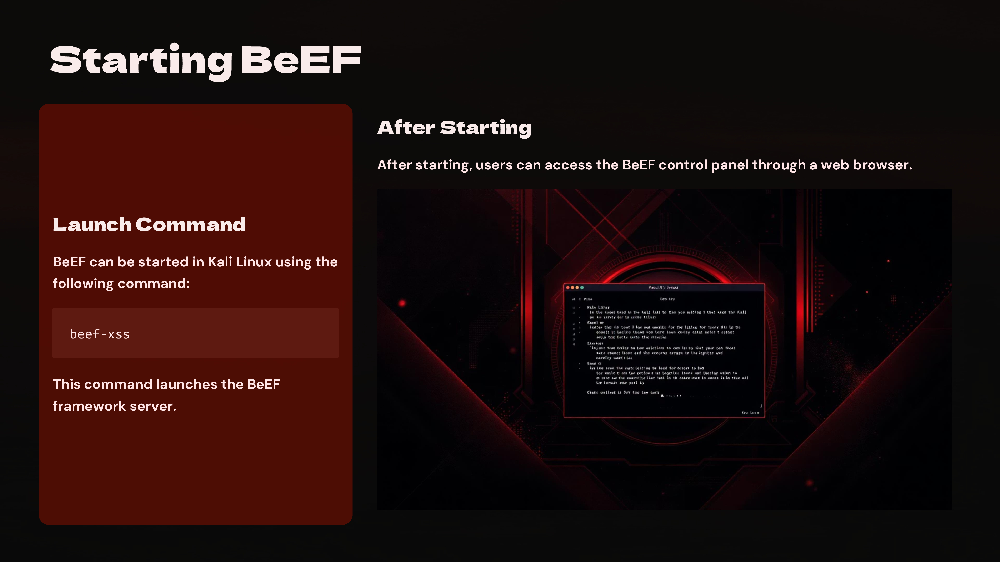
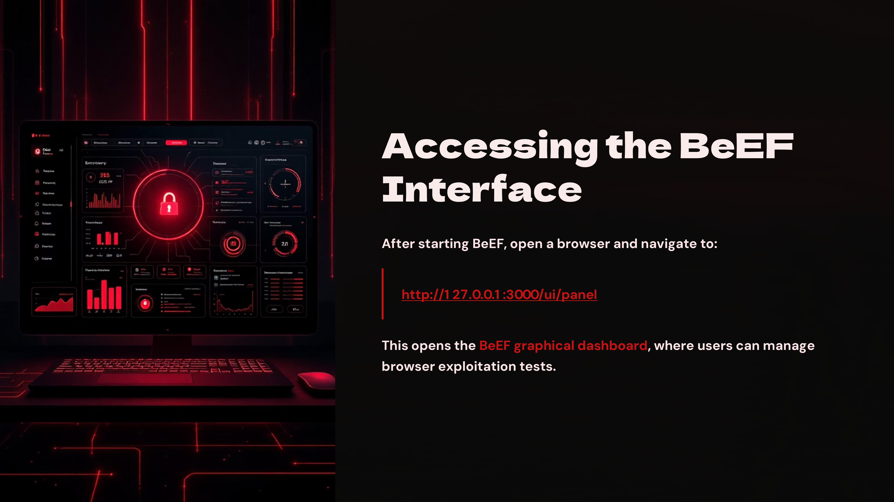
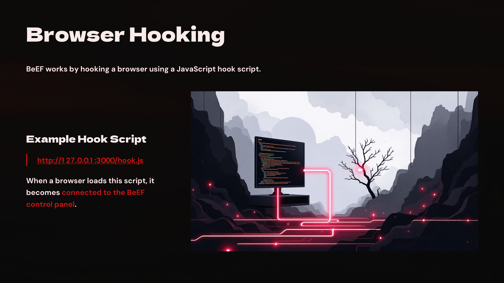
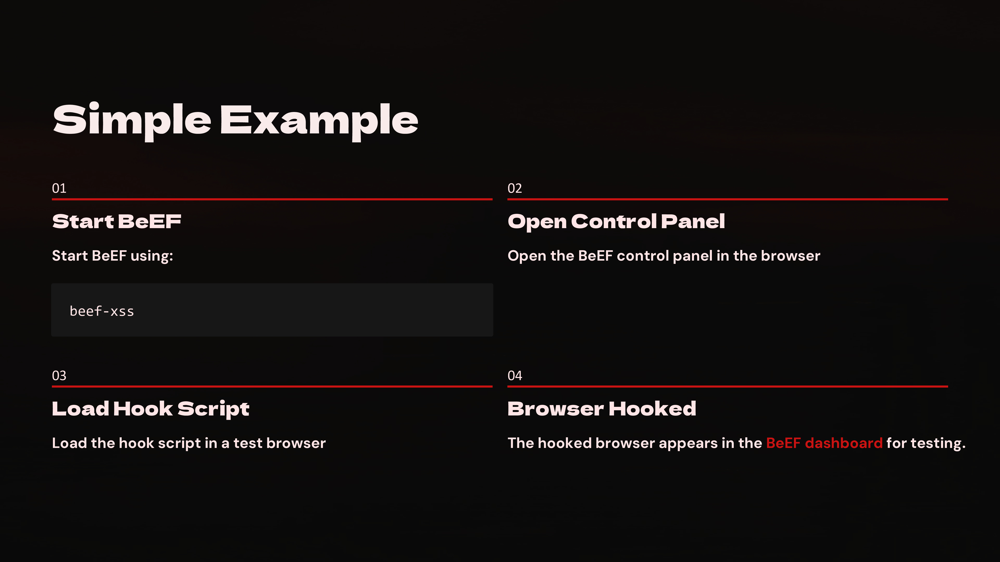

Day 89 — 100 Days Ethical Hacking Challenge

Today I explored the BeEF Framework, a tool used for browser-based penetration testing.

BeEF allows security professionals to analyze client-side vulnerabilities by hooking web browsers and executing different security testing modules.

Key things I learned today:

BeEF focuses on browser exploitation rather than server-side attacks
It uses JavaScript hooks to connect browsers to the framework
It provides a web interface to manage testing modules
It helps understand client-side security risks

Learning tools like BeEF improves understanding of real-world web security testing techniques.

Learning via Skills Uprise Mentored by Manoj Kumar                         

LinkedIn: https://www.linkedin.com/company/skills-uprise

CEO: https://www.linkedin.com/in/manoj-kumar

