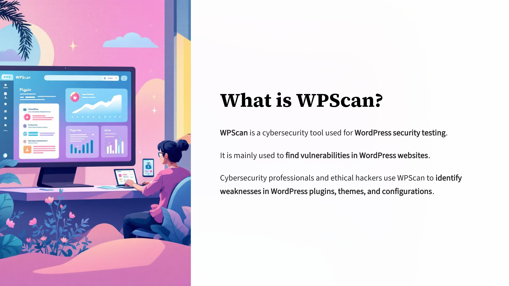
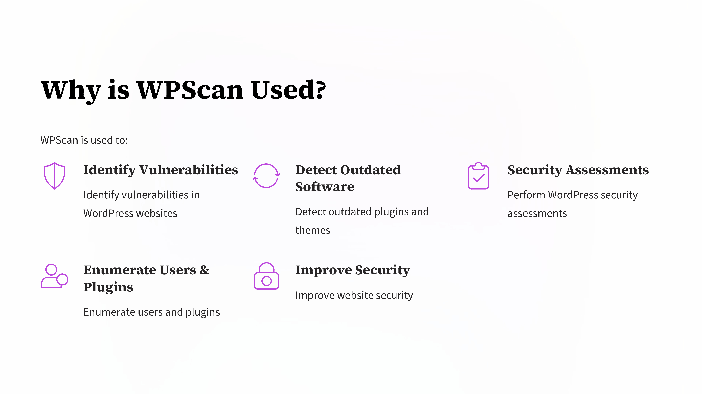
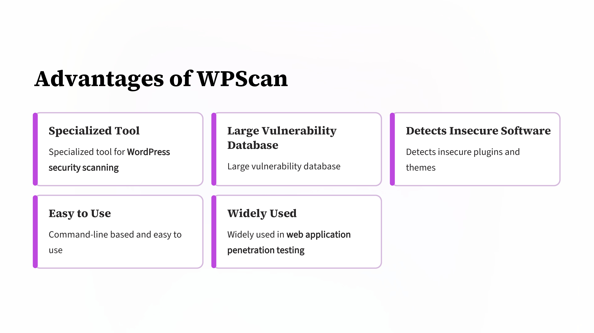
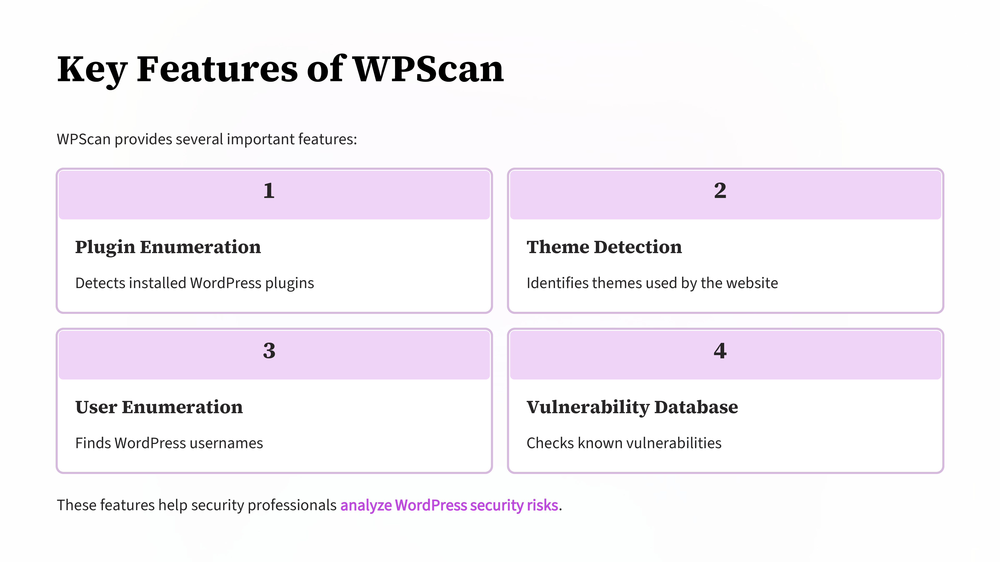
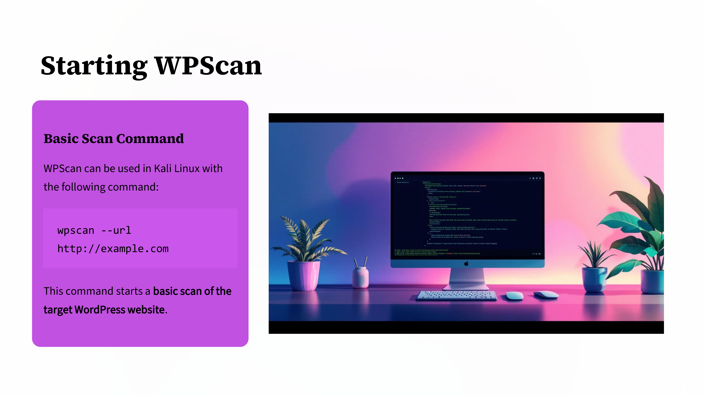
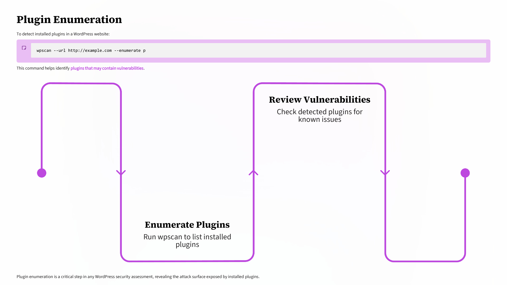
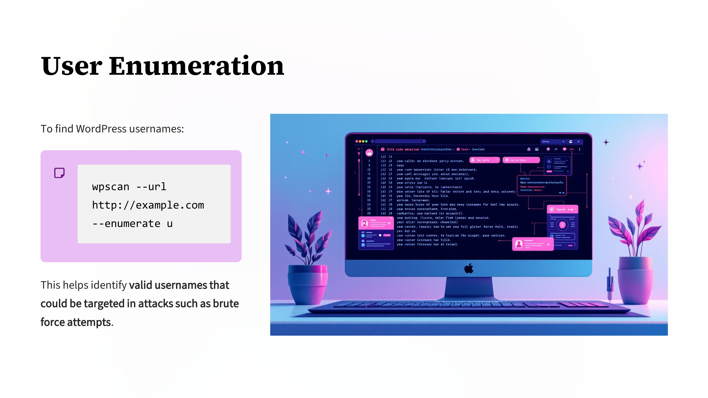
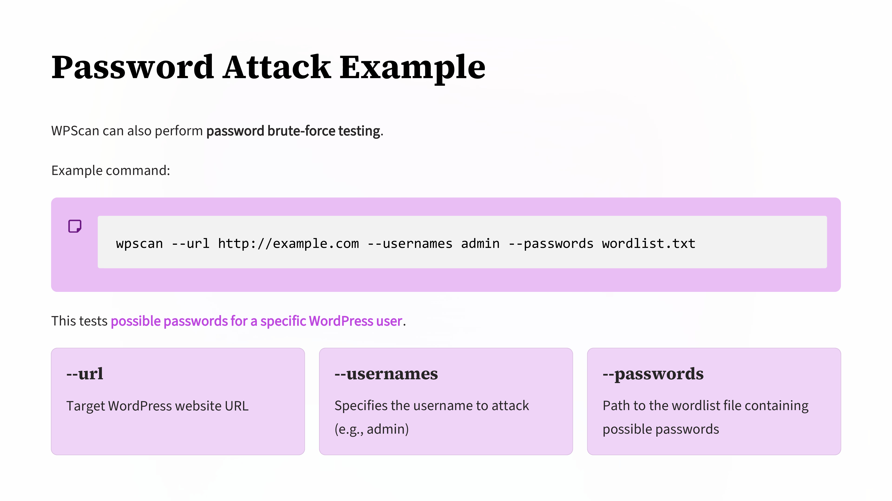

Day 90 – 100 Days Ethical Hacking Challenge

Today I explored WPScan, a popular tool used for WordPress vulnerability scanning and security assessment.

WPScan helps security professionals identify weaknesses in WordPress websites by scanning for outdated plugins, themes, exposed users, and known vulnerabilities.

Key Learnings
WPScan is designed specifically for WordPress security testing
It can perform plugin and theme enumeration
It helps identify known vulnerabilities from a large database
It is widely used in web penetration testing

Learning this tool helped me understand how WordPress websites are analyzed for security weaknesses during penetration testing.

Learning via Skills Uprise Mentored by Manoj Kumar                         

LinkedIn: https://www.linkedin.com/company/skills-uprise

CEO: https://www.linkedin.com/in/manoj-kumar

