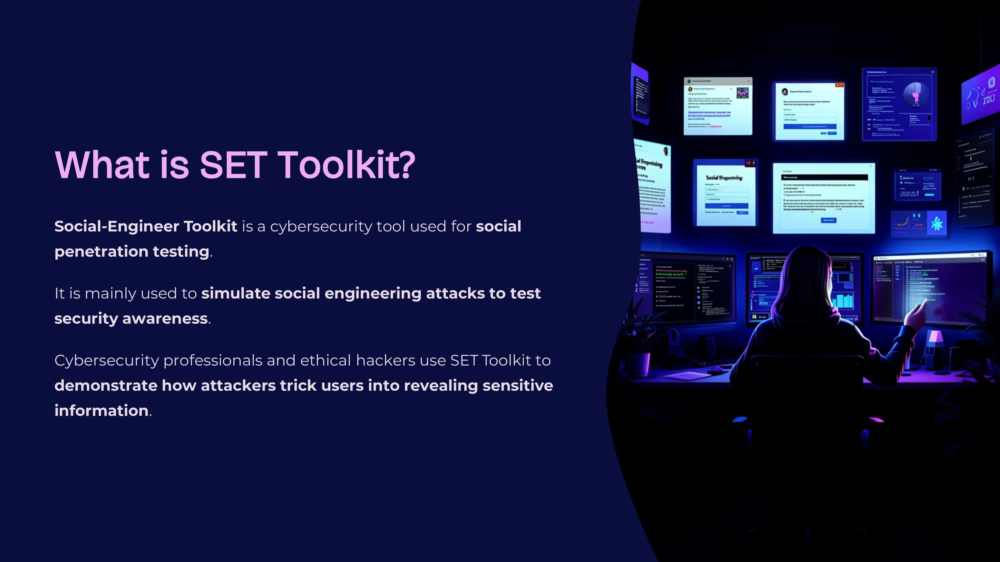
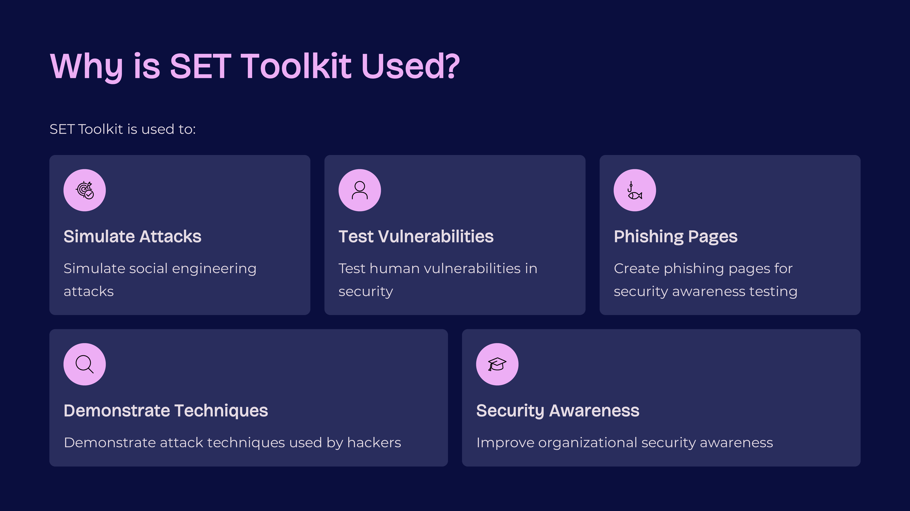
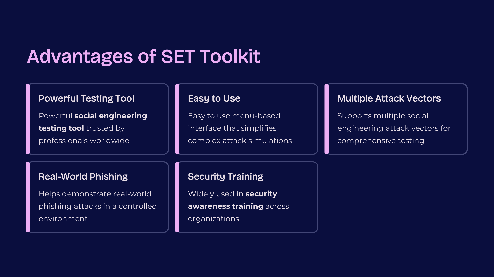
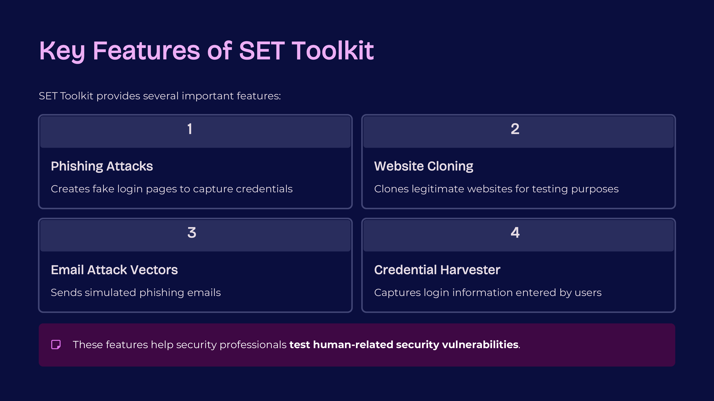
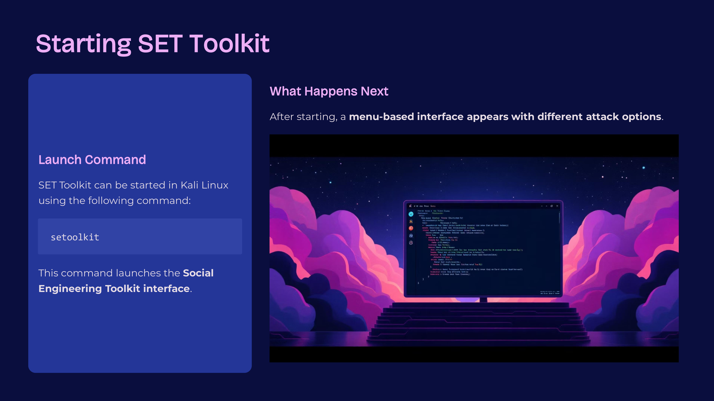
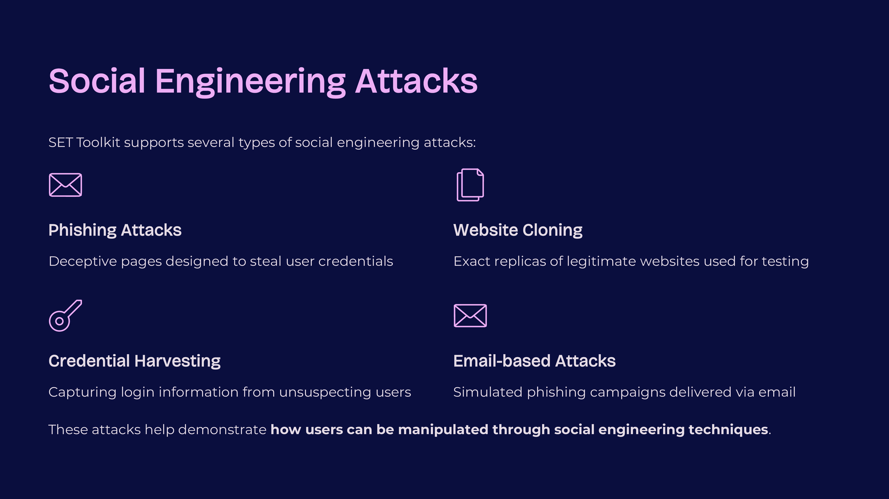
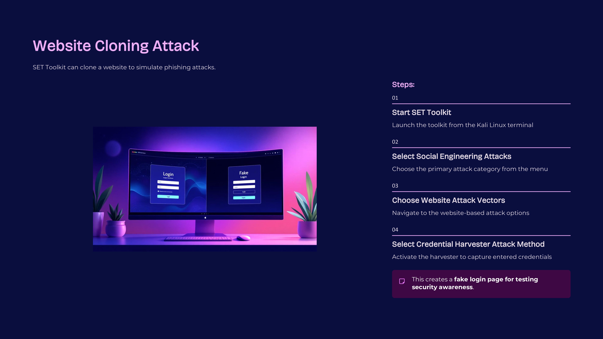
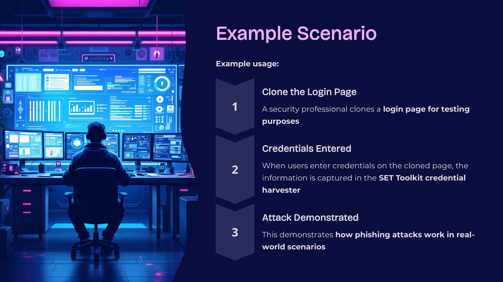

Day 91 – 100 Days Ethical Hacking Challenge

Today I explored the Social-Engineer Toolkit, a framework used for social engineering attack simulations.

SET Toolkit allows security professionals to perform testing scenarios such as phishing attacks, website cloning, and credential harvesting to evaluate human security awareness.

Key Learnings
Used for social engineering penetration testing
Supports phishing and website cloning attacks
Demonstrates human vulnerabilities in cybersecurity
Useful for security awareness training

This learning helped me understand the human side of cybersecurity risks.

Learning via Skills Uprise Mentored by Manoj Kumar                         

LinkedIn: https://www.linkedin.com/company/skills-uprise

CEO: https://www.linkedin.com/in/manoj-kumar

