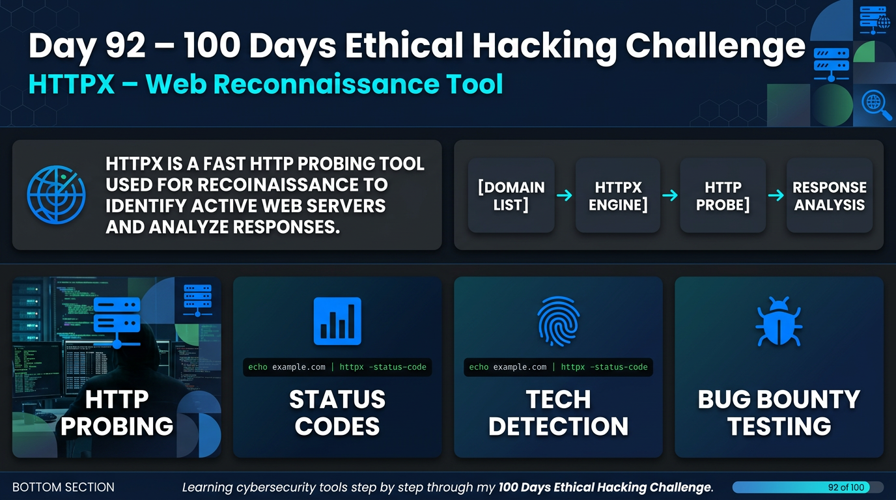

Day 92 – 100 Days Ethical Hacking Challenge

Today I explored httpx, a fast HTTP toolkit used for web reconnaissance and probing active web servers.

HTTPX is widely used by security researchers and bug bounty hunters to analyze large lists of domains and identify active web services.

Key Learnings

• HTTP probing to find live domains
• Detect HTTP status codes
• Identify technologies used by websites
• Useful for reconnaissance during penetration testing

Example command used:

echo example.com | httpx -status-code

Learning reconnaissance tools like HTTPX helps improve information gathering skills in ethical hacking.

Learning via Skills Uprise Mentored by Manoj Kumar                         

LinkedIn: https://www.linkedin.com/company/skills-uprise

CEO: https://www.linkedin.com/in/manoj-kumar

