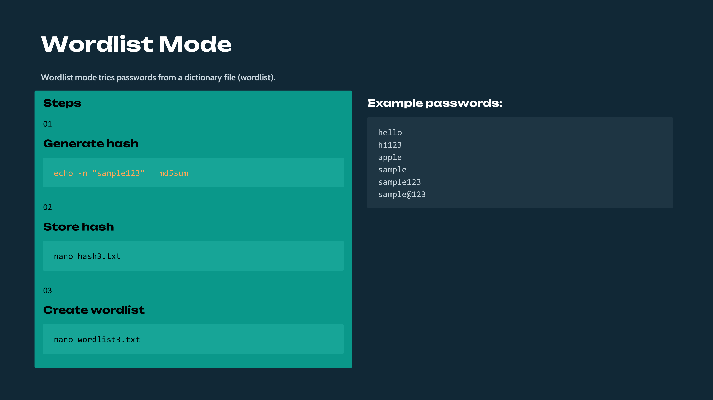
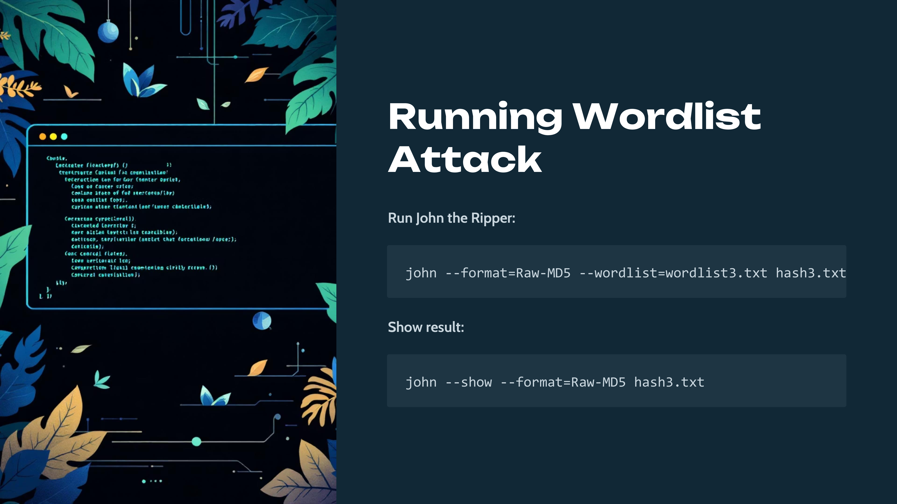
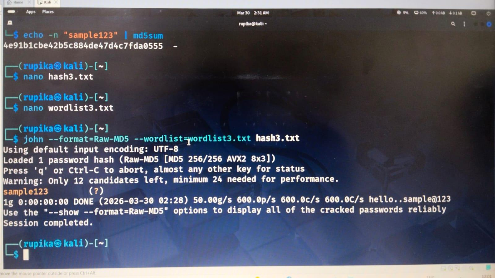
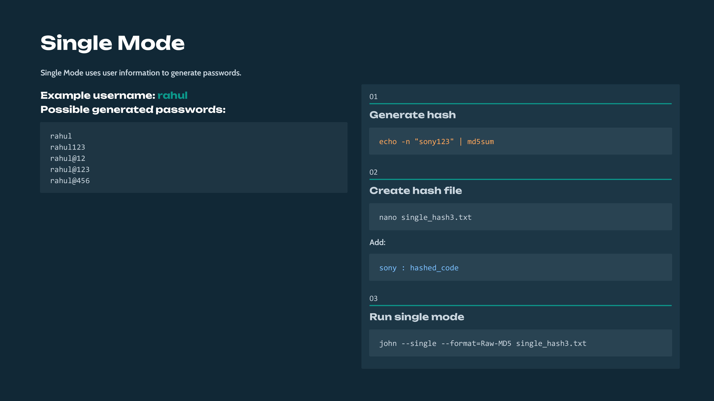
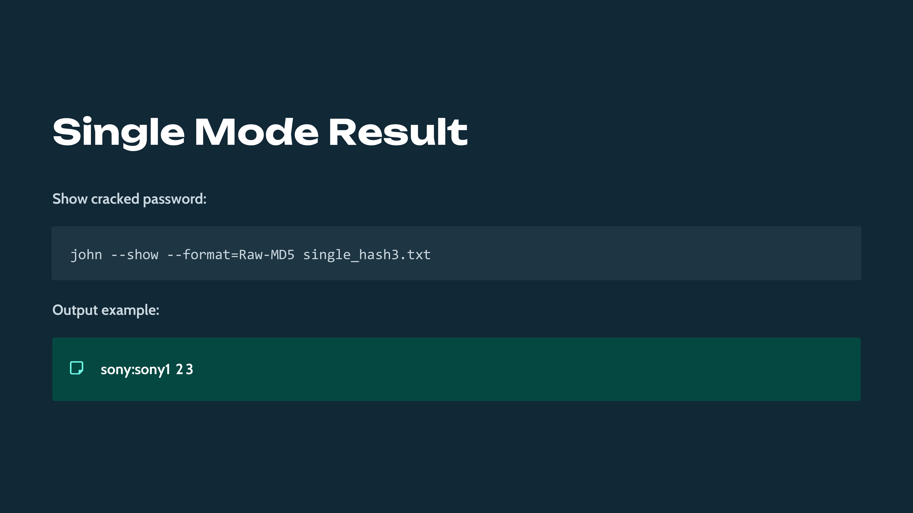
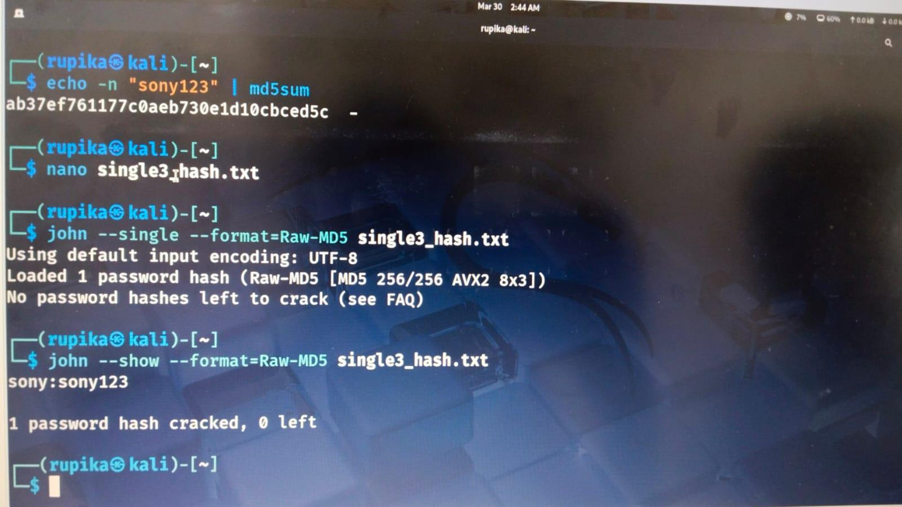
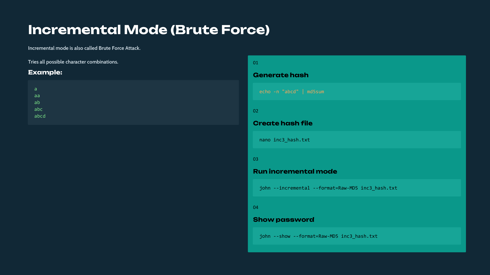
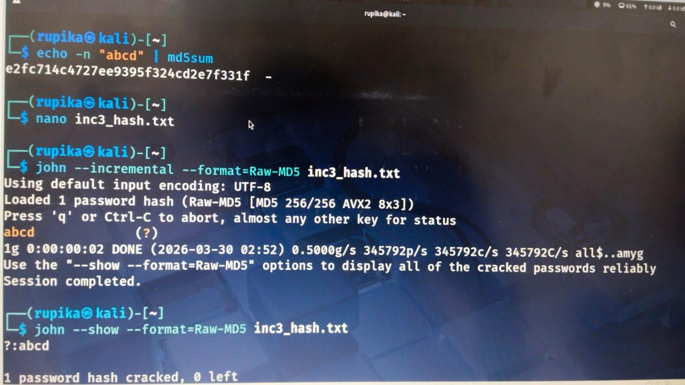
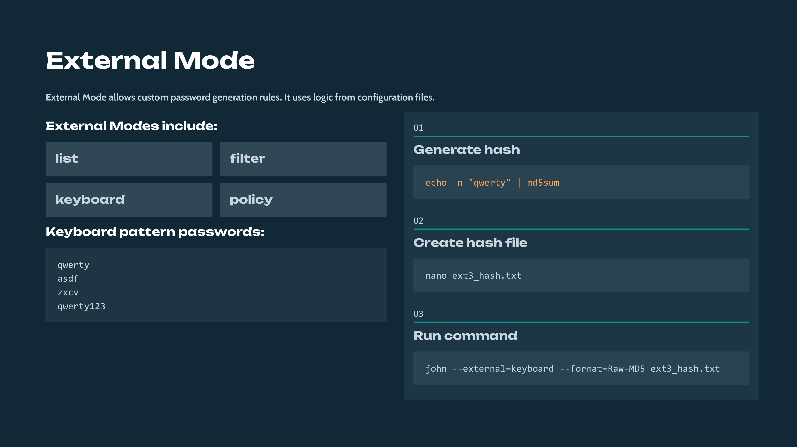
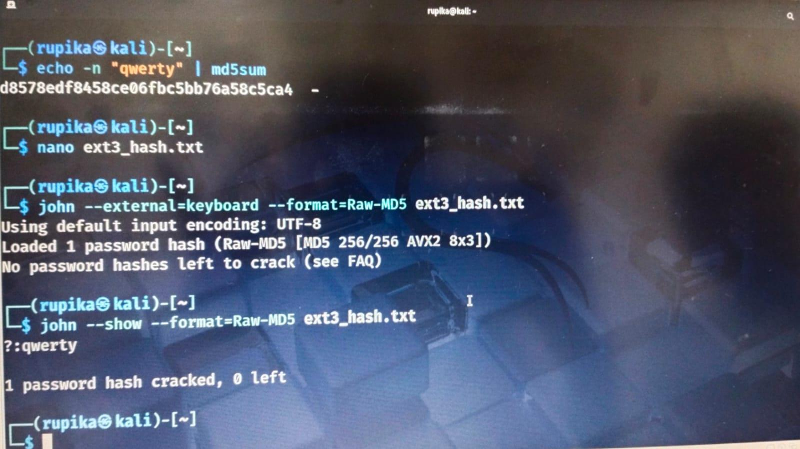

Day 93 – Practical Password Cracking using John the Ripper

Today I performed hands-on practice with John the Ripper on Kali Linux to understand how password cracking techniques work in real environments.

Instead of only learning the concepts, I implemented and tested them practically in the terminal and documented the results with screenshots.

Topics Practiced
1. Wordlist Mode
Used a custom password dictionary to crack hashed passwords.
2. Single Mode
Generated password guesses using username-based patterns.
3. Incremental Mode (Brute Force)
Attempted all possible character combinations to recover the password.
4. External Mode
Used rule-based password generation patterns such as keyboard sequences.

I also generated password hashes using MD5 and stored them in files to simulate real password cracking scenarios.
Practical execution screenshots from the Kali Linux terminal are attached.

Learning via Skills Uprise Mentored by Manoj Kumar                         

LinkedIn: https://www.linkedin.com/company/skills-uprise

CEO: https://www.linkedin.com/in/manoj-kumar

