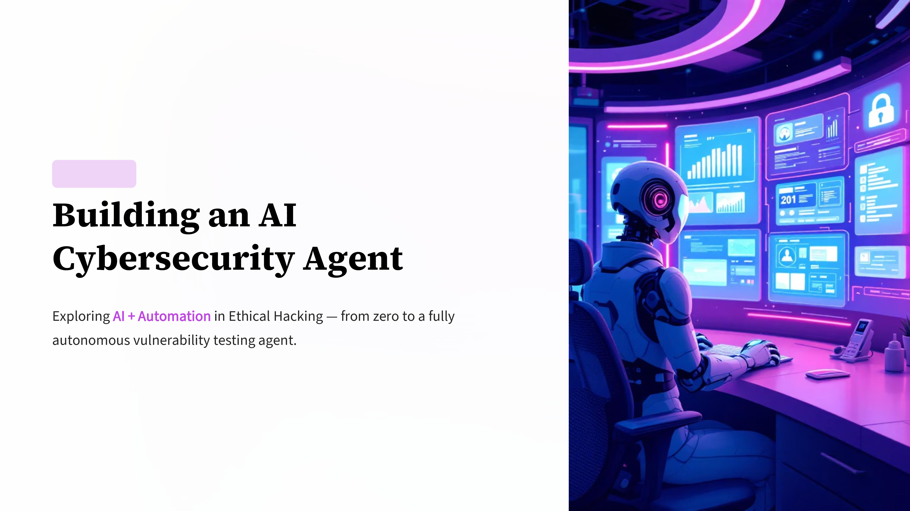
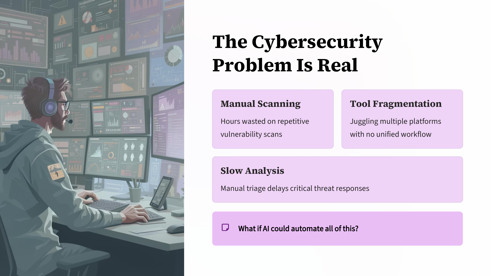
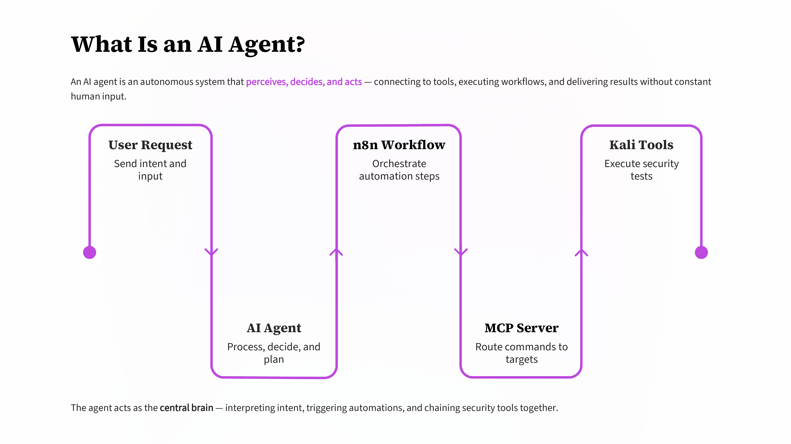
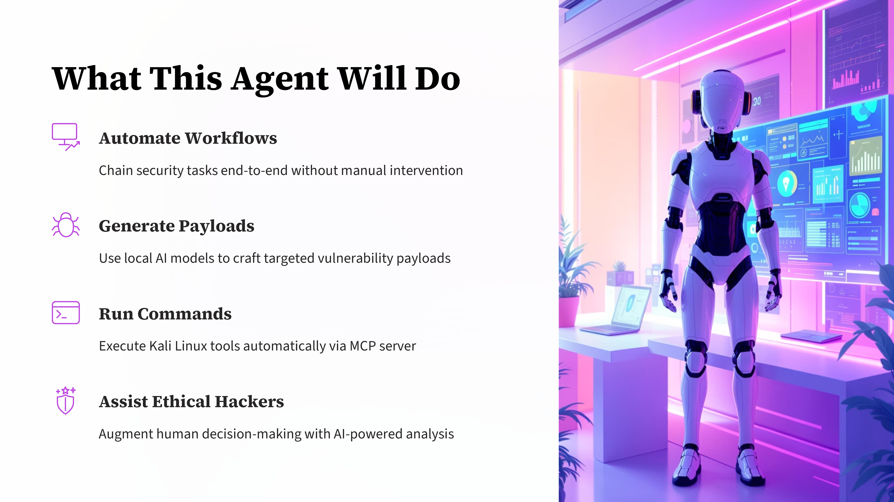
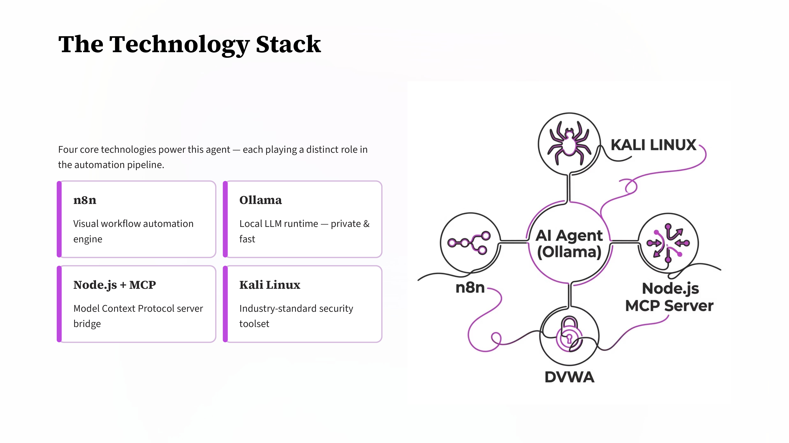
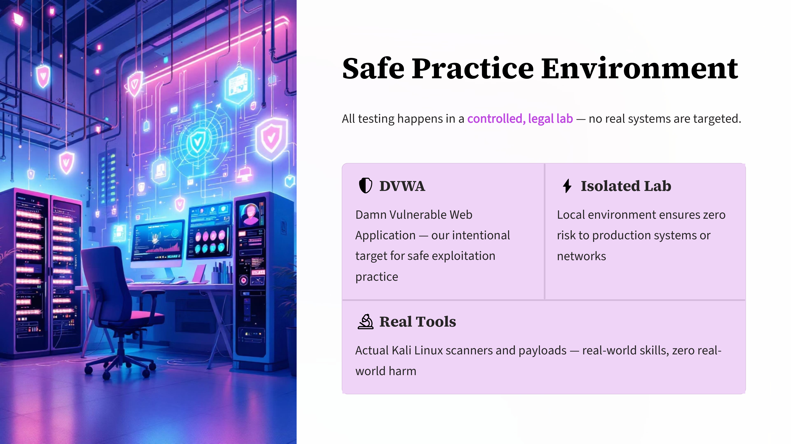
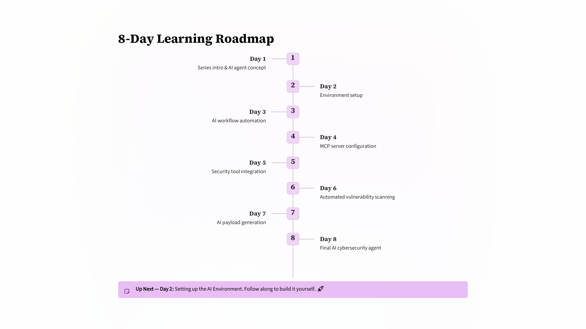

Day 94 – 100 Days of Ethical Hacking
Starting a New Project: AI Cybersecurity Agent

While practicing vulnerability testing, I realized that many security tasks are repetitive — running scans, testing payloads, and analyzing results.

This sparked an idea:
Can an AI agent automate some of these tasks?

To explore this, I’m starting an 8-day experiment to build a simple AI-powered cybersecurity assistant.

The agent will combine:

n8n for automation
Ollama for local AI models
Node.js for building an MCP server
Kali Linux security tools for scanning and testing

All testing will be done on intentionally vulnerable practice environments like DVWA.

This repository will document the progress of the project across 8 days, from setup to a working AI agent capable of automating cybersecurity tasks.

Learning via Skills Uprise Mentored by Manoj Kumar                         

LinkedIn: https://www.linkedin.com/company/skills-uprise

CEO: https://www.linkedin.com/in/manoj-kumar

