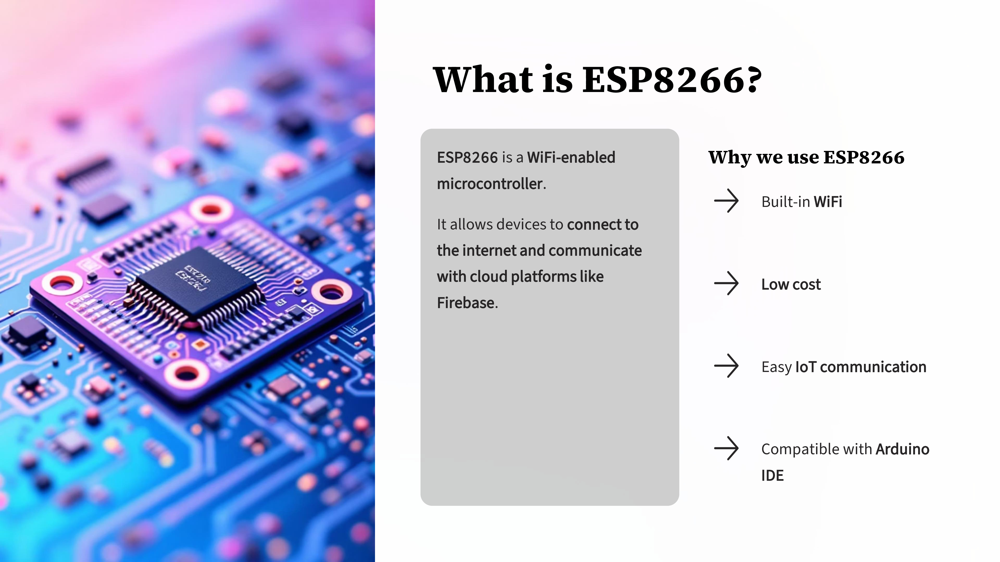
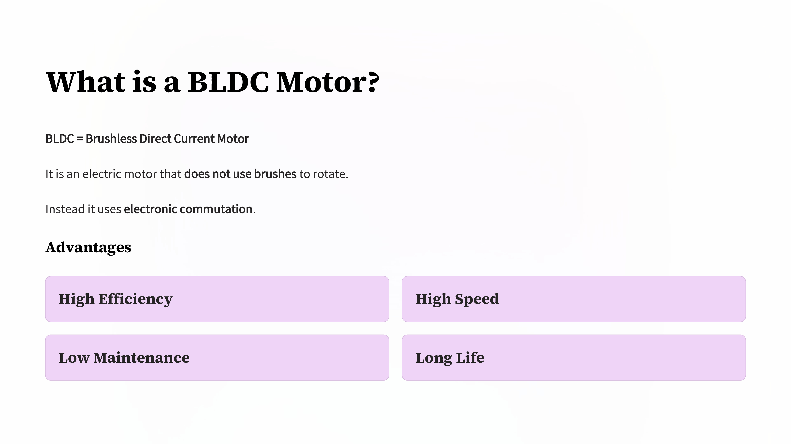
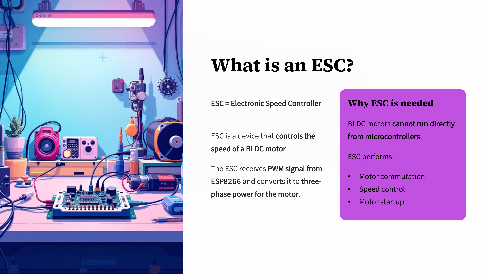
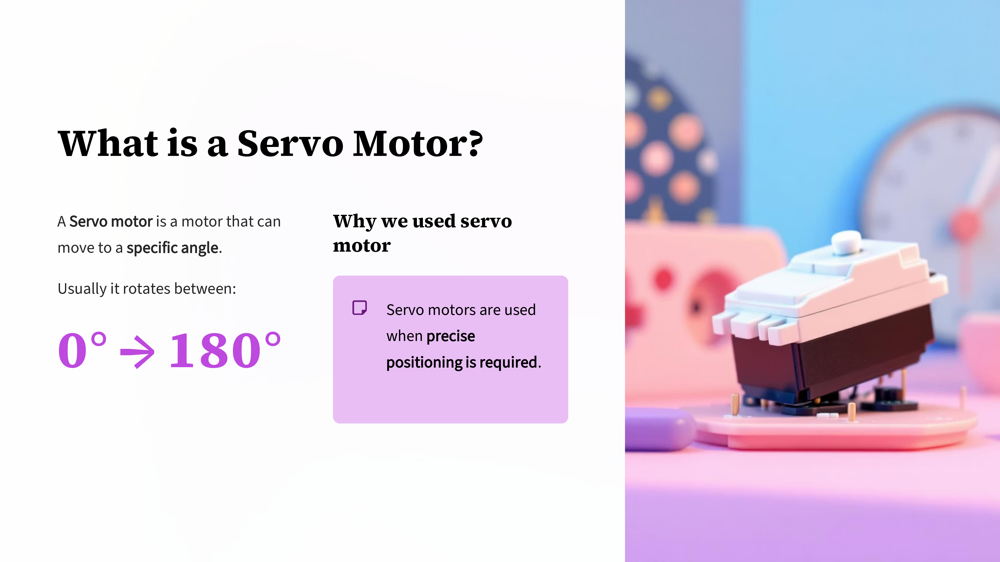
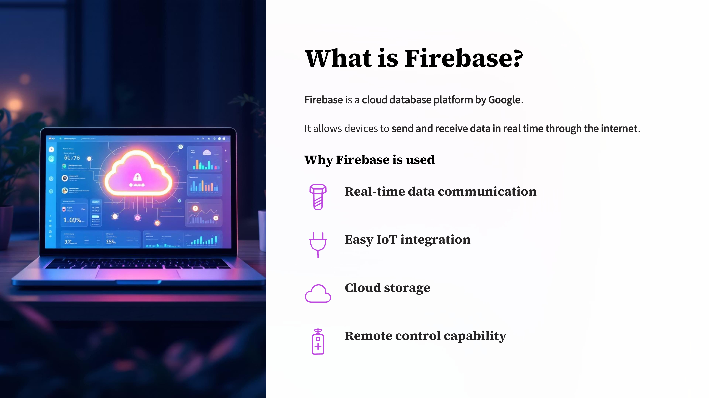
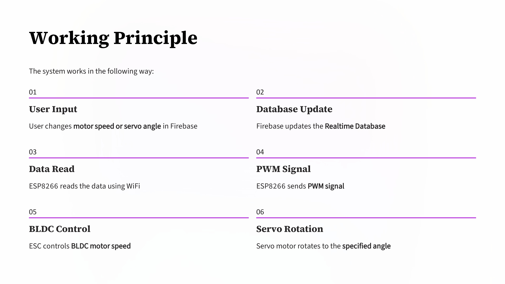
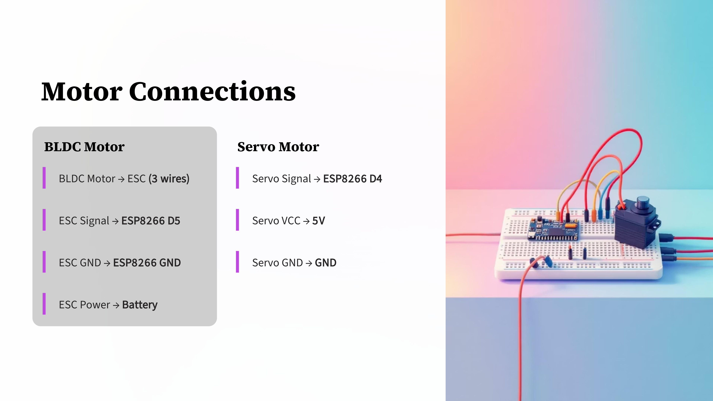
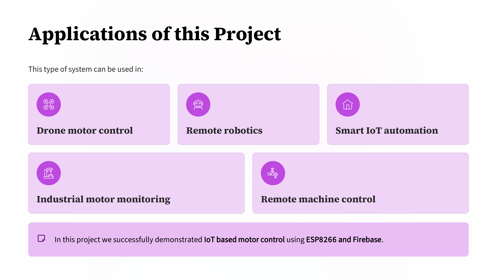

Day 96 – IoT Motor Control using ESP8266

Explored a system where a BLDC motor and a servo motor are controlled remotely using ESP8266 and Firebase.

Workflow:
User updates values in Firebase
ESP8266 reads data via WiFi
PWM signal controls ESC and servo motor

Components:
ESP8266
BLDC Motor
ESC
Servo Motor
Firebase Realtime Database

This demonstrates real-time IoT based motor control using cloud communication.

Learning via Skills Uprise Mentored by Manoj Kumar                         

LinkedIn: https://www.linkedin.com/company/skills-uprise

CEO: https://www.linkedin.com/in/manoj-kumar

