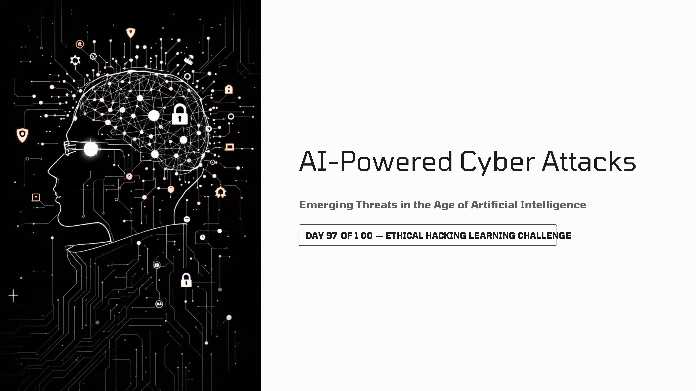
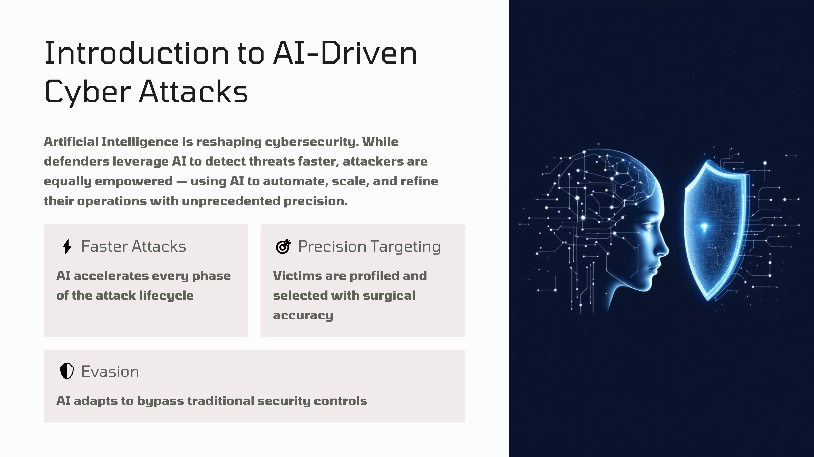
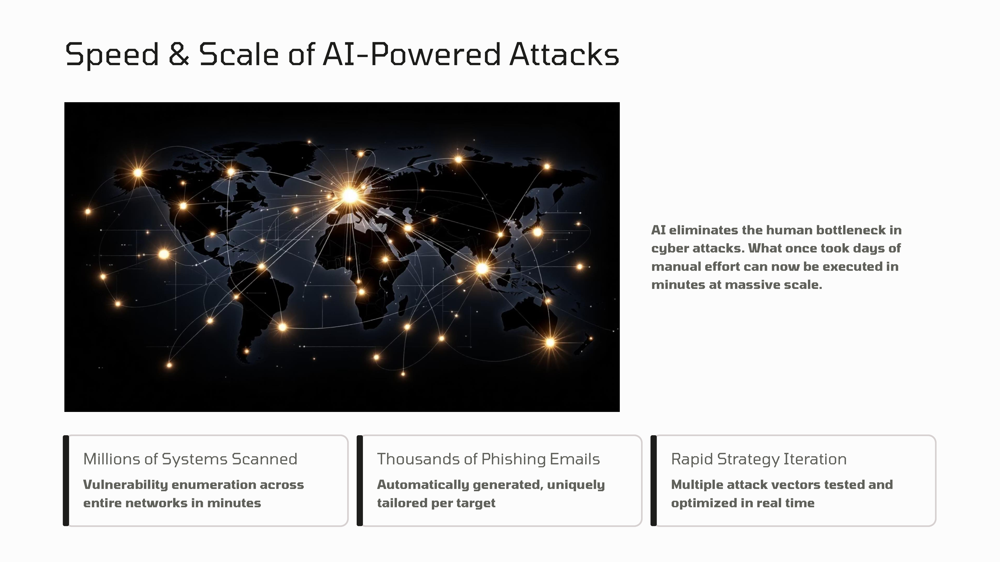
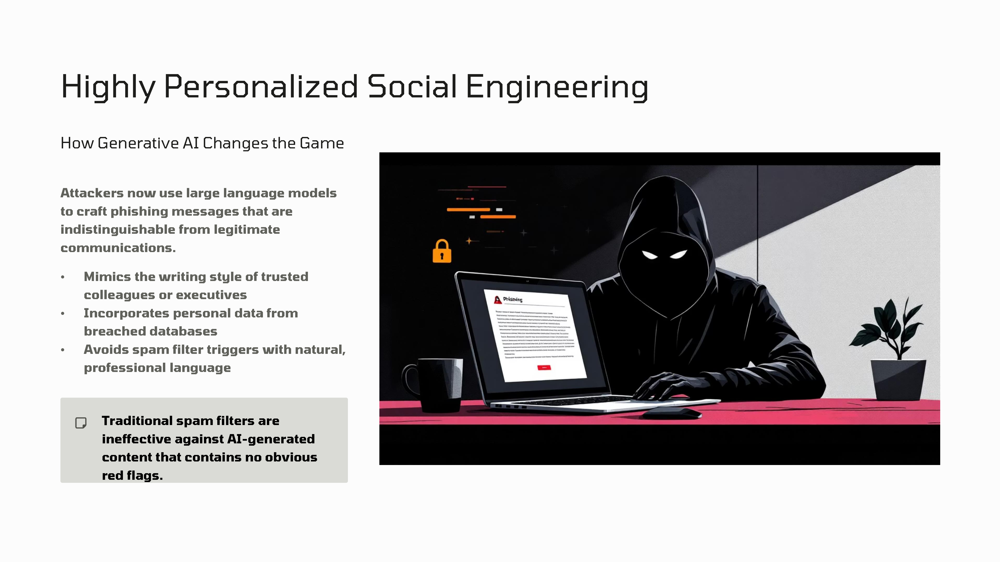
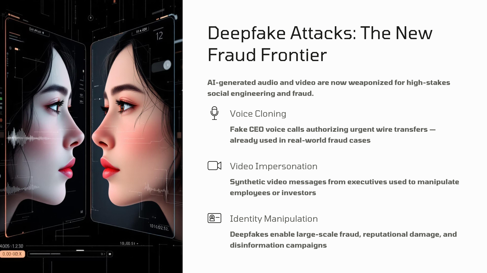
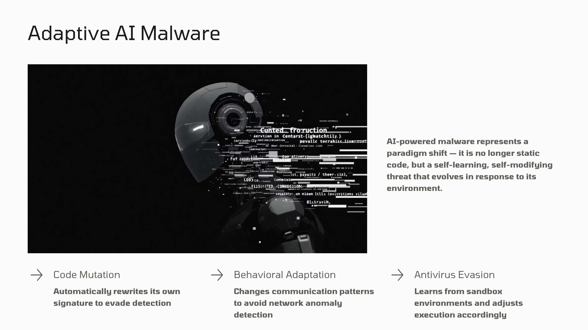
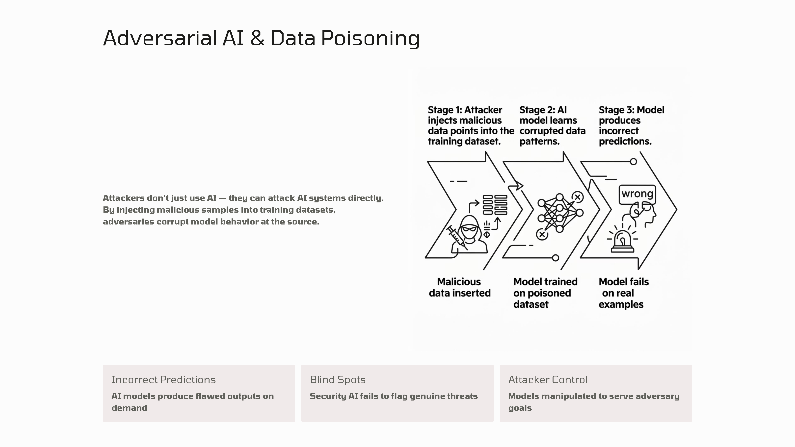
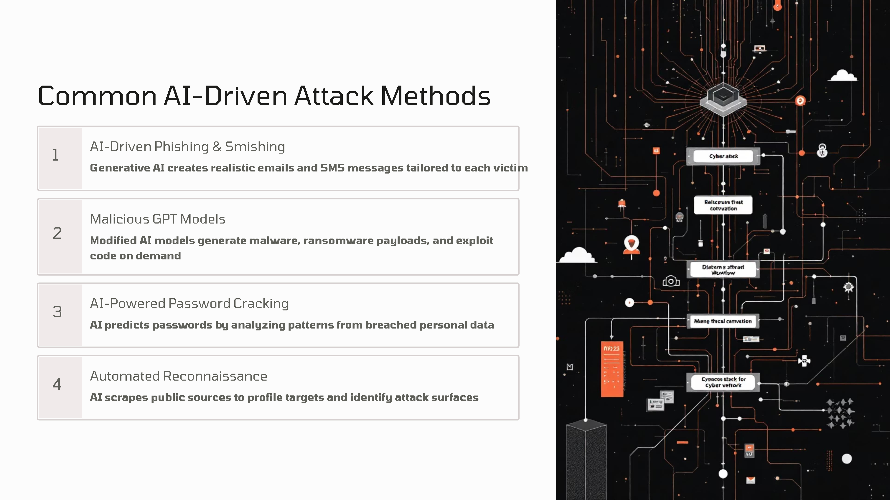
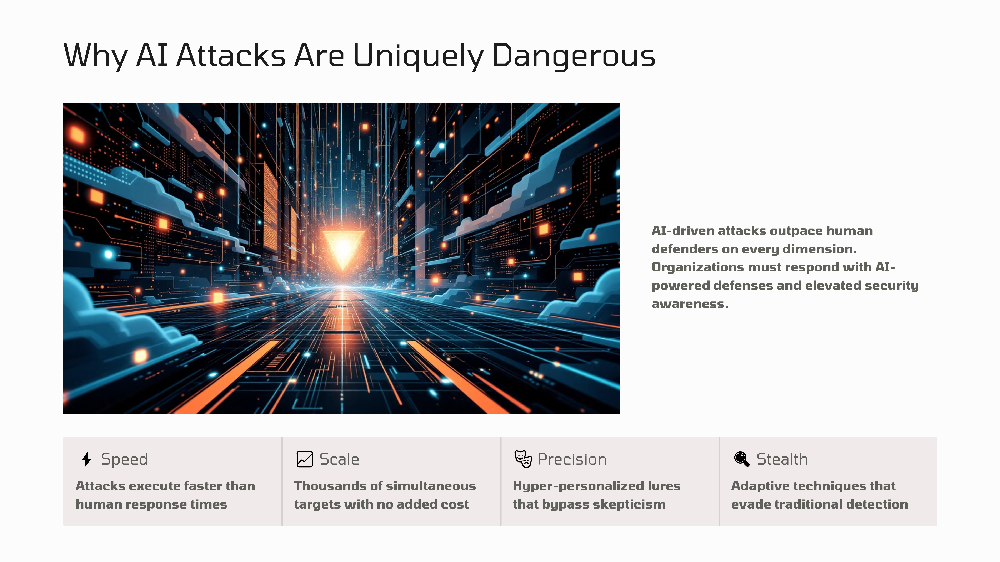
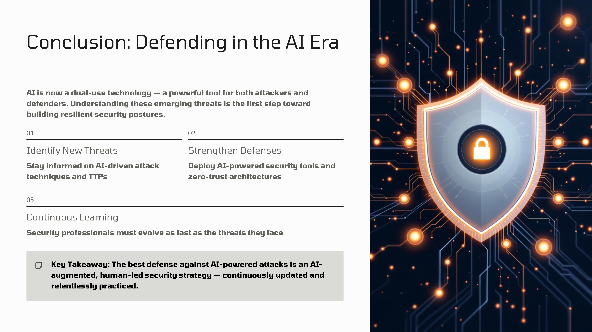

Day 97 – AI Powered Cyber Attacks

Today I studied how Artificial Intelligence is used in cyber attacks.

Topics Covered

AI-driven phishing
Deepfake attacks
Adaptive malware
AI-based password cracking
Automated reconnaissance

Key Insight:
AI makes cyber attacks faster, scalable, and more sophisticated, which increases the importance of advanced cybersecurity defenses.

Learning via Skills Uprise Mentored by Manoj Kumar                         

LinkedIn: https://www.linkedin.com/company/skills-uprise

CEO: https://www.linkedin.com/in/manoj-kumar

