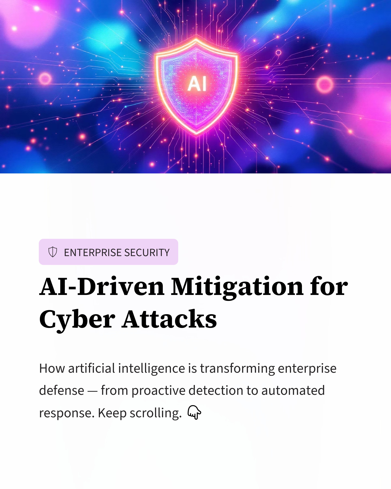
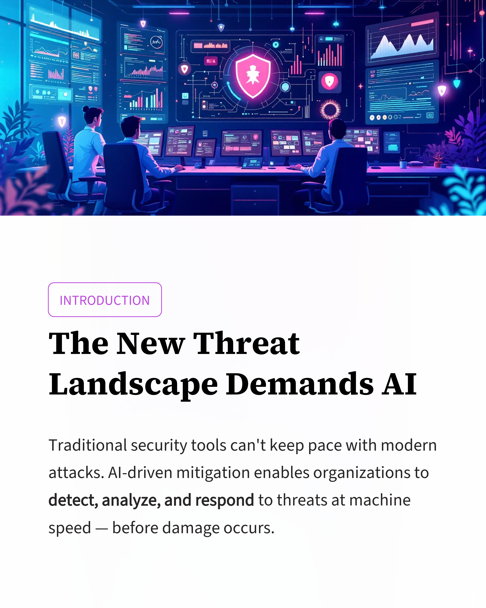
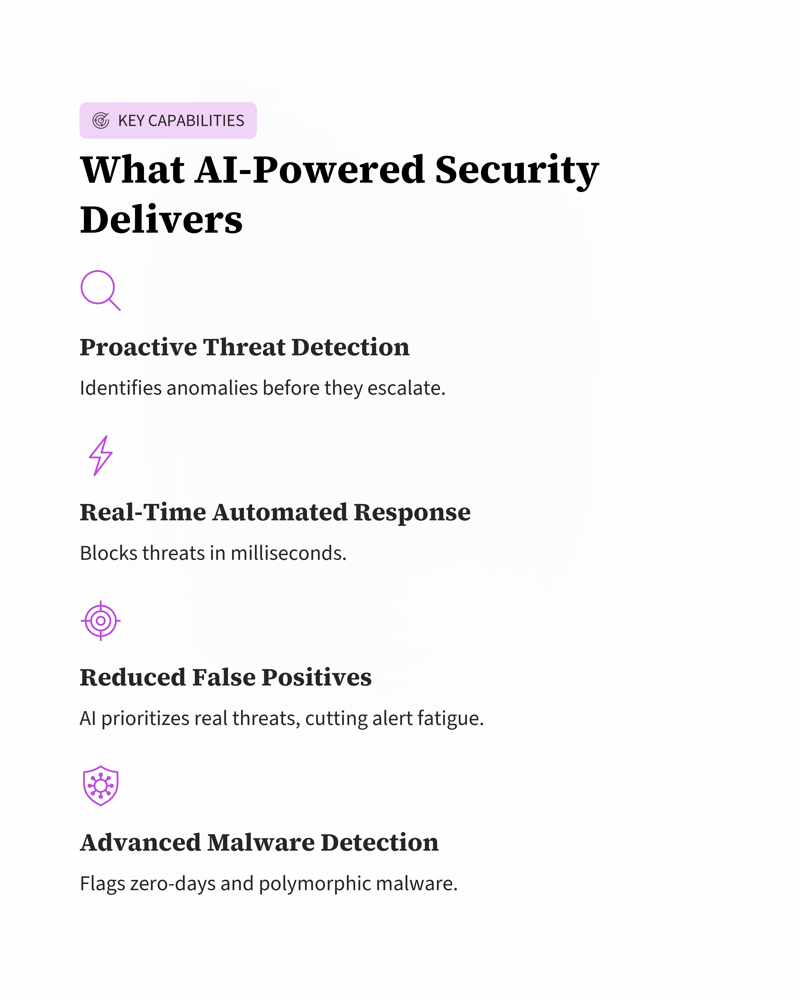
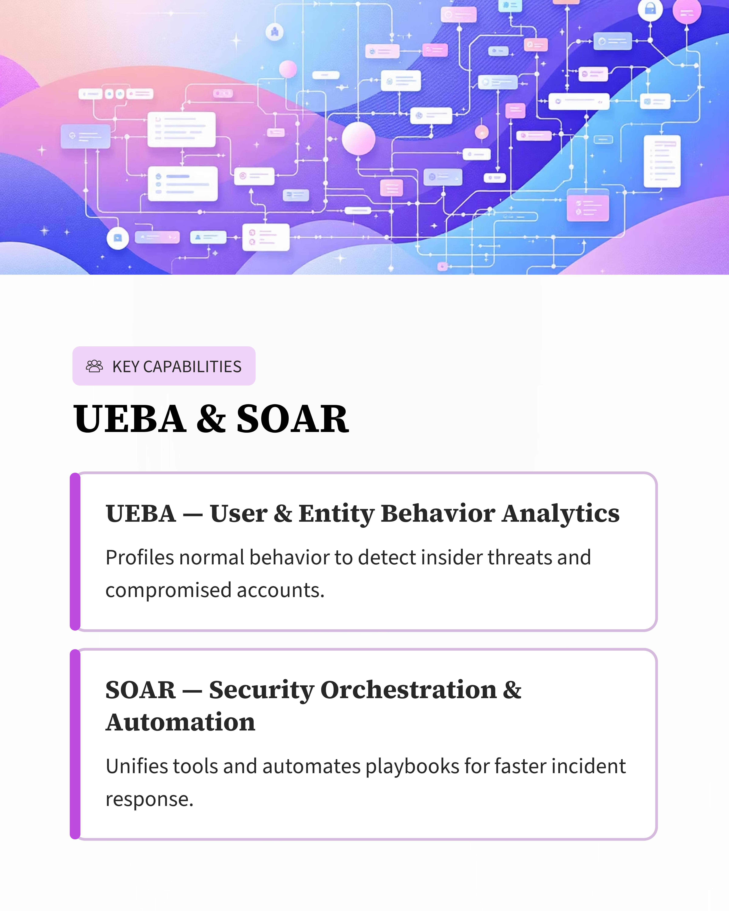
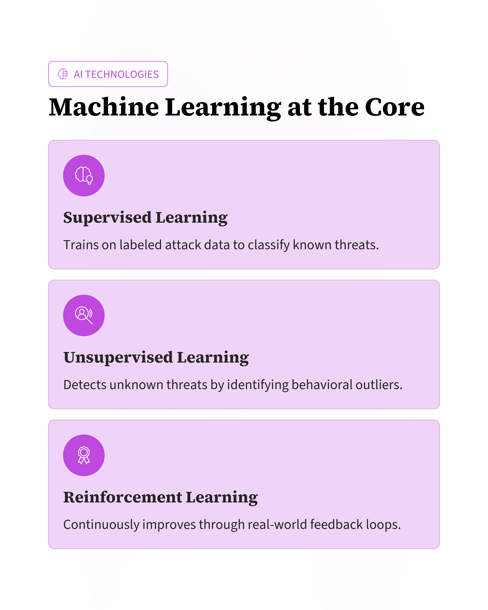
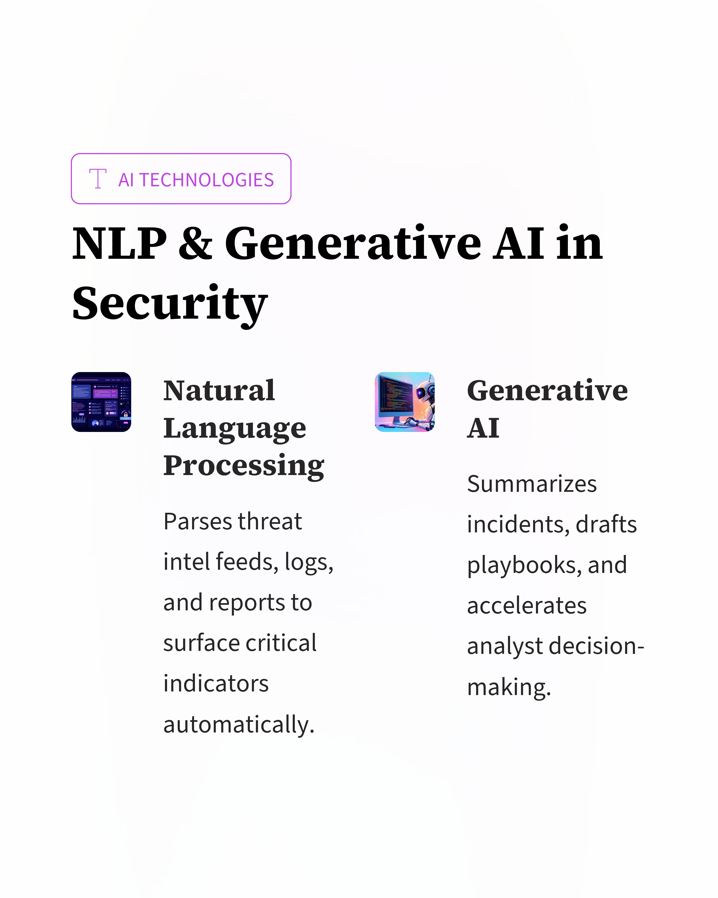
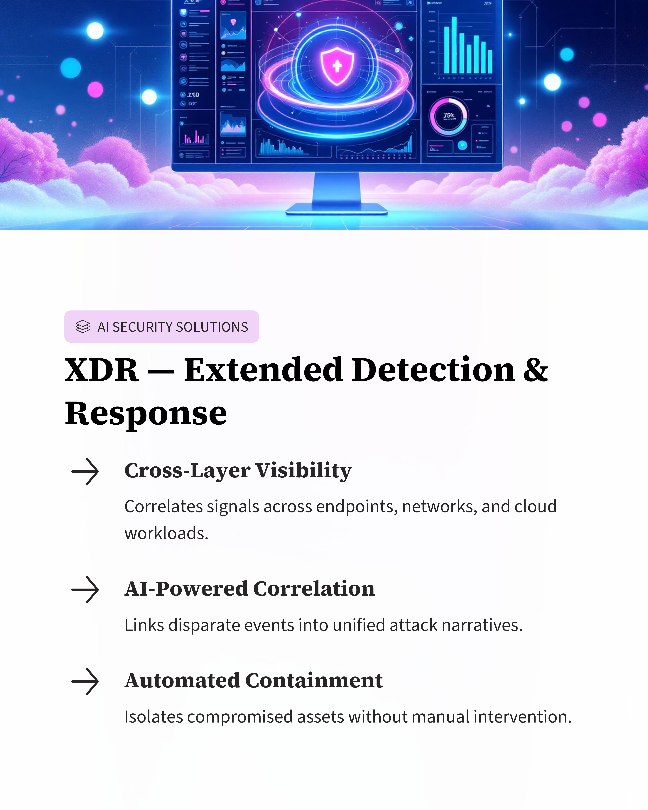
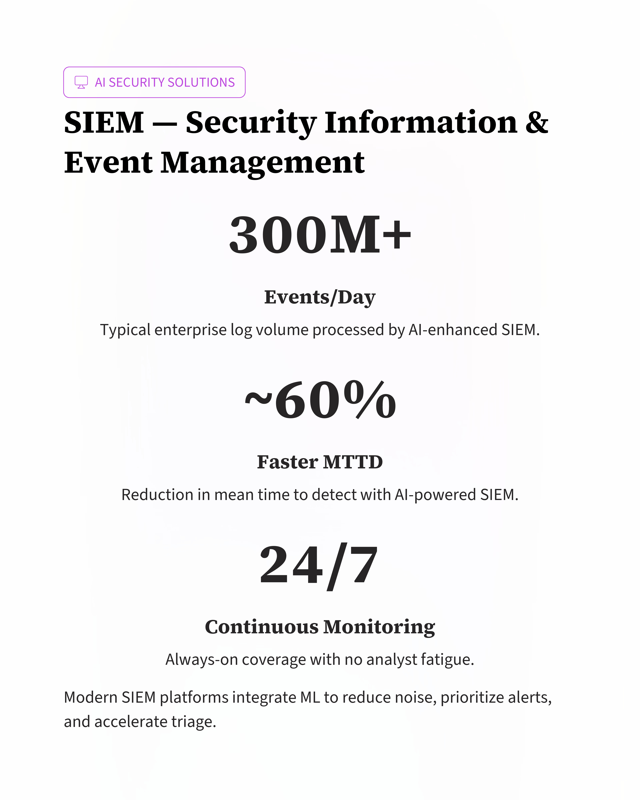
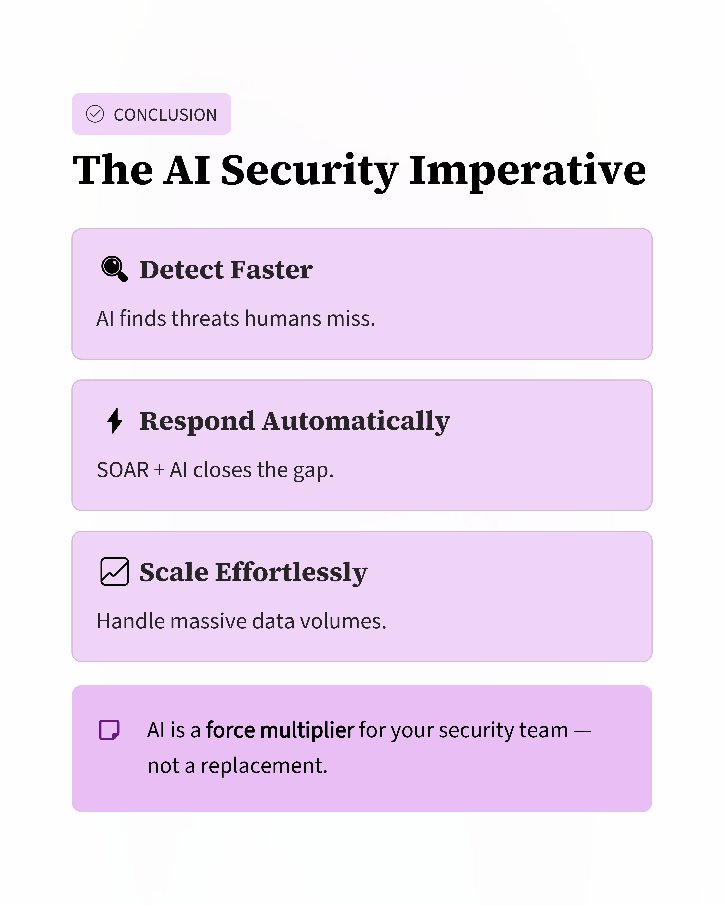

Day 98 – AI-Driven Cyber Attack Mitigation

Today I studied how AI helps detect and mitigate cyber threats automatically.

Key points:

AI detects anomalies in network traffic and user behavior
Real-time response like blocking malicious traffic or isolating devices
Deep learning helps detect advanced malware
Automation through SOAR improves incident response

AI technologies used: Machine Learning, NLP, Generative AI

Many platforms from Fortinet, Palo Alto Networks, and Microsoft use AI for advanced threat detection.

Learning via Skills Uprise Mentored by Manoj Kumar                         

LinkedIn: https://www.linkedin.com/company/skills-uprise

CEO: https://www.linkedin.com/in/manoj-kumar

