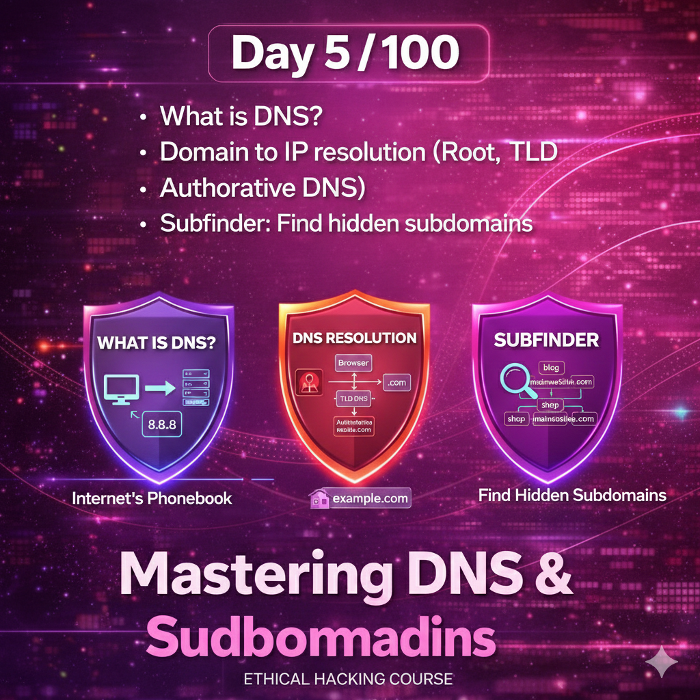
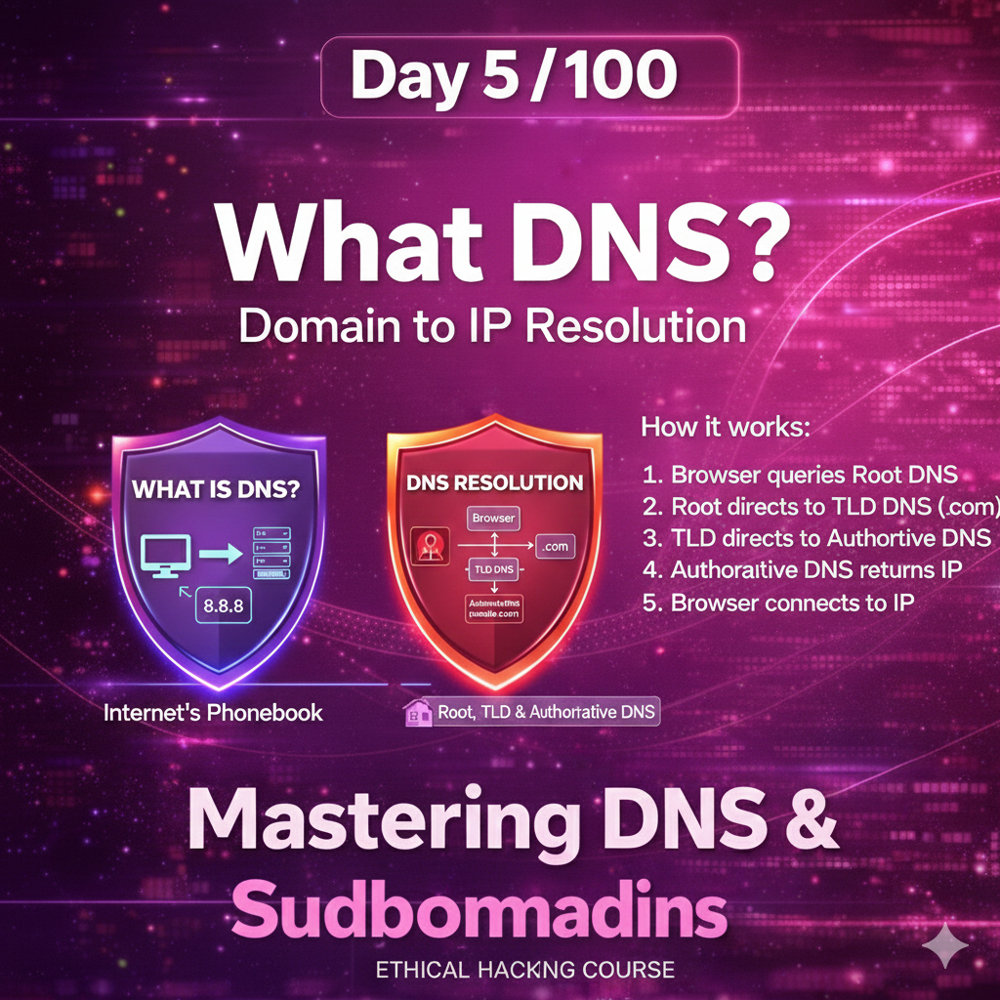
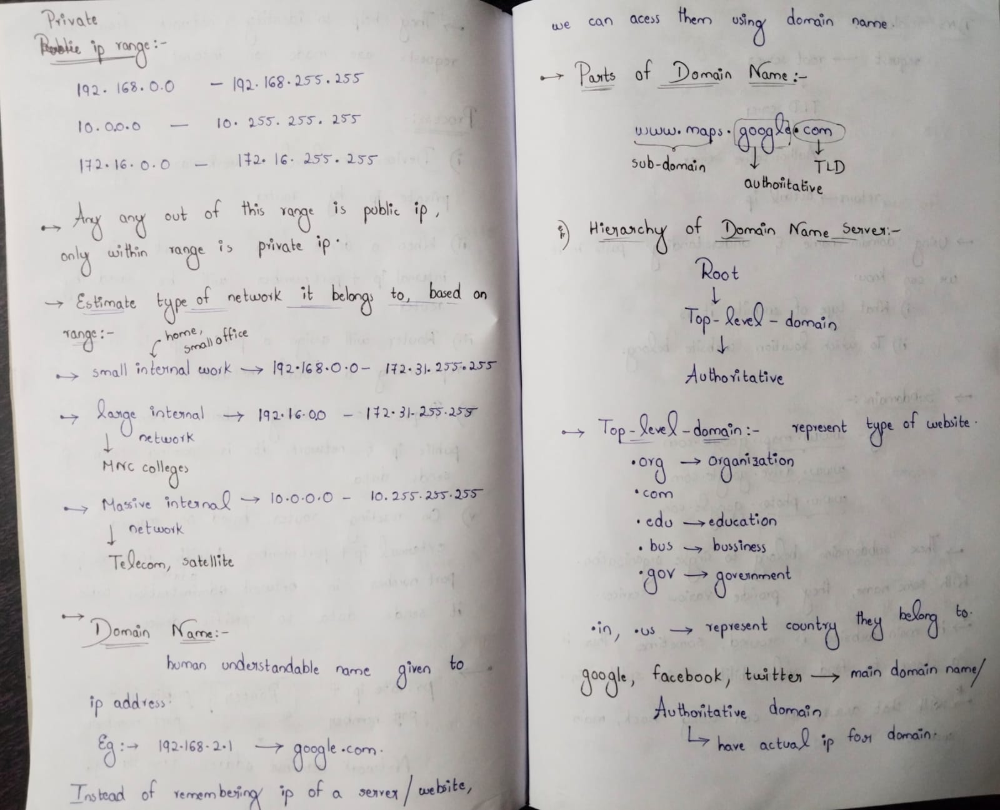
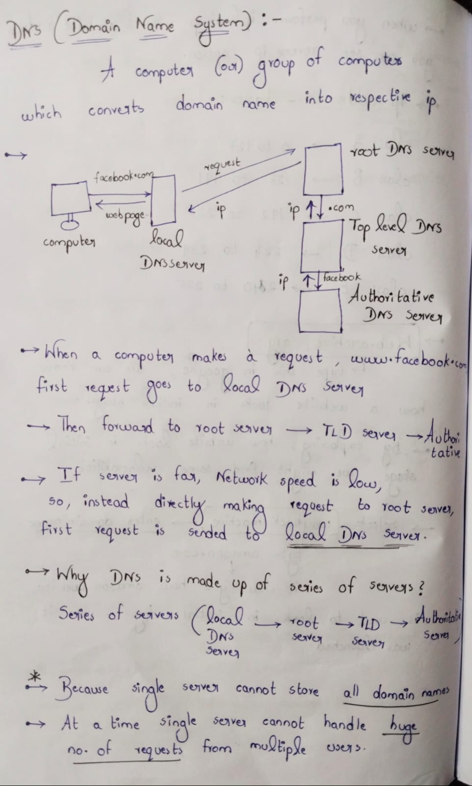
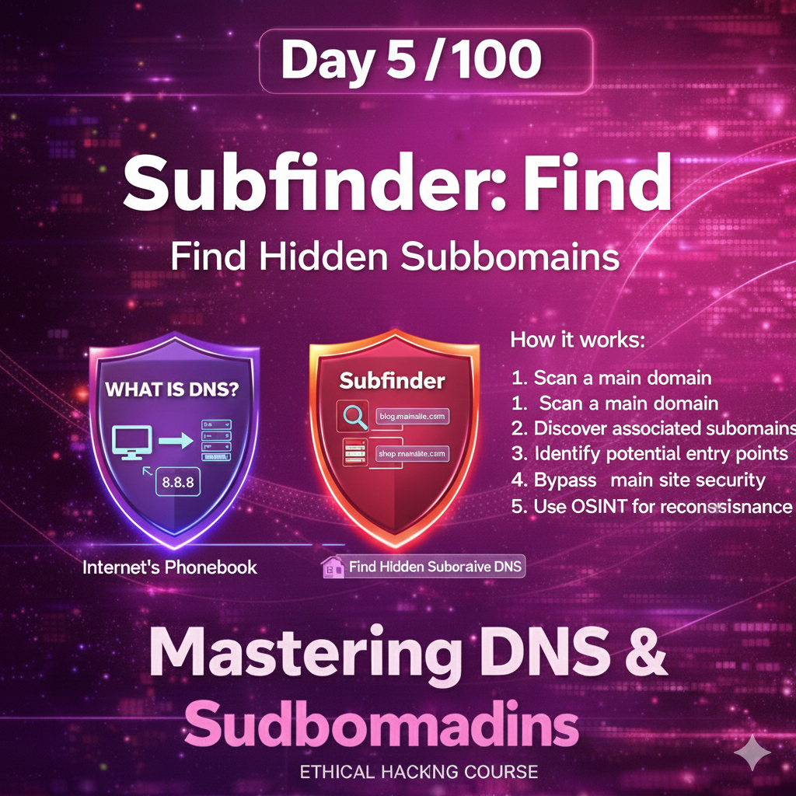
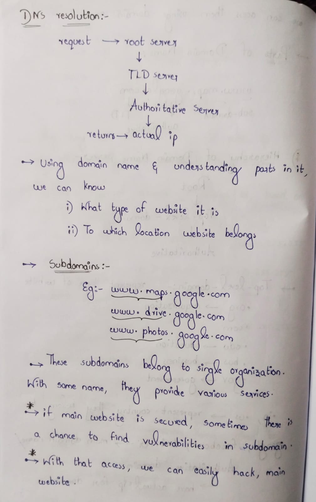
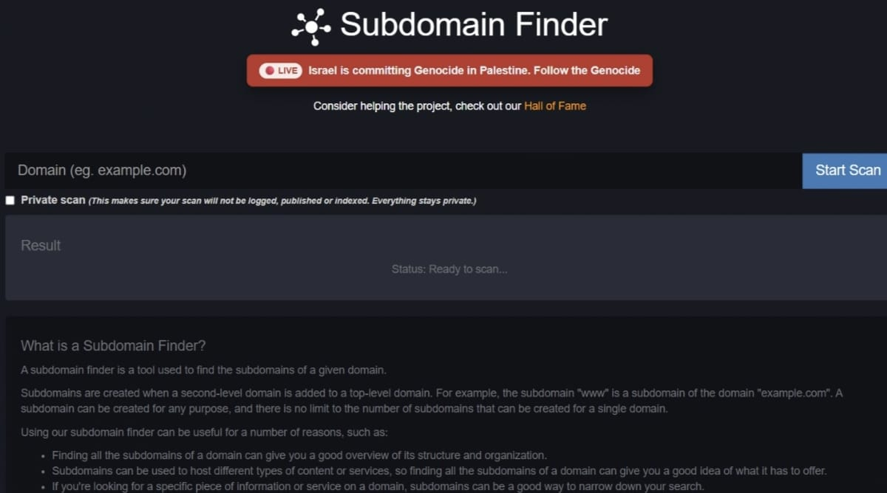

-->Day 05 – Domain Names, DNS, and Subdomain Enumeration

-->What I Explored Today

While using websites daily, I never thought about how a domain name actually works behind the scenes.
Today’s learning helped me understand that hidden process.

I learned that a domain name is made of different parts and that converting it into an IP address happens in stages.
A request first reaches the Root DNS, then the Top-Level Domain server, and finally the Authoritative DNS, which provides the correct IP address.
This layered process showed me how organized and structured the internet really is.The most important lesson came from a security perspective.

Even if a company secures its main website strongly, subdomains are often overlooked.
Attackers enumerate subdomains to find forgotten admin panels, test environments, and legacy applications.

To understand this practically, I used an online subdomain finder tool on a deliberately vulnerable website (testphp.vulnhub.com).
This helped me realize how unsecured or forgotten subdomains can become real entry points during attacks.

-->Key Reflection:-
Security is not just about protecting what is visible.
It is also about securing what is hidden and often ignored.

These notes represent my learning from Day 5 of the 100 Days Ethical Hacking Challenge.

Learning via Skills Uprise  
Mentored by Manoj Kumar  

LinkedIn: https://www.linkedin.com/company/skills-uprise  
CEO: https://www.linkedin.com/in/manoj-kumar

