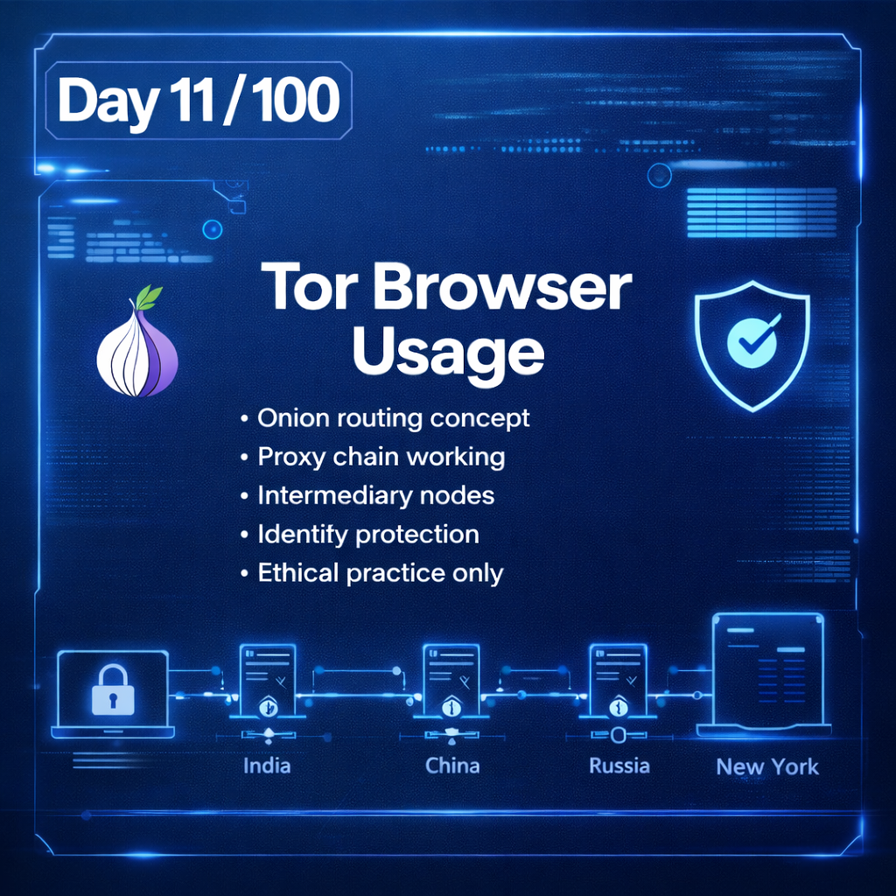
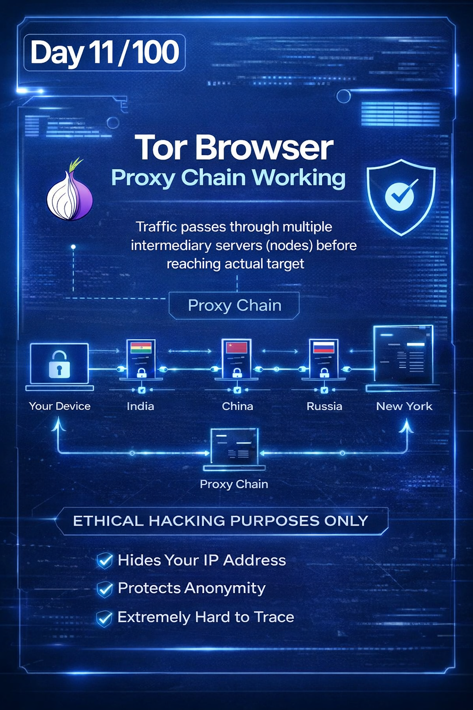
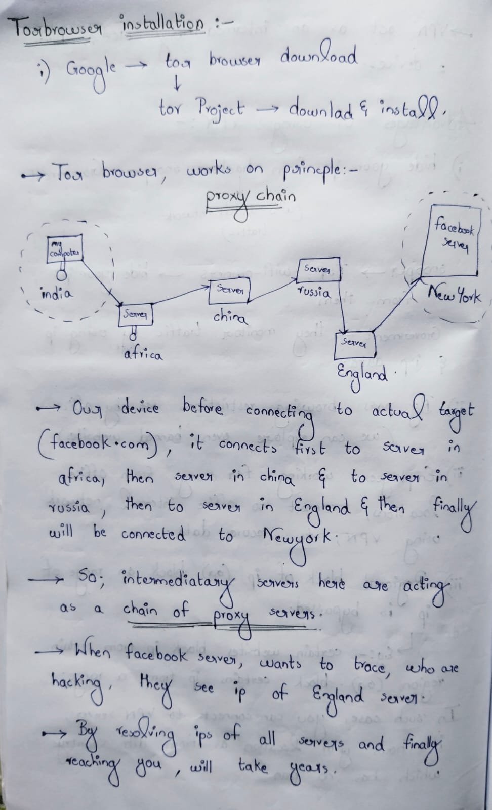
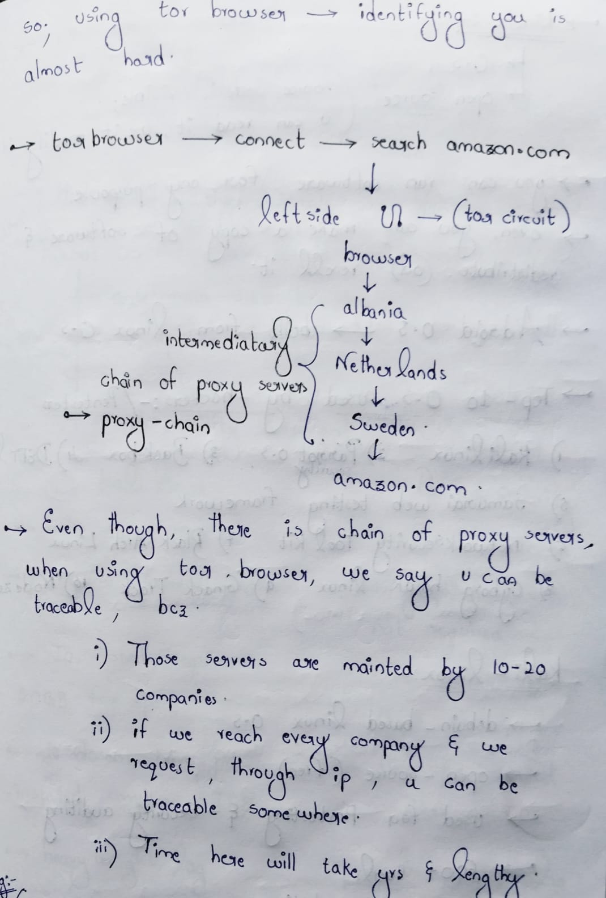
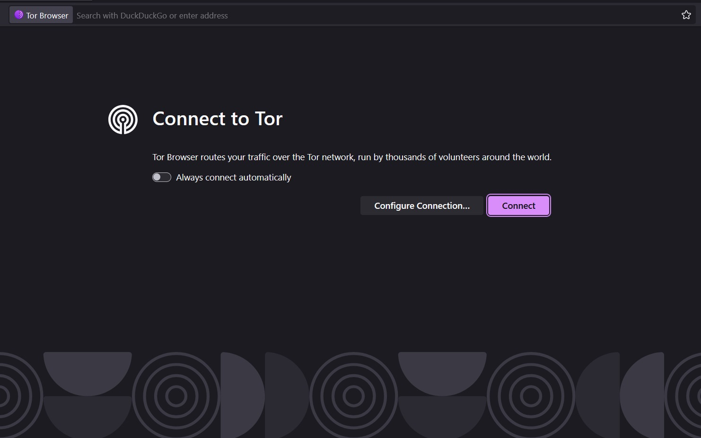
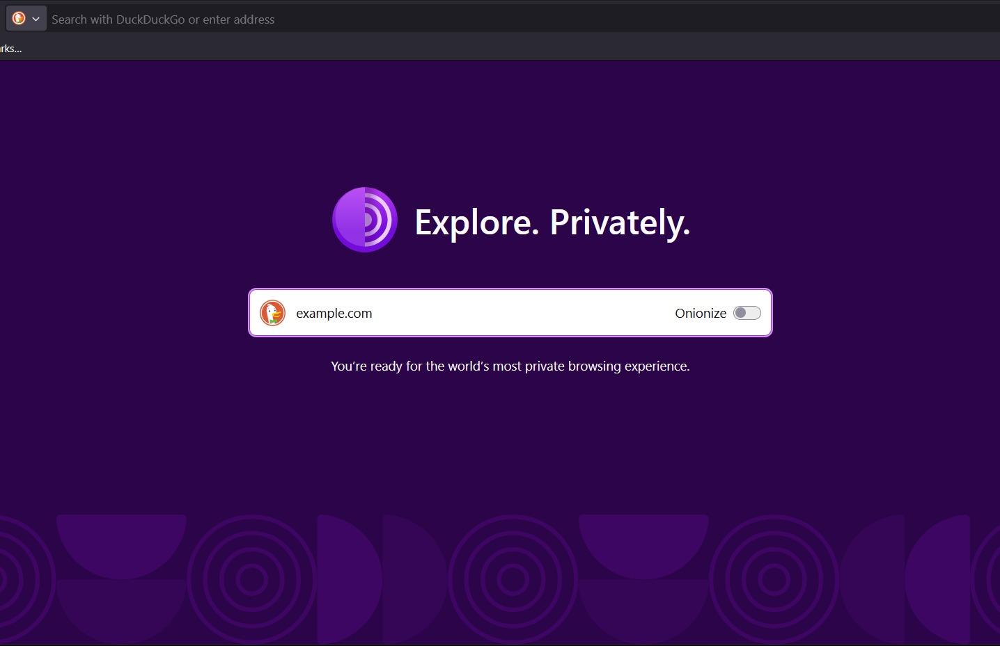
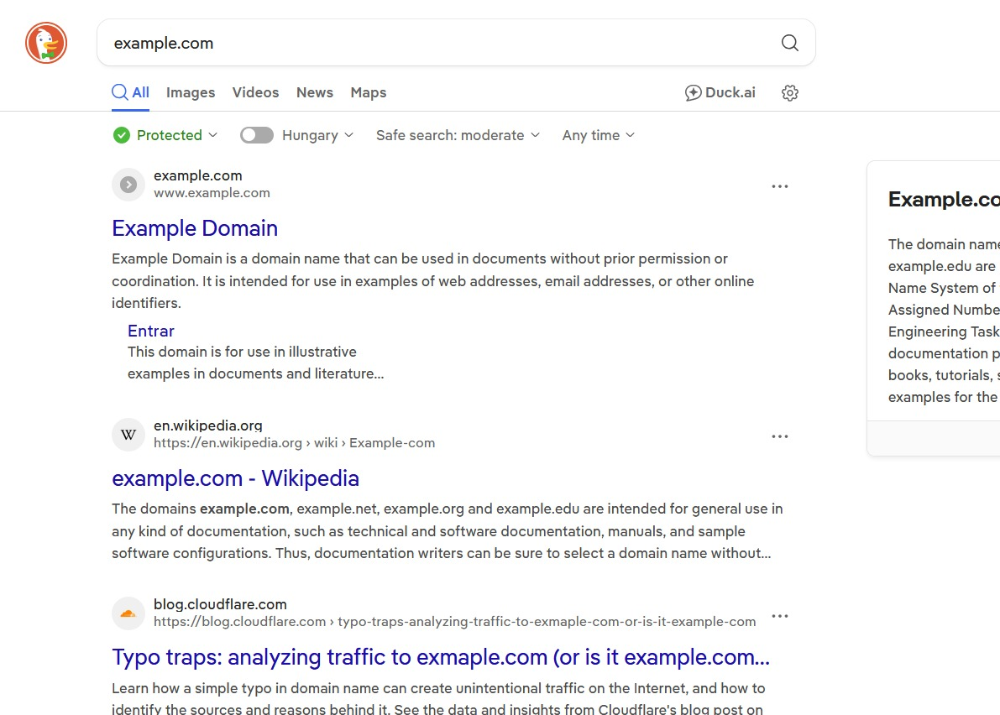
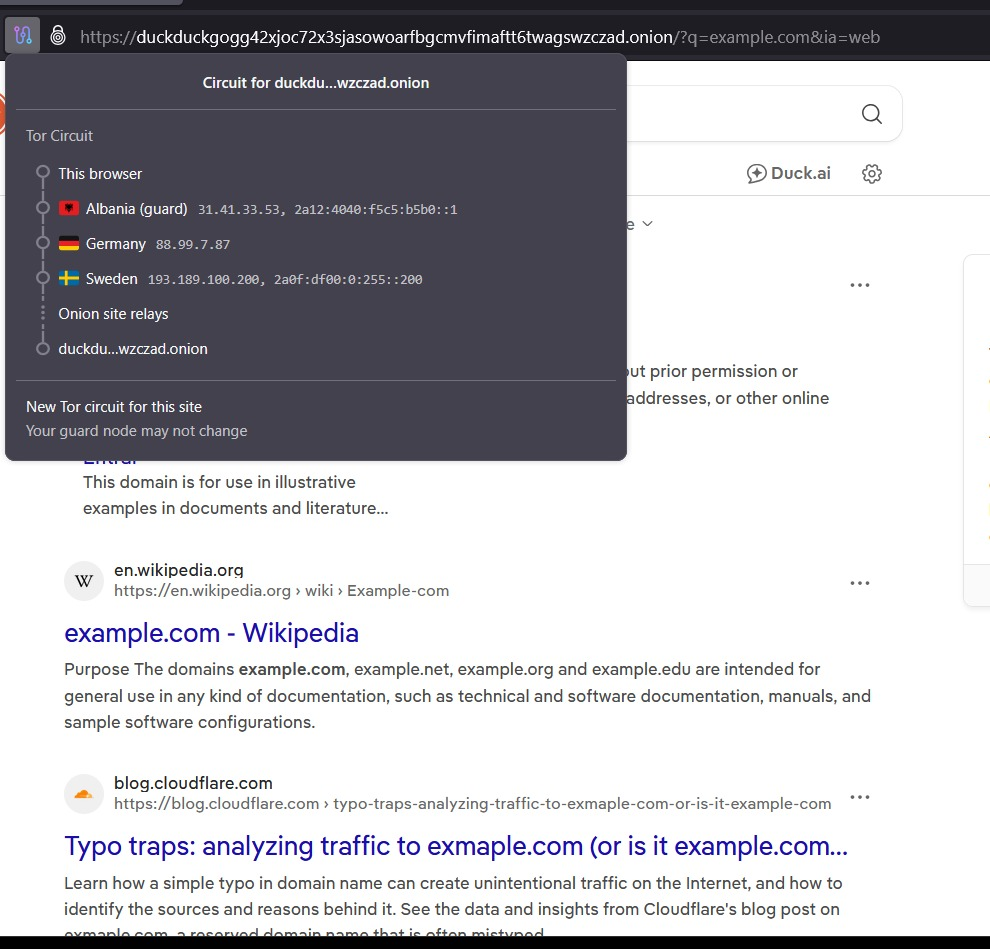

Day 11/100 Days-Ethical hacking learning challenge.

 What I Learned
- Installation and basic usage of Tor Browser
- Understanding how Tor works using a proxy chain (Tor circuit)
- Concept of intermediary relay servers
- How anonymity is achieved through layered routing

-->How Tor Works (Simple Explanation)
1. User connects to Tor Browser
2. Traffic is routed through multiple servers (relays)
3. Each relay knows only the previous and next node
4. Final request reaches the destination website
5. Target sees only the last relay, not the real user IP

-->Practical Activity
- Connected to example.com for safe practice
- Observed Tor circuit and relay countries
- No real-world targets used

-->Ethical Disclaimer
This learning activity was performed strictly for educational purposes.
No unauthorized access, scanning, or illegal actions were carried out.

-->Key Takeaway
Tor is a privacy tool, not a hacking tool.  
Understanding it helps security professionals design better defenses.

Learning via Skills Uprise Mentored by Manoj Kumar                         

LinkedIn: https://www.linkedin.com/company/skills-uprise

CEO: https://www.linkedin.com/in/manoj-kumar

