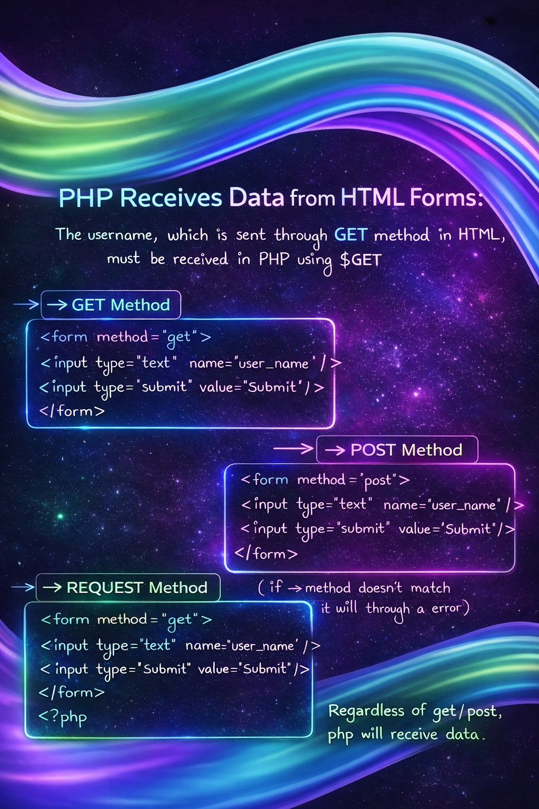

Day-24: Integrating HTML with PHP
100 Days Ethical Hacking Challenge
What I Learned:-

HTML is used to design web pages and collect user input, but it cannot process data or perform server-side logic.
To handle form data, apply logic, and make websites dynamic, PHP is required.

By integrating HTML with PHP, user input can be securely received and processed on the server.

Key Concepts Covered:-
HTML form handling
Server-side processing using PHP
Data transfer using GET and POST methods
Matching form method with PHP superglobal

In this learning, I have discussed GET and POST methods, but PHP also provides the $_REQUEST method, which allows us to receive form data without worrying about whether it was sent using GET or POST.

Important Rule:-
If the form uses GET, PHP must use $_GET.
If the form uses POST, PHP must use $_POST.

HTML Form
<form action="getdata.php" method="get">
    <input type="text" name="city" placeholder="Enter city">
    <input type="submit">
</form>

PHP File
<?php
echo "City: " . $_GET['city'];
?>

Why This Is Important:-
Builds dynamic and interactive websites
Foundation for login and registration systems
Helps understand web vulnerabilities like parameter tampering
Essential for backend and cybersecurity learning

Learning via Skills Uprise Mentored by Manoj Kumar                         

LinkedIn: https://www.linkedin.com/company/skills-uprise

CEO: https://www.linkedin.com/in/manoj-kumar

-->Day-24 completed successfully in my 100 Days Ethical Hacking Challenge
