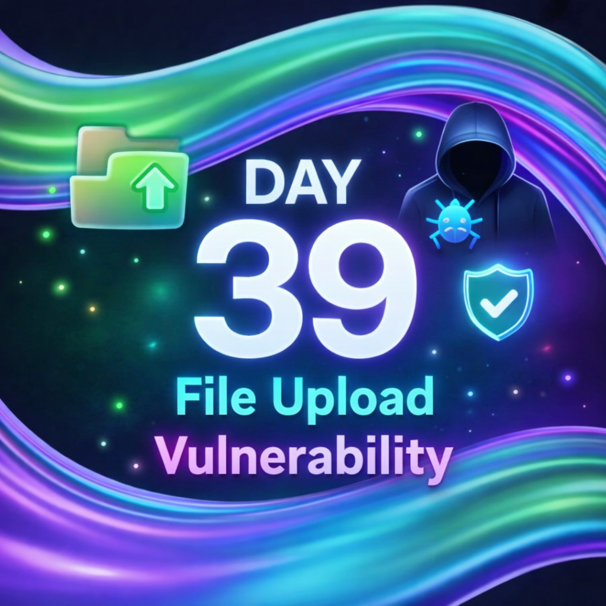
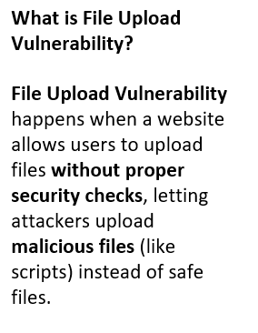
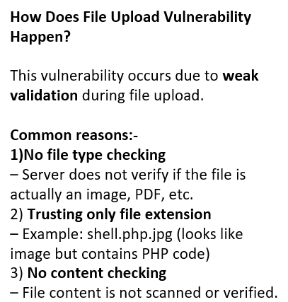
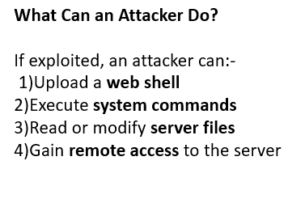
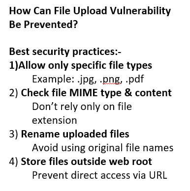

Day-39: File Upload Vulnerability

As part of my 100 Days of Ethical Hacking Challenge, I studied File Upload Vulnerability, a critical web application security issue.

What is File Upload Vulnerability?
It occurs when a web application allows users to upload files without proper validation, enabling attackers to upload malicious files that can be executed on the server.

When does it occur?
Improper file type validation
Reliance only on file extensions
Publicly accessible upload directories
Execution permissions enabled on uploaded files

How attackers exploit it:
Attackers upload malicious scripts or web shells and access them via the browser to execute commands, read files, or gain unauthorized access.

Prevention techniques:
Strict allow-listing of file types
MIME type and content validation
Renaming uploaded files
Storing uploads outside the web root
Disabling execution permissions

This topic helped me understand the importance of secure file handling in web applications and how small flaws can lead to major security risks.

Learning via Skills Uprise Mentored by Manoj Kumar                         

LinkedIn: https://www.linkedin.com/company/skills-uprise

CEO: https://www.linkedin.com/in/manoj-kumar

