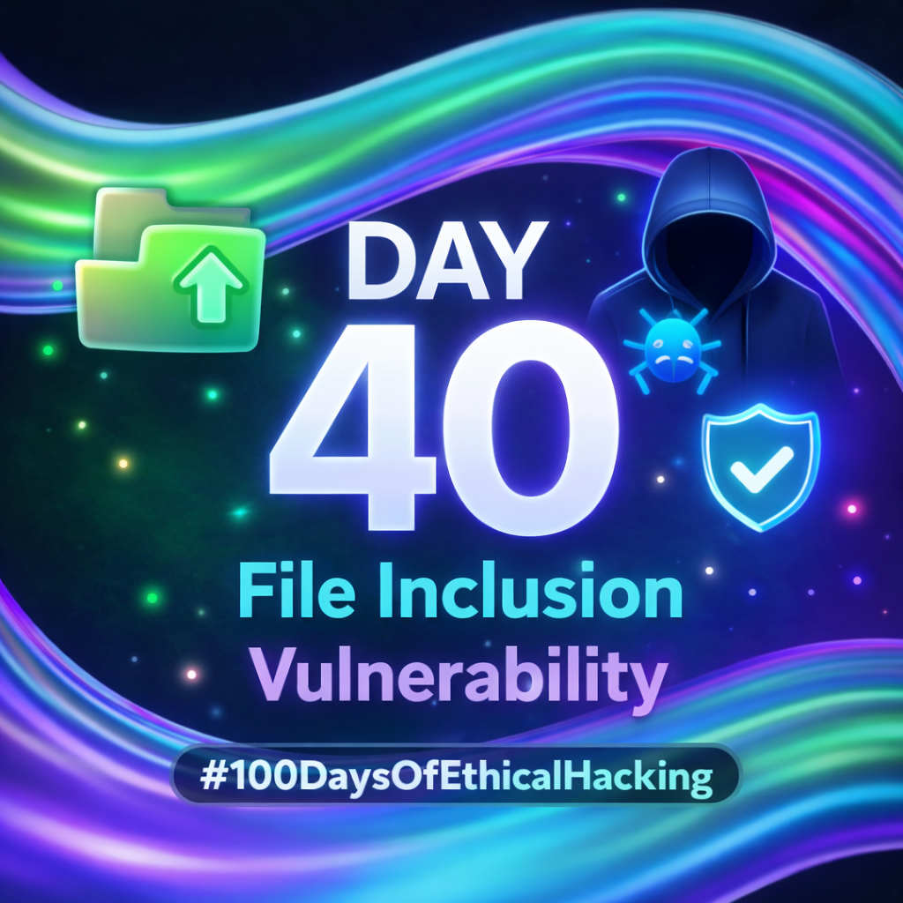
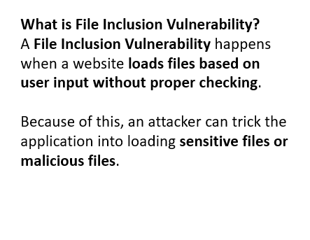
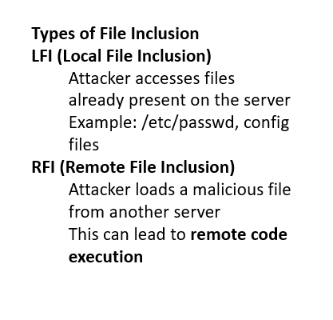
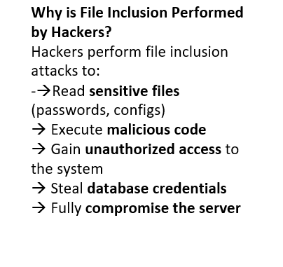
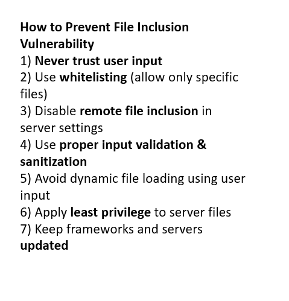

Day-40: File Inclusion Vulnerability

File Inclusion Vulnerability occurs when a web application includes files using unsanitized user input, leading to LFI or RFI attacks.

Covered Topics:-
Definition of File Inclusion Vulnerability
Difference between LFI and RFI
Why attackers exploit it
Common attack patterns using URL parameters
Prevention techniques (whitelisting, input validation, secure configs)

This knowledge is critical for identifying and mitigating real-world web vulnerabilities.

#Day40 #100DaysOfEthicalHacking #WebSecurity #OWASP #CyberSecurityLearning

Learning via Skills Uprise Mentored by Manoj Kumar                         

LinkedIn: https://www.linkedin.com/company/skills-uprise

CEO: https://www.linkedin.com/in/manoj-kumar

