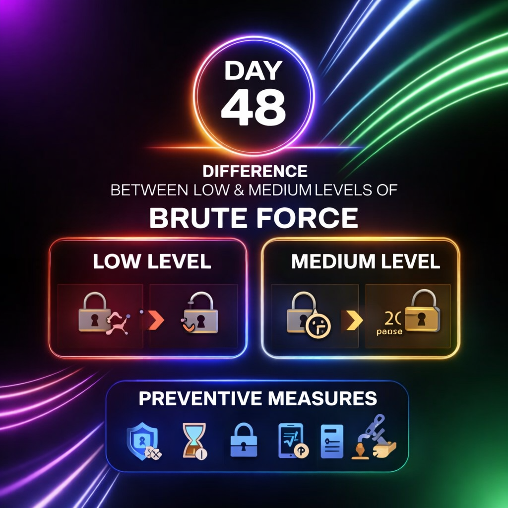

Day-48: Brute Force (Low vs Medium – DVWA)

Low level:
No validation
No delay
Unlimited attempts
→ Fast exploitation

Medium level:
Input validation
2-sec delay
Still unlimited attempts
→ Slower but exploitable

Takeaway
Time delay alone is not enough.
Proper defense requires:
Rate limiting, account lockout, 2FA, CAPTCHA, monitoring.

Learning via Skills Uprise Mentored by Manoj Kumar                         

LinkedIn: https://www.linkedin.com/company/skills-uprise

CEO: https://www.linkedin.com/in/manoj-kumar

