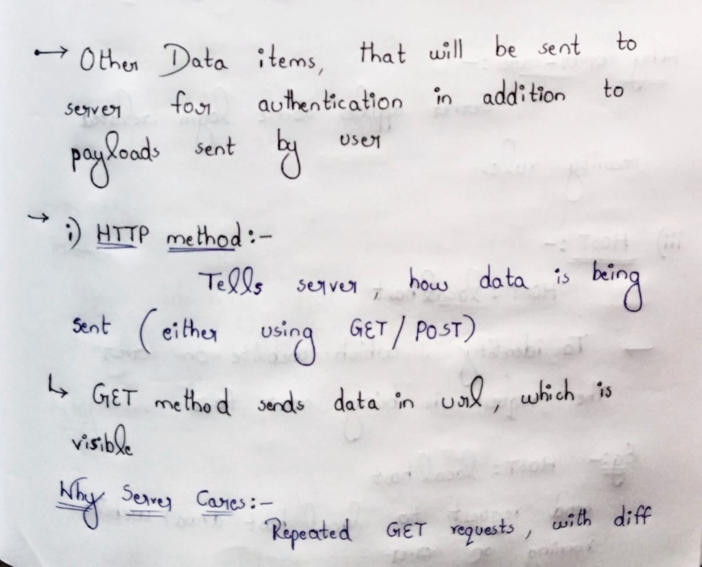
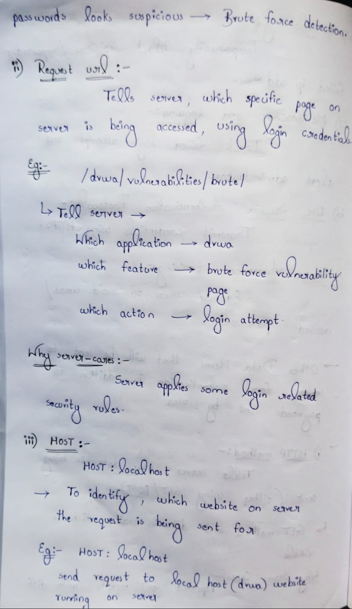
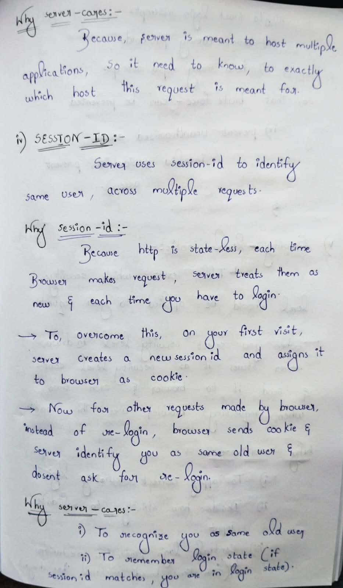
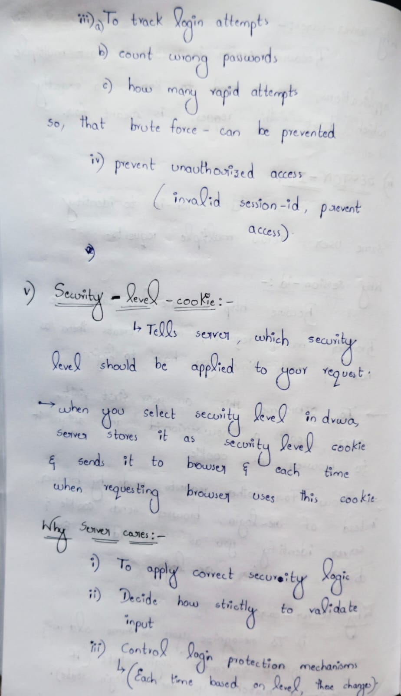
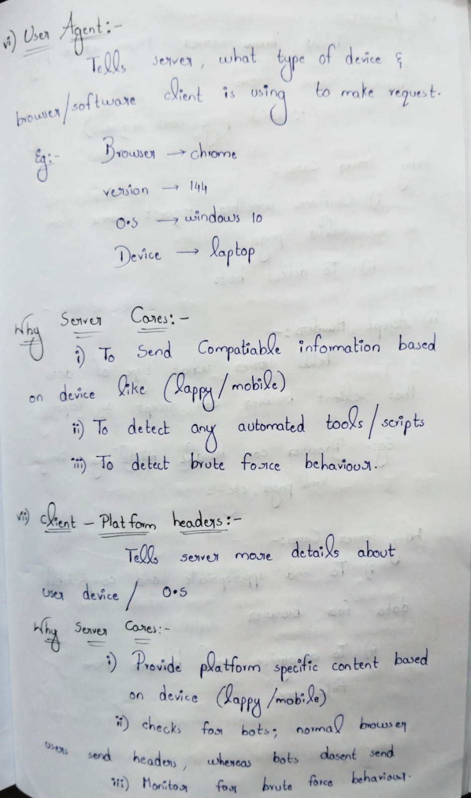
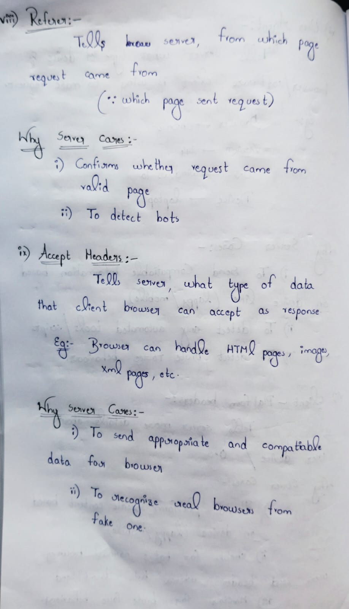
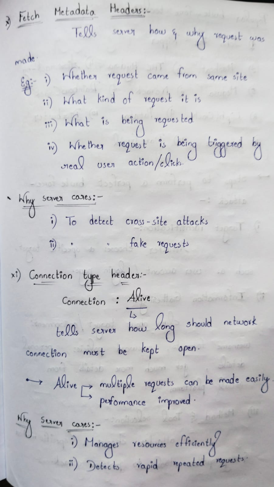

Day-49 – Other Data Items Sent During Authentication

While analyzing authentication requests, I studied additional request components beyond payload parameters:

Observed Data Items:
HTTP Method (POST/GET)
Request URL
Host Header
Session ID (PHPSESSID)
Security Level Cookie
User-Agent Header
Client Platform Headers
Referer Header
Accept Header

Key Learning:
Authentication is influenced not only by credentials but also by headers, cookies, and session identifiers. These components can impact:
Session management
Access control
Security bypass attempts
Request validation

Understanding full HTTP request structure is essential for ethical hacking.

#Day49 #100DaysOfEthicalHacking #WebSecurity

Learning via Skills Uprise Mentored by Manoj Kumar                         

LinkedIn: https://www.linkedin.com/company/skills-uprise

CEO: https://www.linkedin.com/in/manoj-kumar

