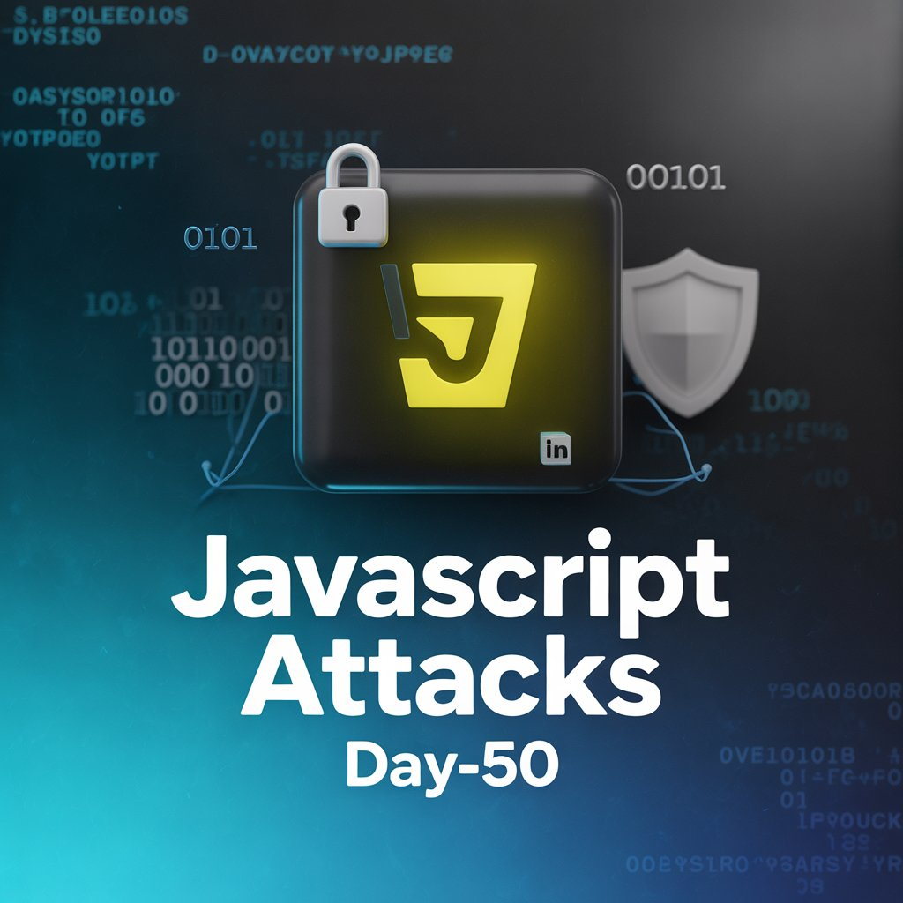
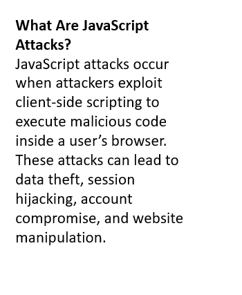
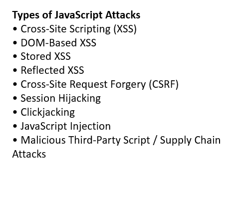
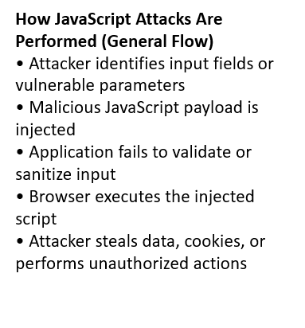
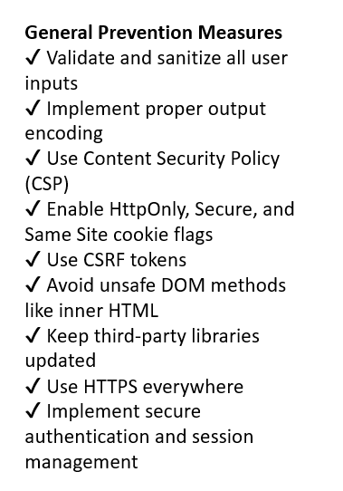

Day-50 – JavaScript Attacks (Theoretical Study)

Today I explored JavaScript-based vulnerabilities in web applications.

Covered Topics:
Cross-Site Scripting (XSS)
DOM-based attacks
CSRF
Session Hijacking
Clickjacking
Script Injection & Supply Chain risks

Key Learning:
Understanding how malicious JavaScript executes in the browser when input validation fails, and how security controls like CSP, secure cookies, CSRF tokens, and proper session management help prevent exploitation.

Strengthening my foundation in client-side web security as part of my #100DaysOfEthicalHacking journey

Learning via Skills Uprise Mentored by Manoj Kumar                         

LinkedIn: https://www.linkedin.com/company/skills-uprise

CEO: https://www.linkedin.com/in/manoj-kumar

