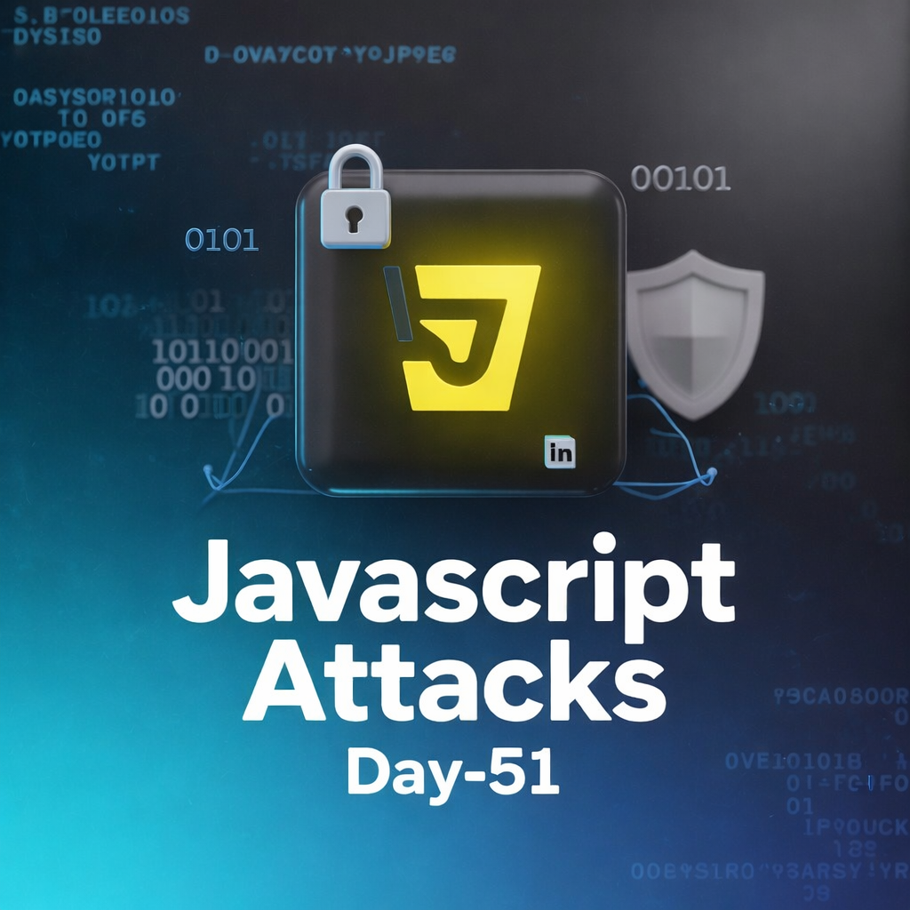
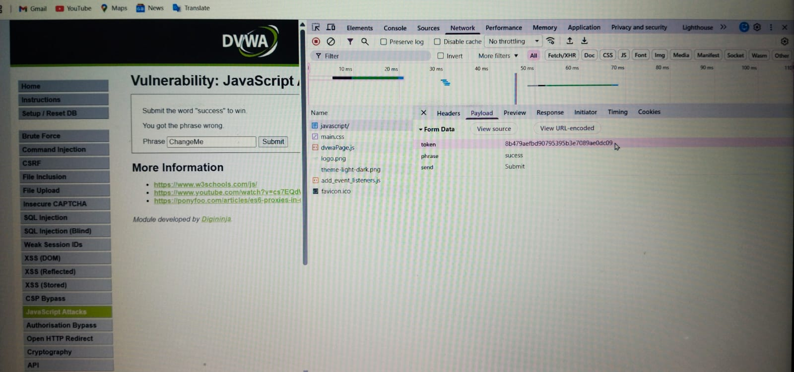
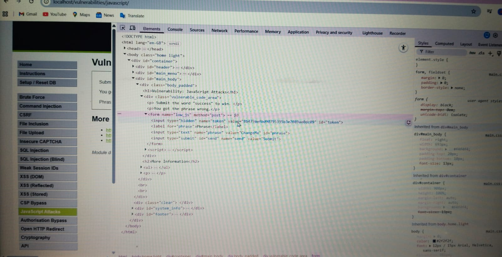
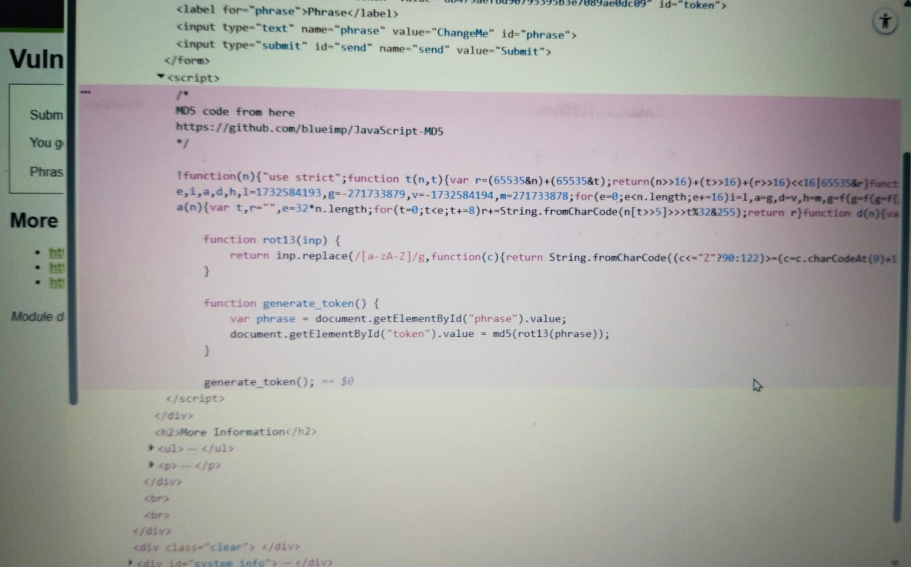
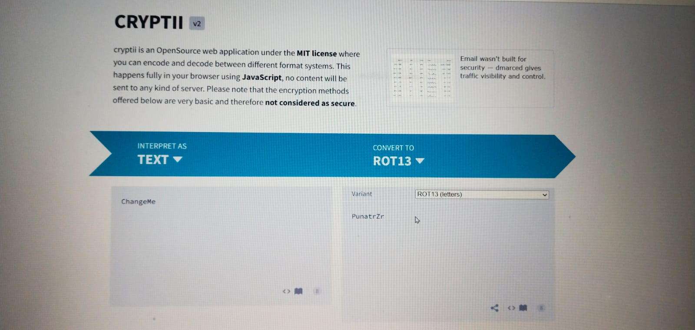
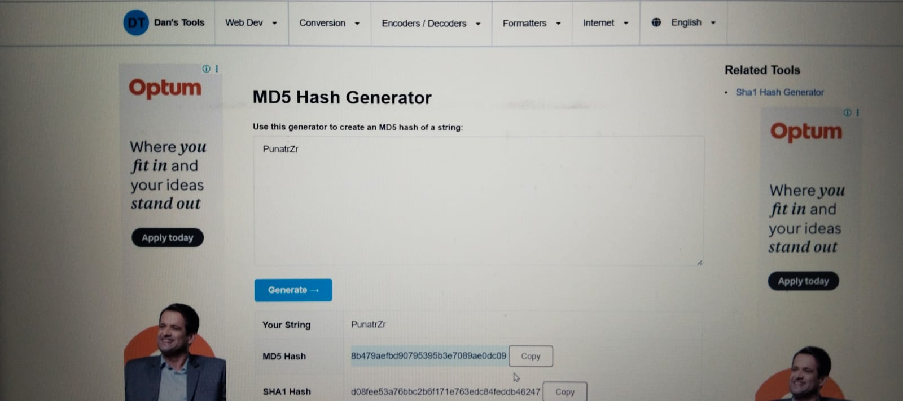
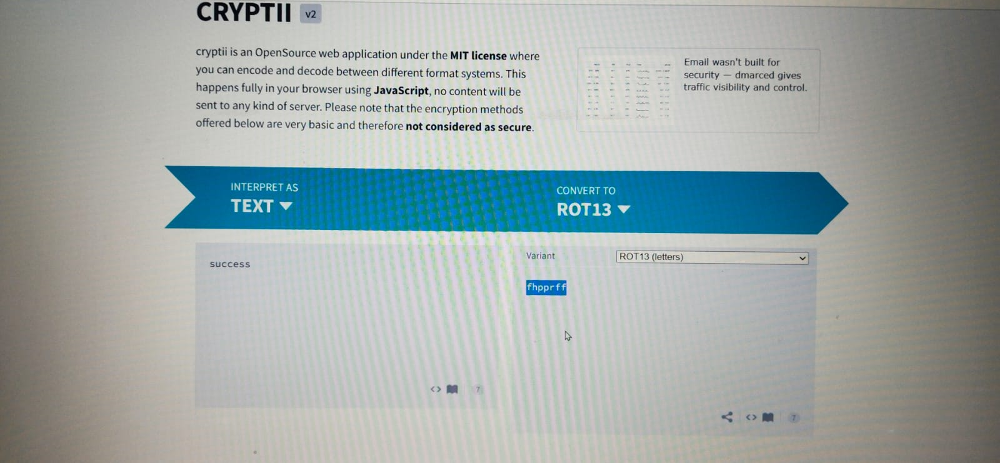
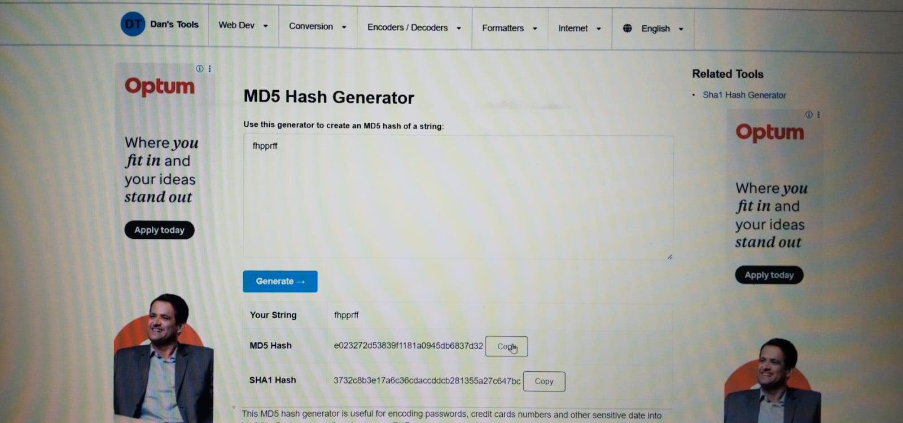
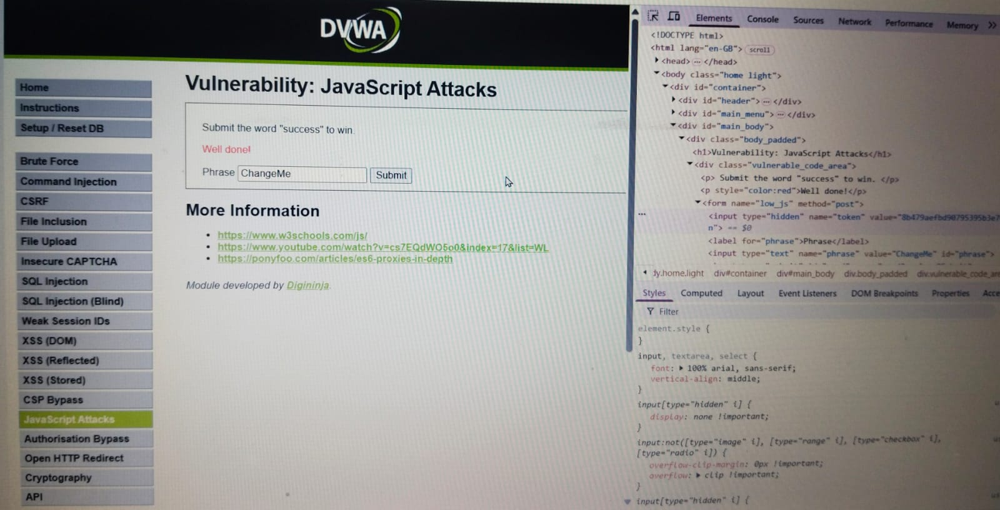

Day-51 – JavaScript Token Validation Bypass (DVWA Lab)

Today I practiced analyzing client-side token validation in DVWA (intentionally vulnerable lab).

Steps I performed:
Tested default phrase (changeme) → Failed
Modified phrase → Token mismatch error
Inspected source code → Found token generated via JavaScript
Analyzed logic → ROT13 encoding + MD5 hashing
Reproduced token generation locally
Verified with original phrase → Token matched
Generated new valid token for modified phrase
Edited request with updated token → Successfully bypassed validation

Key Learning:
Client-side security mechanisms can be reverse engineered. Proper security must always be enforced server-side.

Performed strictly in a legal lab environment for educational purposes.
#100DaysOfEthicalHacking #Day51

Learning via Skills Uprise Mentored by Manoj Kumar                         

LinkedIn: https://www.linkedin.com/company/skills-uprise

CEO: https://www.linkedin.com/in/manoj-kumar

