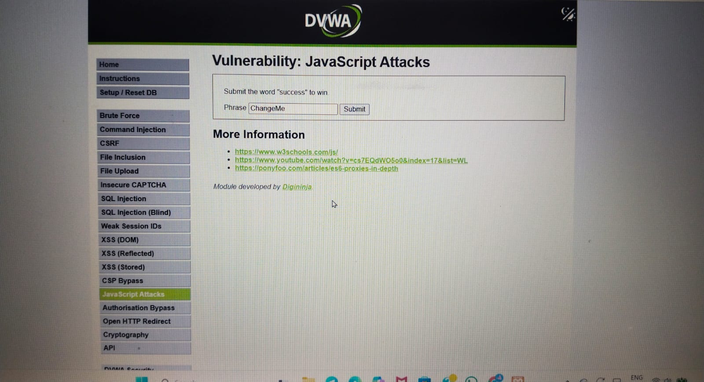
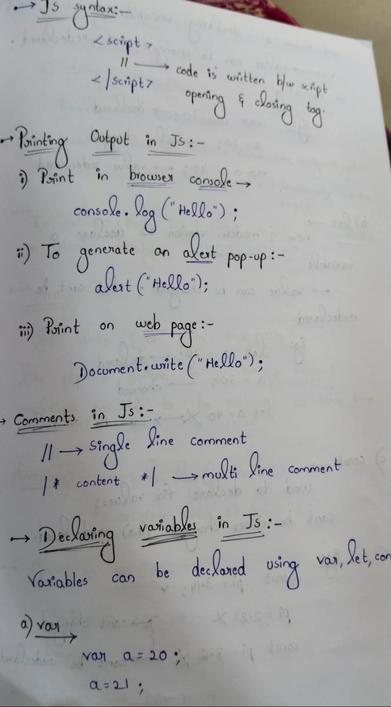
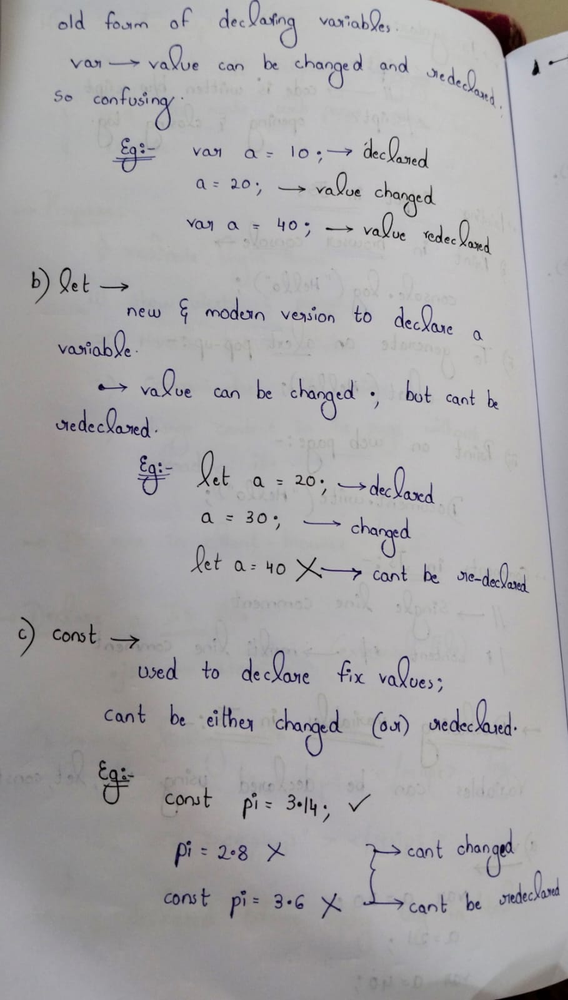

Day-52 – JavaScript Basics

As part of my 100 Days Ethical Hacking Challenge, today I covered fundamental JavaScript concepts:
Introduction to JavaScript and its purpose
Creating and linking .js files
Basic <script> syntax structure
Output methods (console.log())
Writing comments in JS
Variable declarations using var, let, and const

These fundamentals are crucial for understanding client-side behavior and analyzing web-based vulnerabilities in future security testing.
Notes and practice examples included in this update.

Learning via Skills Uprise Mentored by Manoj Kumar                         

LinkedIn: https://www.linkedin.com/company/skills-uprise

CEO: https://www.linkedin.com/in/manoj-kumar

