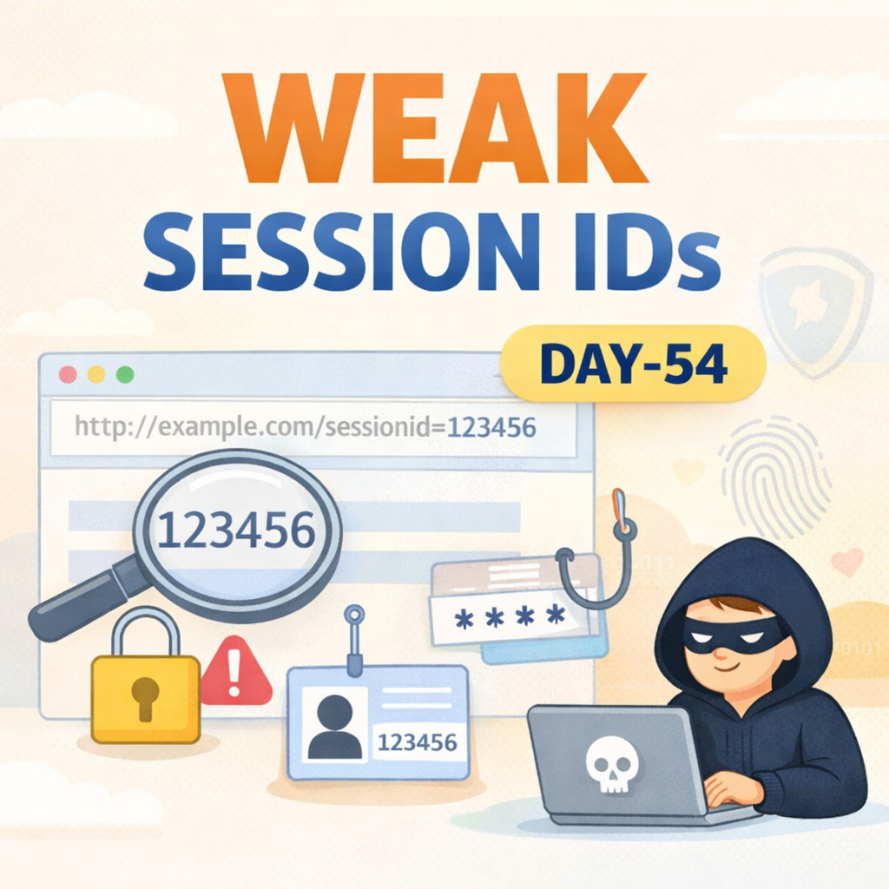
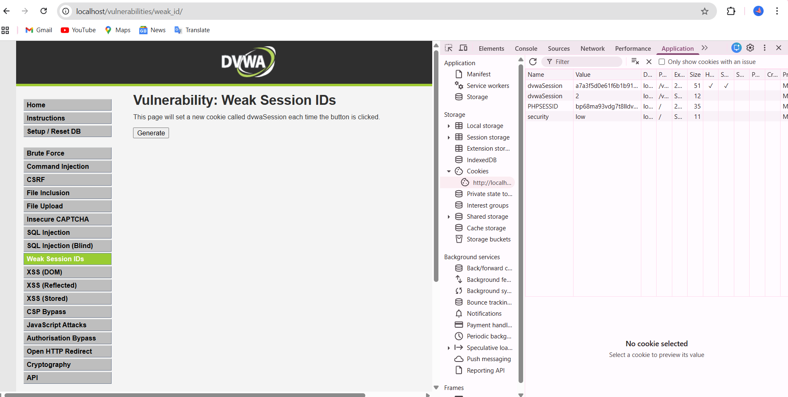
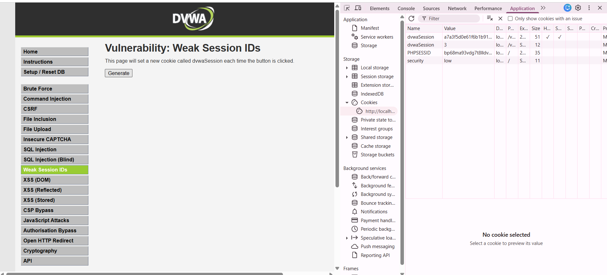

Day-54 – Weak Session ID Exploitation (DVWA)

Today I analyzed weak session ID behavior in DVWA.

Observation:
The application generates predictable session IDs. The pattern was guessable and lacked randomness.

What are Weak Session IDs?
Session identifiers that are predictable, sequential, or generated using weak logic.

How they are exploited:
An attacker observes one valid session ID → predicts the next ID → manually sets it in the browser → gains unauthorized access.

Impact:
• Session Hijacking
• Privilege escalation
• Sensitive data exposure

This demonstrates the importance of secure random token generation and proper session management.

#100DaysOfEthicalHacking #Day54 #WebSecurity #DVWA #SessionManagement

Learning via Skills Uprise Mentored by Manoj Kumar                         

LinkedIn: https://www.linkedin.com/company/skills-uprise

CEO: https://www.linkedin.com/in/manoj-kumar

