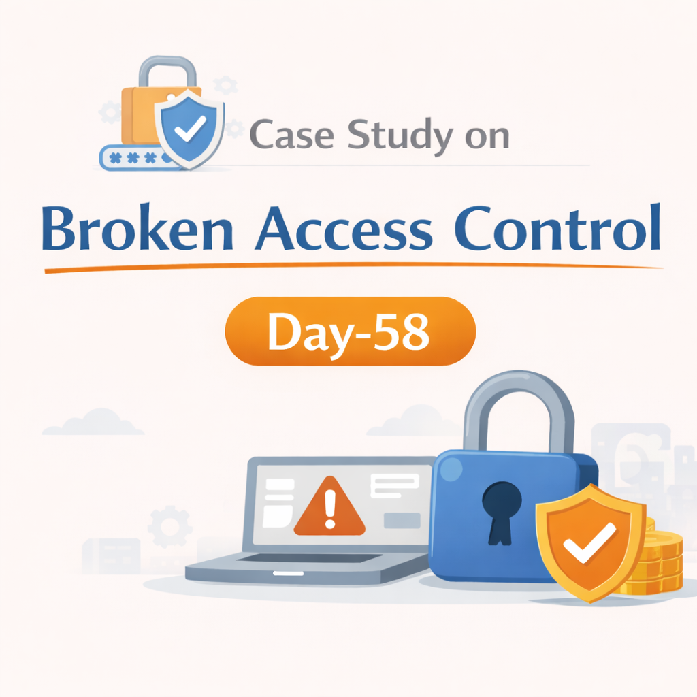
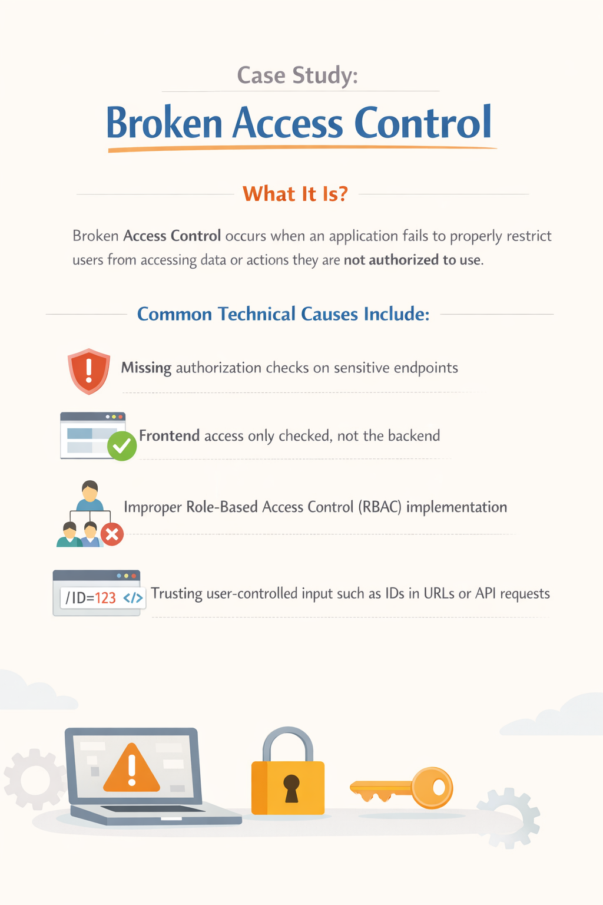
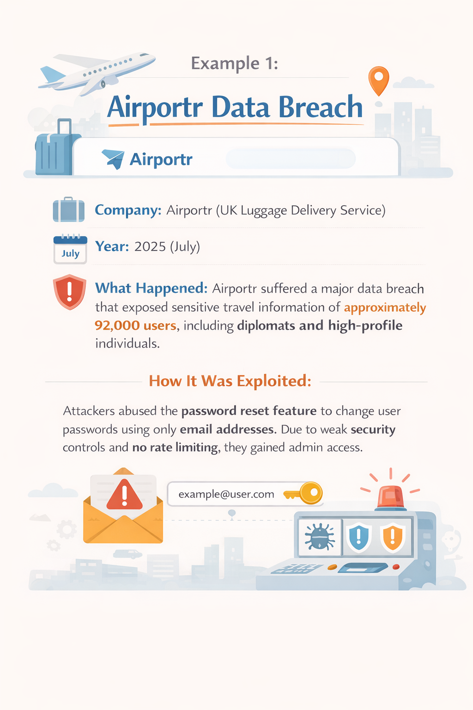
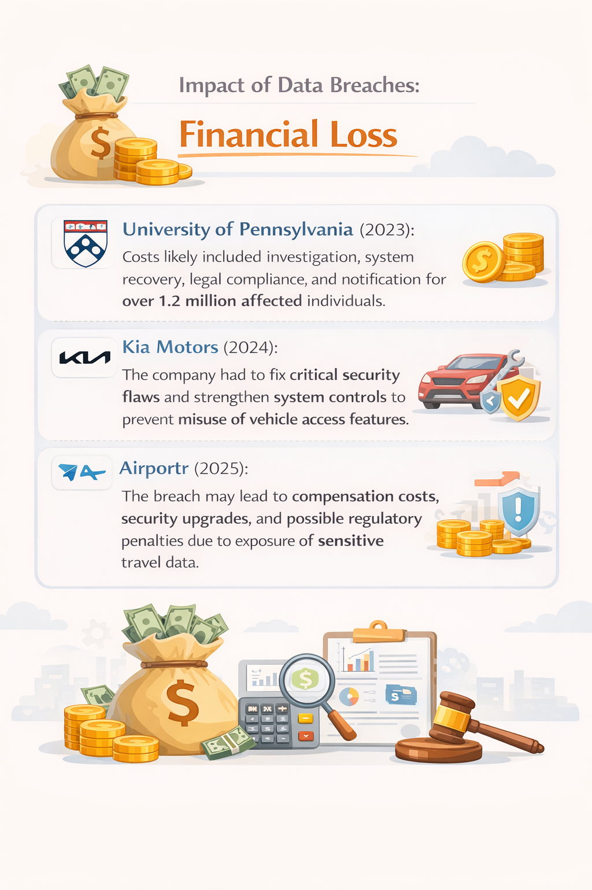
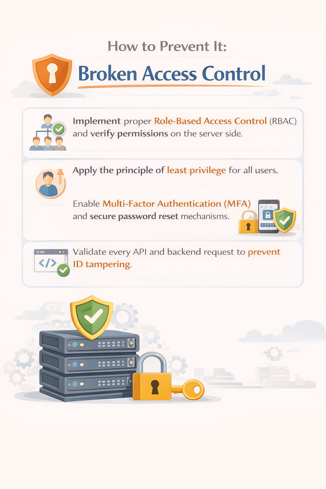

Day-58 – Case Study: Broken Access Control

This case study analyzes how improper authorization checks led to unauthorized privilege escalation.

Root Causes:
Missing backend access validation
Weak RBAC implementation
Insecure password reset mechanism
Lack of rate limiting

Security Improvements:
Enforce server-side authorization
Implement strict RBAC
Apply least privilege
Validate all API requests

Broken Access Control remains one of the top OWASP risks because it is often overlooked in logic design.

Learning via Skills Uprise Mentored by Manoj Kumar                         

LinkedIn: https://www.linkedin.com/company/skills-uprise

CEO: https://www.linkedin.com/in/manoj-kumar

