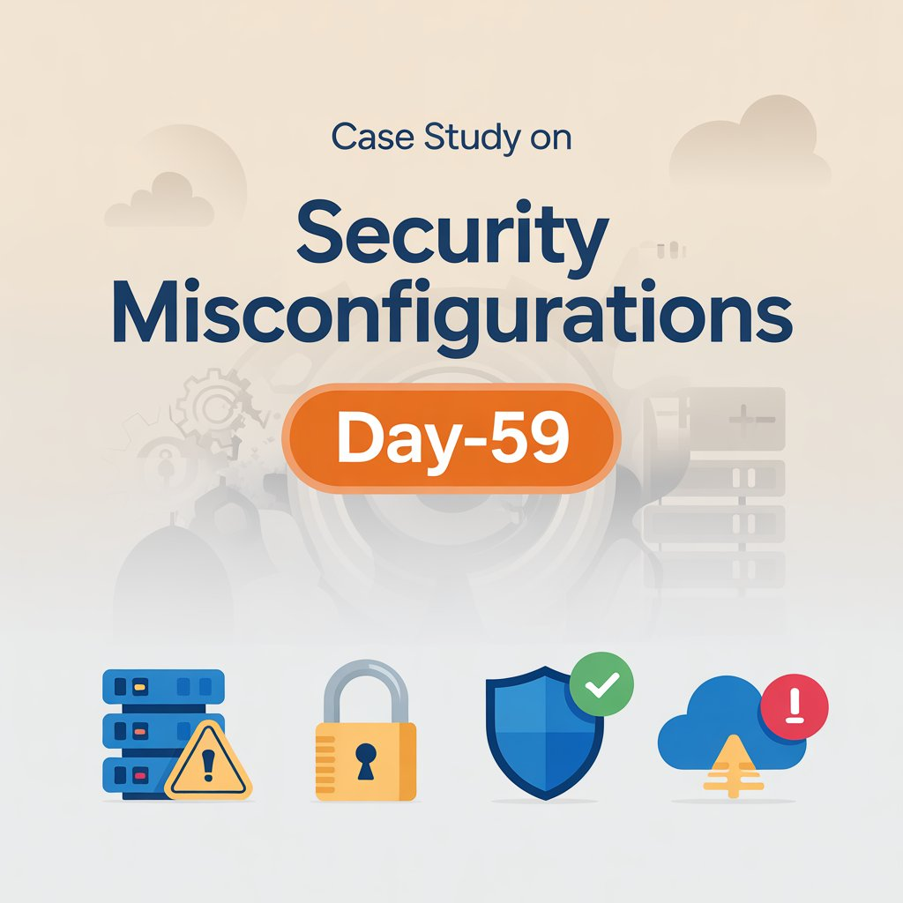

Day-59: Security Misconfigurations

Today I studied Security Misconfiguration — one of the most common and preventable security weaknesses.

This vulnerability arises when systems are deployed with insecure defaults or improper configurations.

Typical examples:
Default credentials in production
Debug mode exposing stack traces
Unnecessary services/ports enabled
Public cloud storage buckets
Excessive permissions or unused accounts

Why it matters:
Misconfigurations reduce the attacker's effort dramatically. Instead of exploiting complex flaws, they simply leverage exposed surfaces.

Prevention requires:
Configuration hardening
Principle of least privilege
Continuous monitoring
Proper access lifecycle management

Learning via Skills Uprise Mentored by Manoj Kumar                         

LinkedIn: https://www.linkedin.com/company/skills-uprise

CEO: https://www.linkedin.com/in/manoj-kumar

