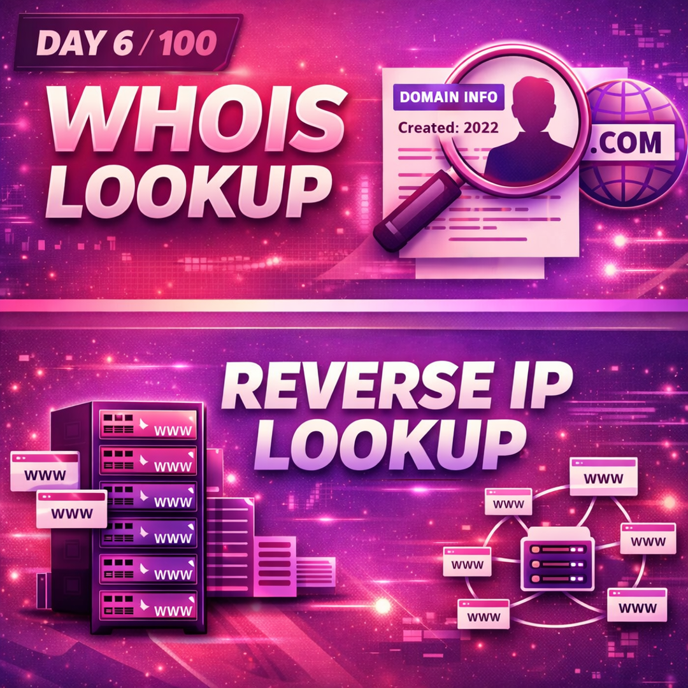
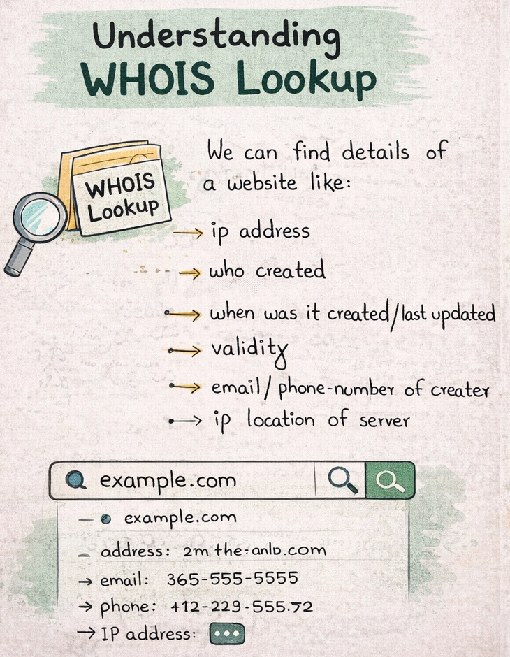
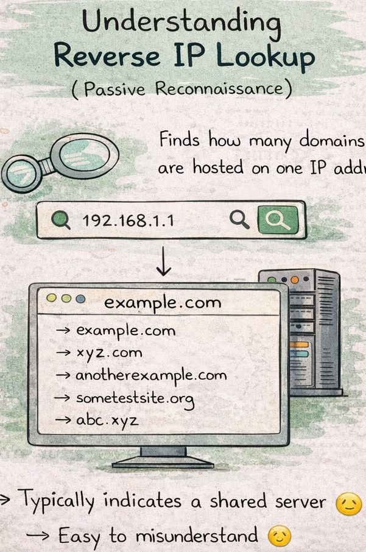
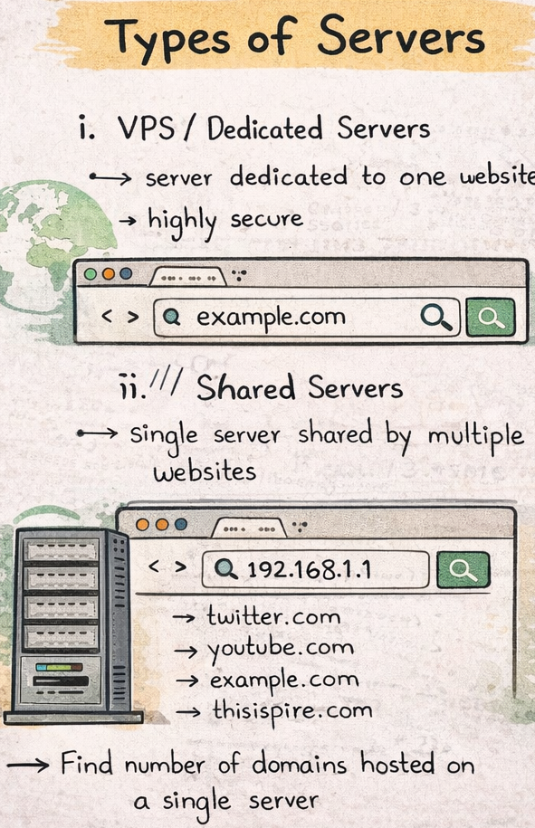

Today’s learning focused on understanding passive reconnaissance techniques and basic server infrastructure.

--.What I Learned
- WHOIS lookup provides public domain metadata such as:
  - Creation and expiry dates
  - Registrar information

- Reverse IP lookup helps identify:
  - How many domains are hosted on a single IP
  - Whether hosting is shared or dedicated (VPS)

-->Practice Performed
- WHOIS lookup on example.com
- Reverse IP lookup using browser-based tools only

-->Key Insight:-
Public information helps in understanding infrastructure, not exploiting systems.

-->Ethical Note:-
All activities were passive, ethical, and performed on test/public domains only.
No real-world systems were targeted.

Learning via Skills Uprise Mentored by Manoj Kumar

LinkedIn: https://www.linkedin.com/company/skills-uprise
CEO: https://www.linkedin.com/in/manoj-kumar

