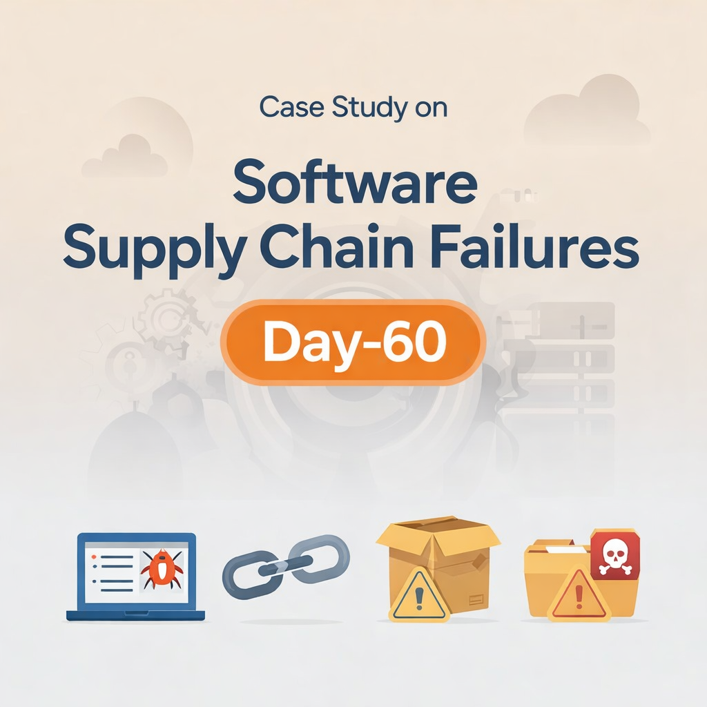
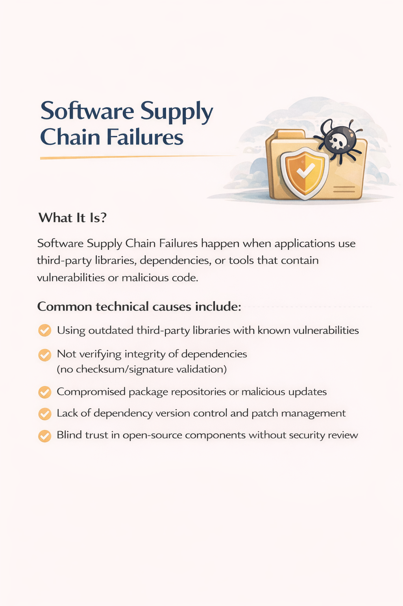
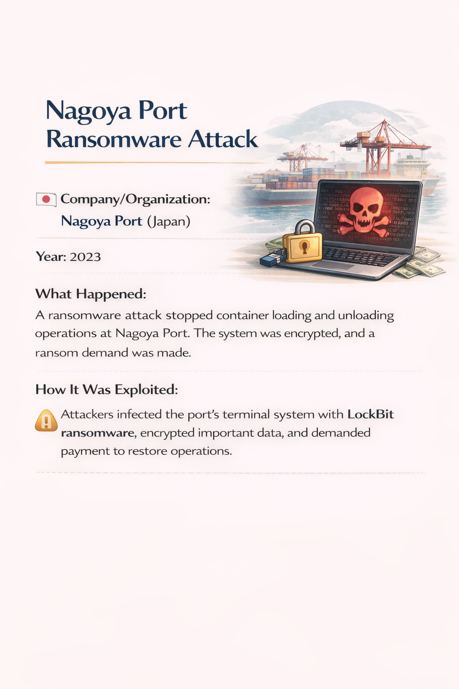
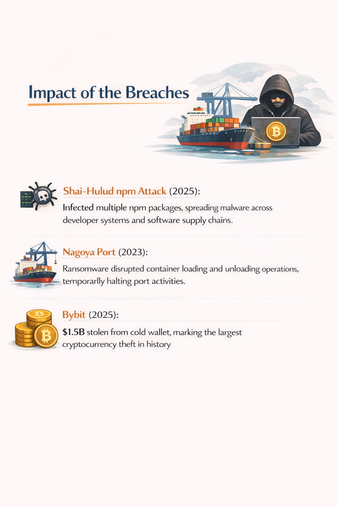
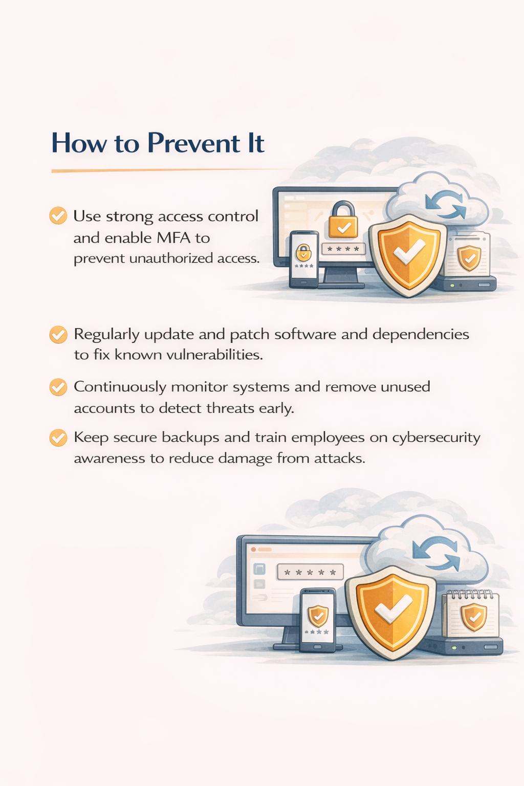

Day-60: Software Supply Chain Failures 

A real incident showed how attackers injected malicious code into a popular third-party library. This library was used in thousands of apps, which unknowingly became vulnerable.

Lessons for developers:
Verify and audit every third-party library
Keep dependencies updated
Use integrity checks and code signing
Monitor alerts and advisories for supply chain risks

Even safe code can become unsafe if a dependency is compromised. Learn from Day-60 

#CyberSecurity #OWASP #SoftwareSupplyChain #AppSec #Day60 #LearningJourney

Learning via Skills Uprise Mentored by Manoj Kumar                         

LinkedIn: https://www.linkedin.com/company/skills-uprise

CEO: https://www.linkedin.com/in/manoj-kumar

