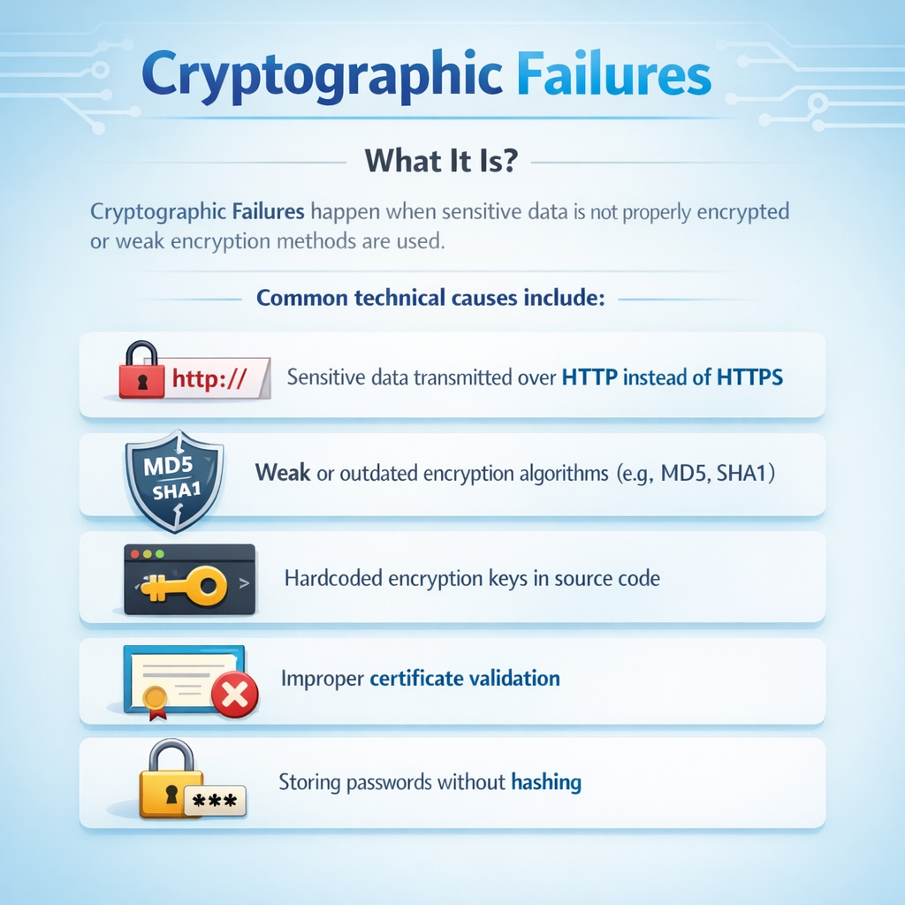
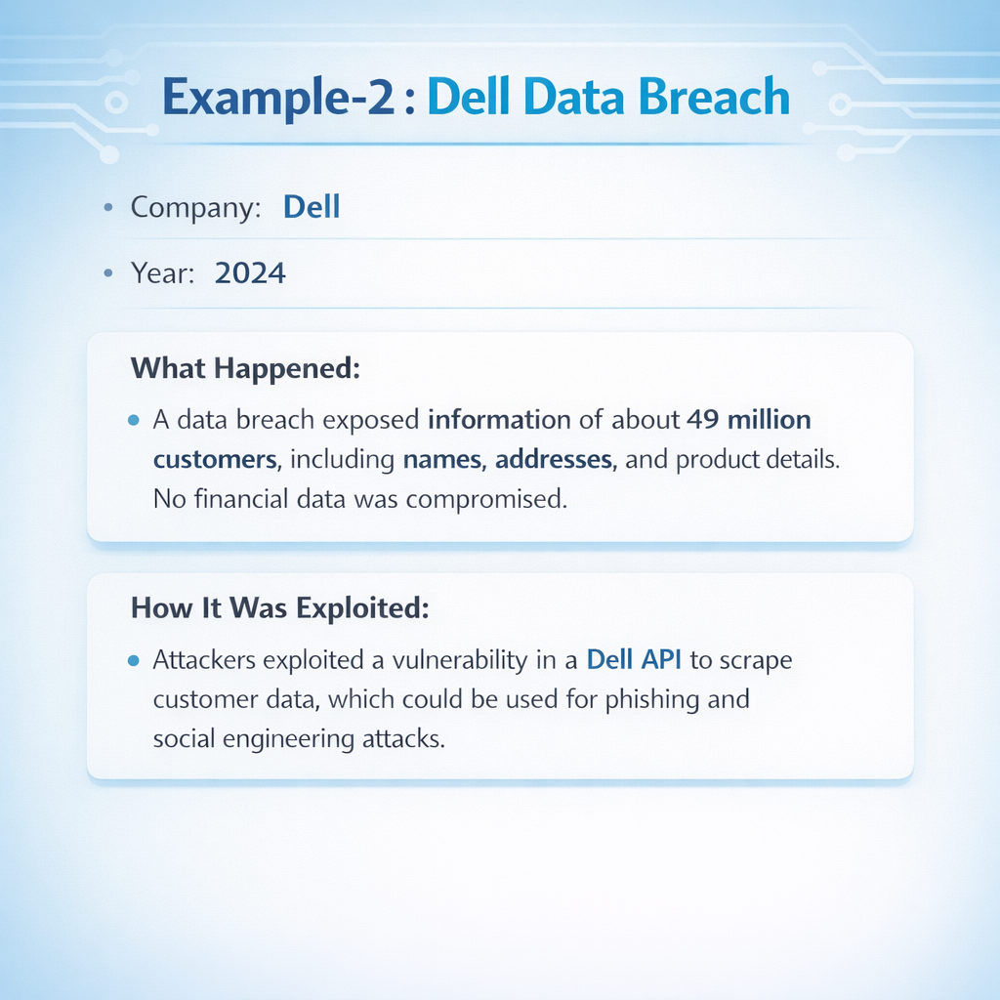
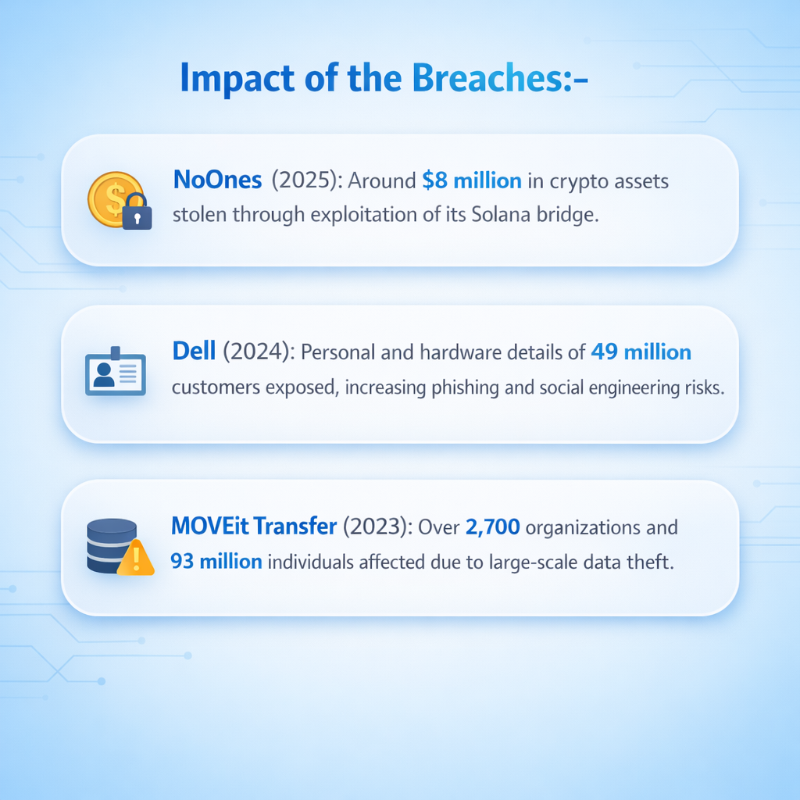
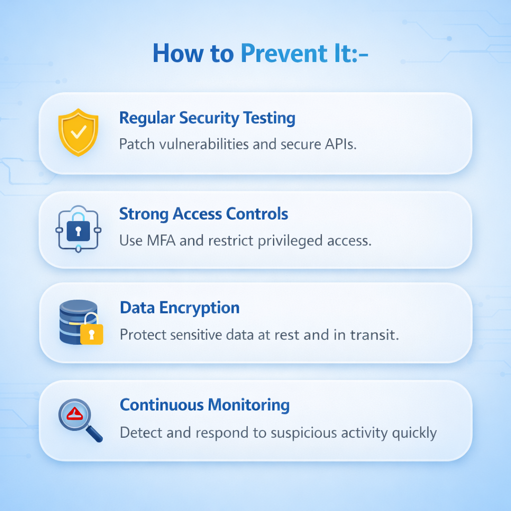

Day-61: Cryptographic Failures

Today’s focus: understanding how improper cryptographic implementation leads to serious vulnerabilities.

Common causes:
Weak hashing (MD5, SHA1)
Storing passwords without salting
Hardcoded API keys or secrets
Missing TLS enforcement
Improper certificate validation

Impact:
Credential theft
Data exposure
Session hijacking
Compliance failures

Mitigation strategies:
Use bcrypt/Argon2 for password hashing
Enforce HTTPS with HSTS
Implement secure key storage (vaults, environment variables)
Rotate and monitor keys regularly

Learning via Skills Uprise Mentored by Manoj Kumar                         

LinkedIn: https://www.linkedin.com/company/skills-uprise

CEO: https://www.linkedin.com/in/manoj-kumar

