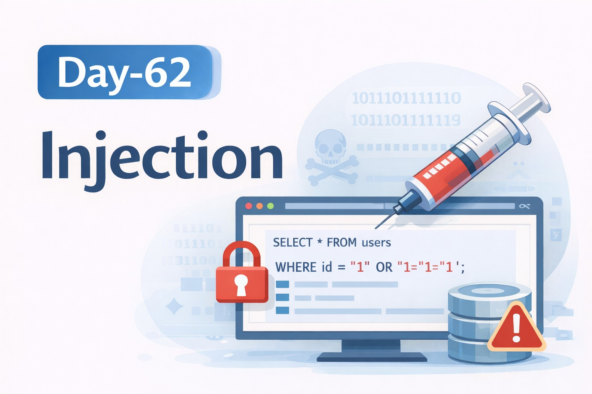
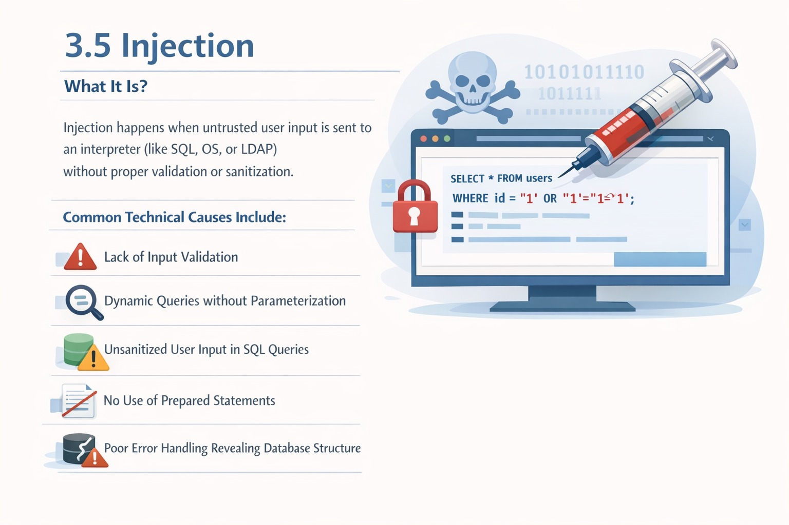
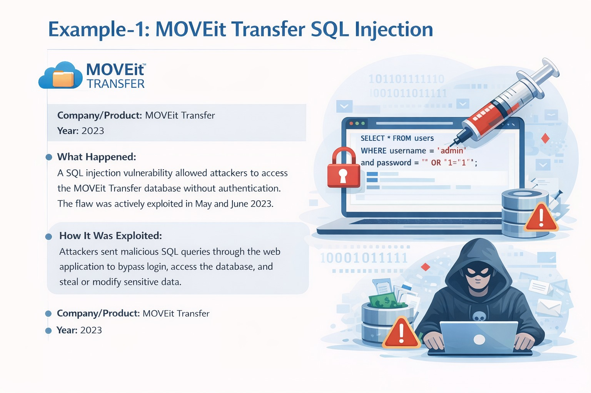
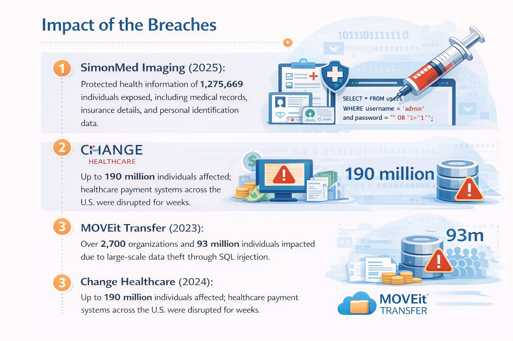
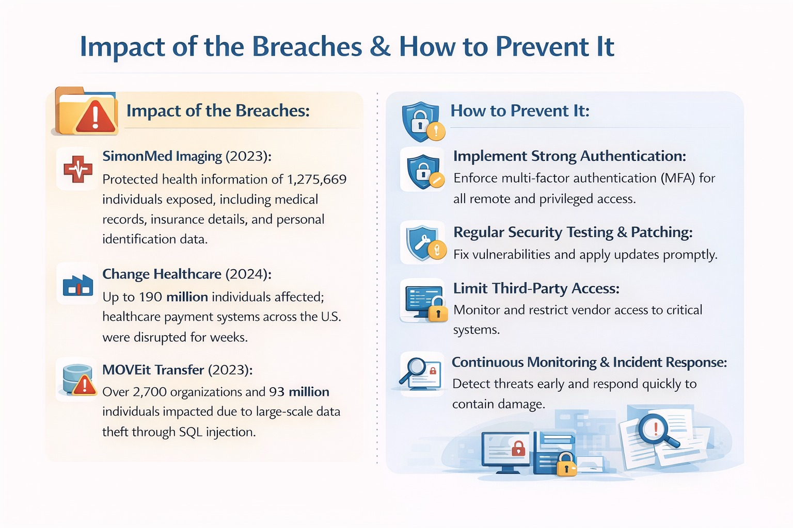

Day-62: Injection 💉

Injection occurs when unvalidated user input is directly passed to interpreters like SQL, OS, or LDAP.

Impact:
Authentication bypass
Data exposure
Command execution

Prevention:
Use prepared statements
Validate inputs
Avoid dynamic query concatenation
Implement least privilege

Learning via Skills Uprise Mentored by Manoj Kumar                         

LinkedIn: https://www.linkedin.com/company/skills-uprise

CEO: https://www.linkedin.com/in/manoj-kumar

