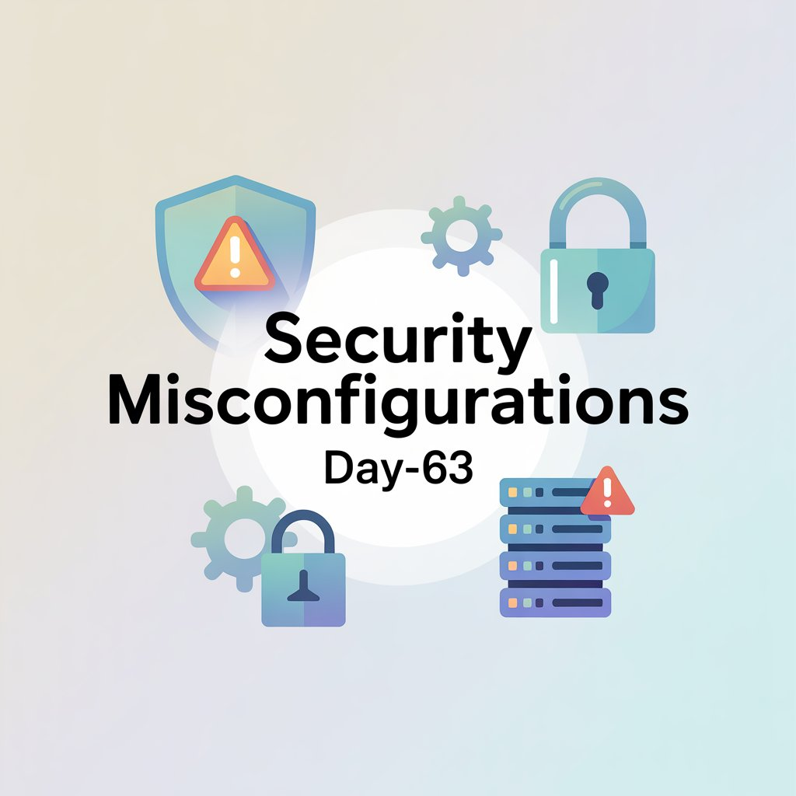
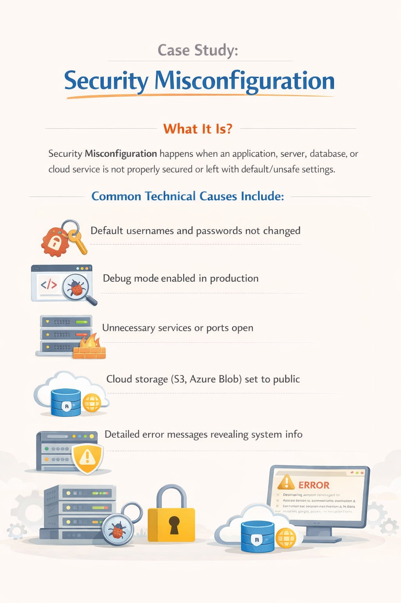
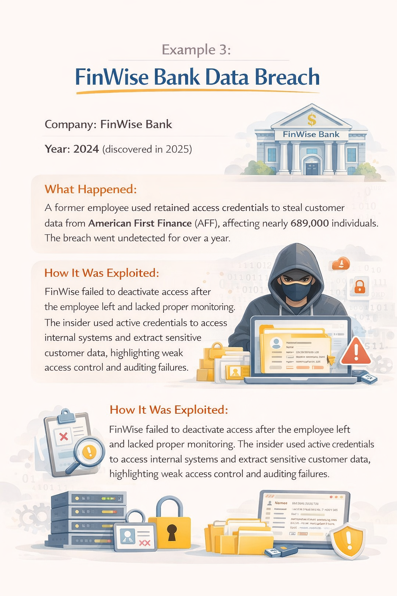
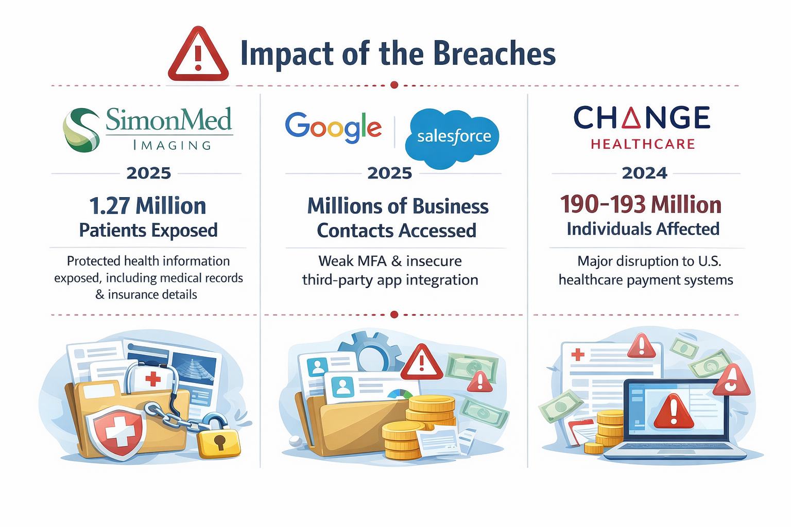
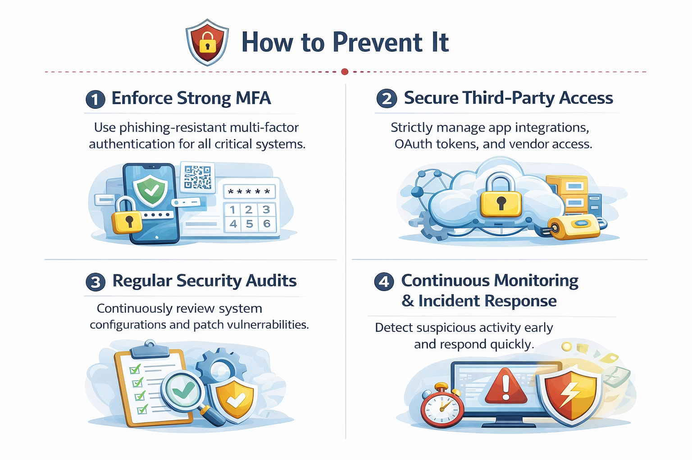

Day-63 – Security Misconfiguration Case Study

Case: REWN (2023)
Impact: ~1.5 billion records exposed
Root Cause: Publicly accessible database without authentication

Observation:
No complex exploitation required — direct data access due to misconfiguration.

Related Incidents:
SimonMed Imaging (2025)
Google Salesforce (2025)
Change Healthcare (2024)

Takeaway:
Proper configuration and access control are critical before deployment.

