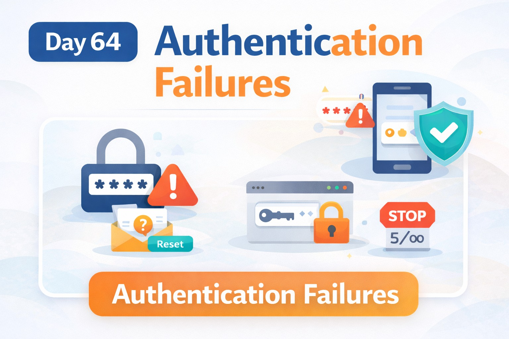
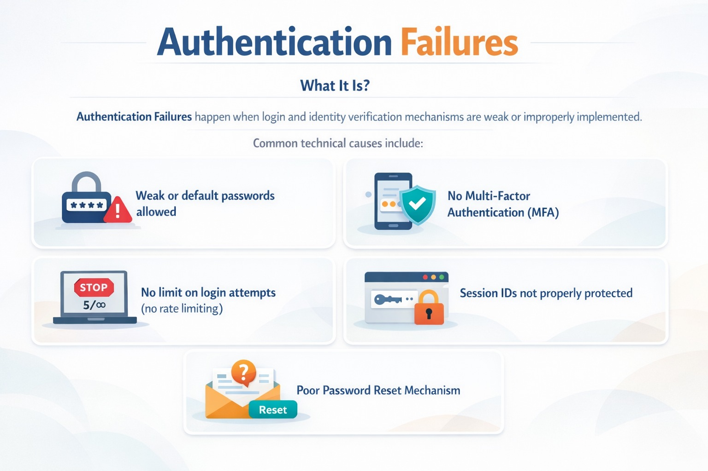
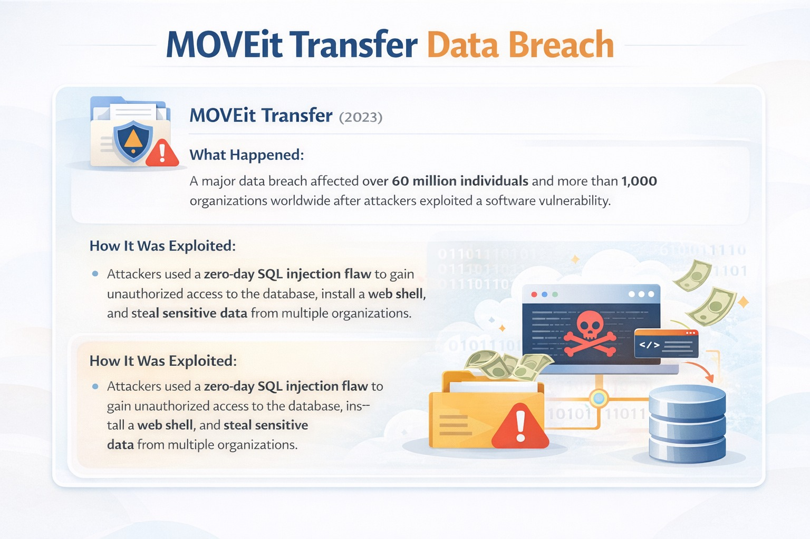
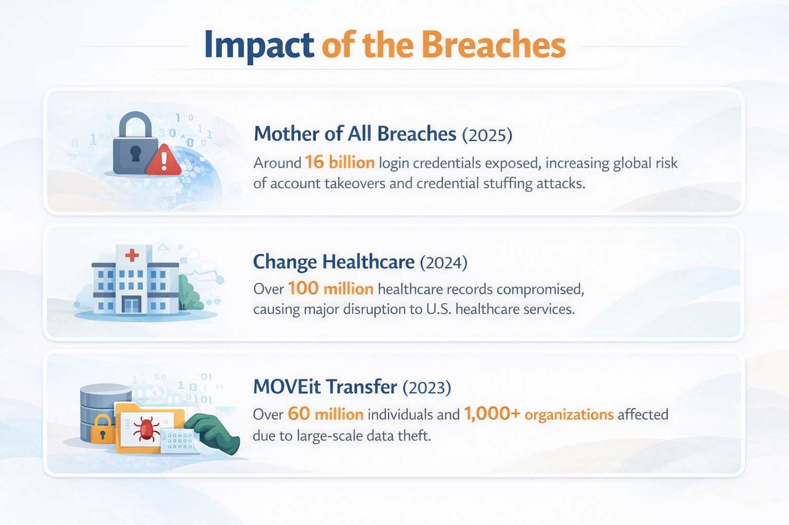
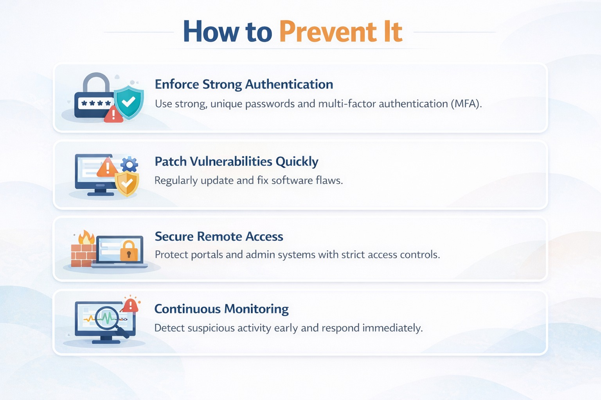

Day-64: Authentication Failures

Case Study: MOVEit Transfer (2023)

Zero-day SQL Injection exploited
Web shell installed
60M+ individuals impacted
1,000+ organizations affected
Initial access came from a vulnerability.

Post-exploitation impact depends heavily on authentication and access control strength.

Lessons:
Enforce MFA
Apply least privilege
Protect sessions
Monitor authentication anomalies

Security doesn’t stop at patching vulnerabilities.
Identity verification must be strong at every layer.

#AppSec #OWASPTop10 #SecureCoding #CyberSecurity

Learning via Skills Uprise Mentored by Manoj Kumar                         

LinkedIn: https://www.linkedin.com/company/skills-uprise

CEO: https://www.linkedin.com/in/manoj-kumar

