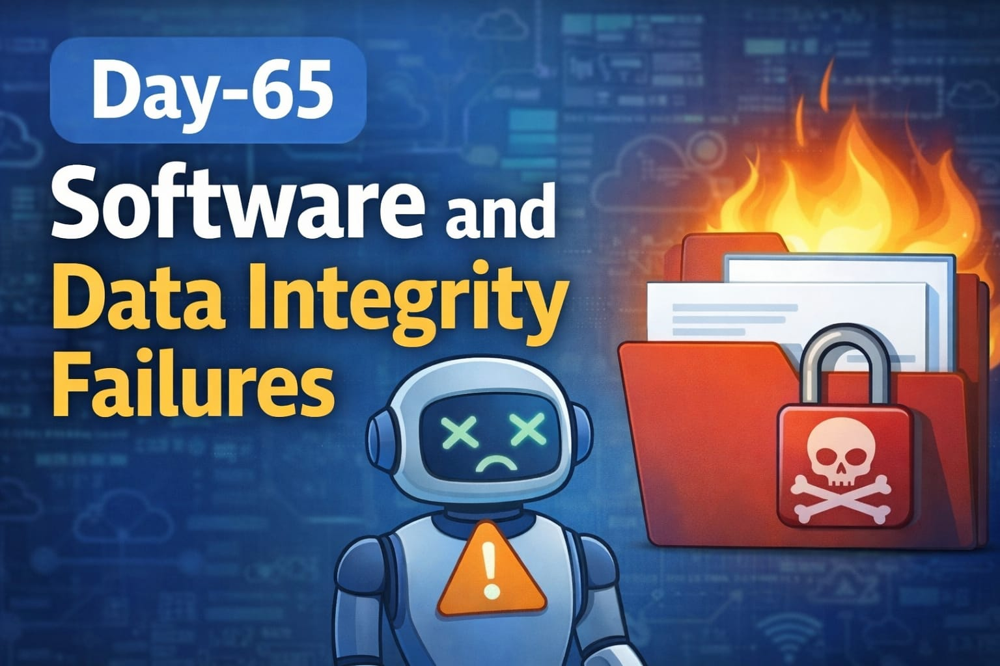
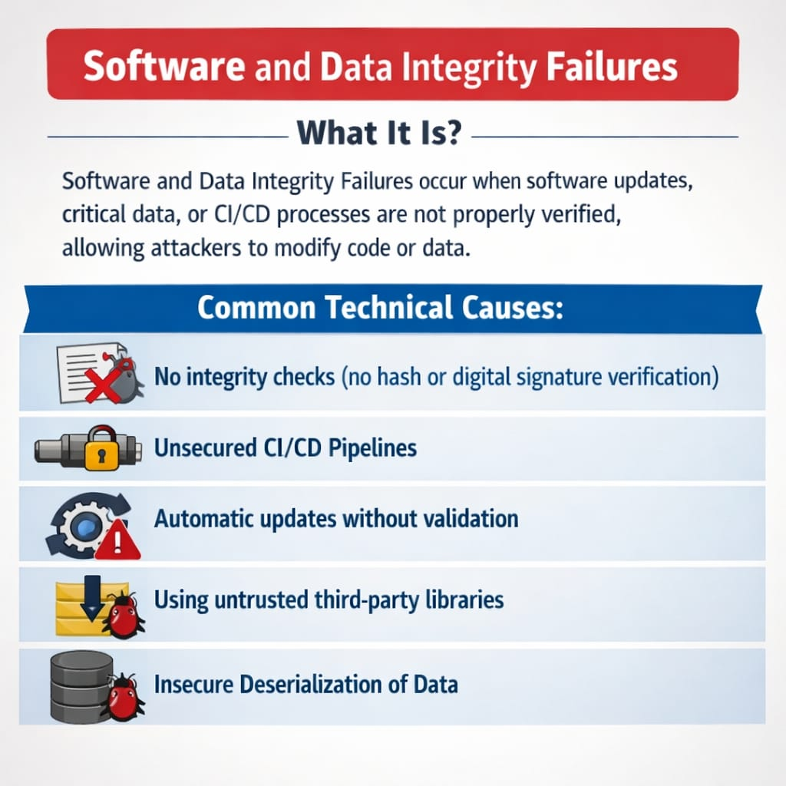
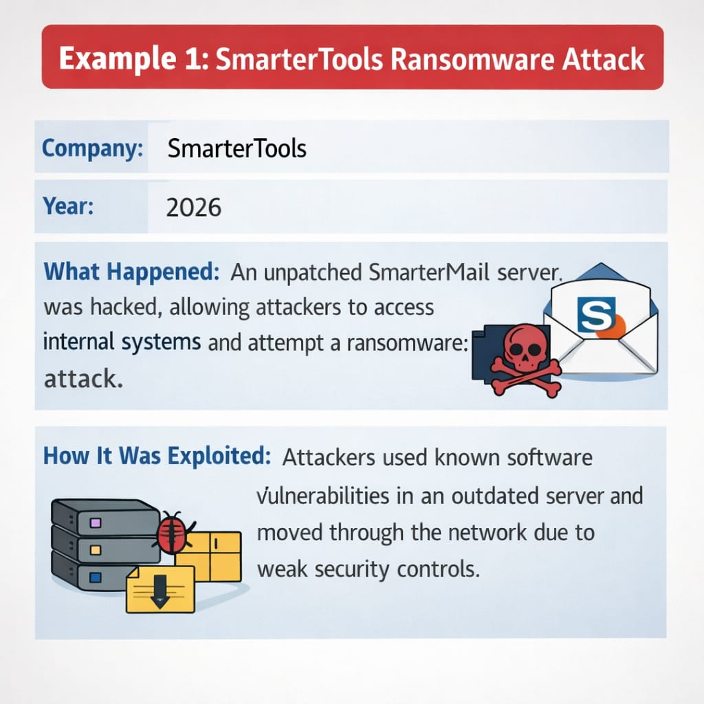
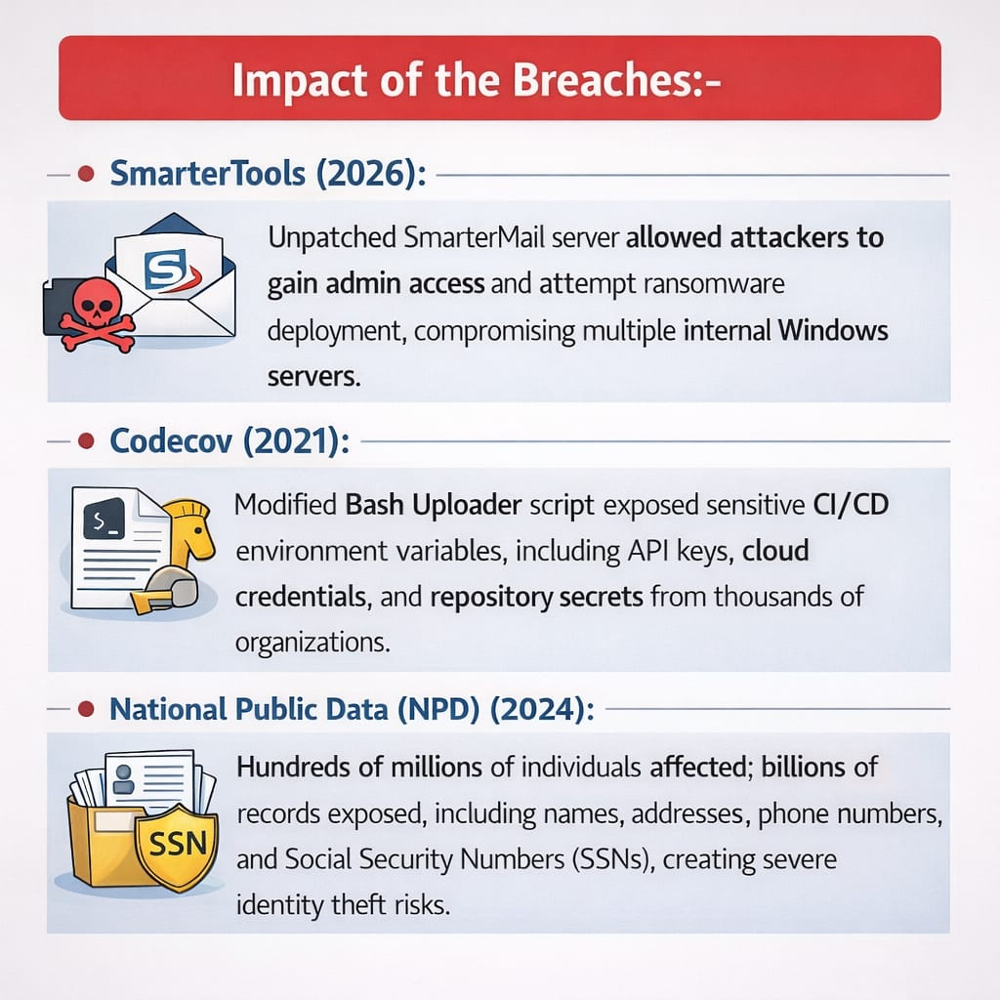
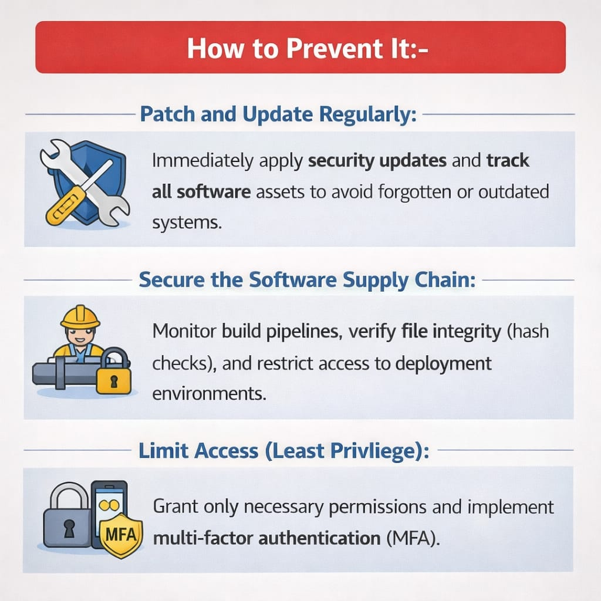

Today’s study focused on a 2026 incident involving SmarterTools, where an outdated SmarterMail server was exploited.

Root Cause:
Unpatched server with known vulnerabilities
Weak internal network segmentation
Lack of strict security controls

Attack Flow:
Exploit known vulnerability
Gain unauthorized access
Move laterally inside network
Attempt ransomware deployment

Key Takeaway:
Patch management + network segmentation + monitoring = Reduced attack surface.

Security is not just about prevention — it’s about maintaining integrity continuously.

Learning via Skills Uprise Mentored by Manoj Kumar                         

LinkedIn: https://www.linkedin.com/company/skills-uprise

CEO: https://www.linkedin.com/in/manoj-kumar

