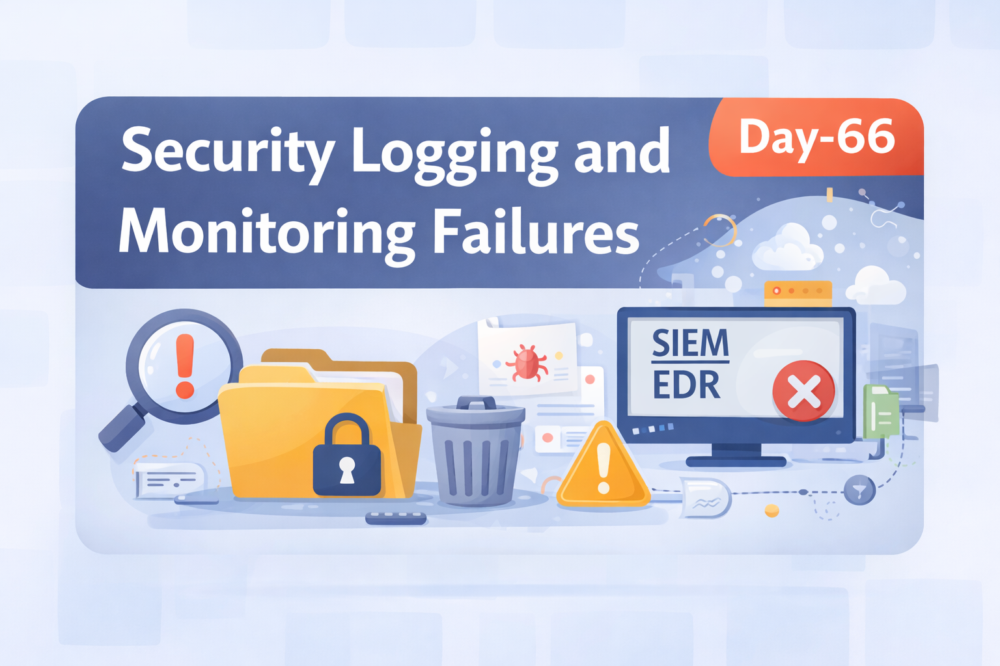
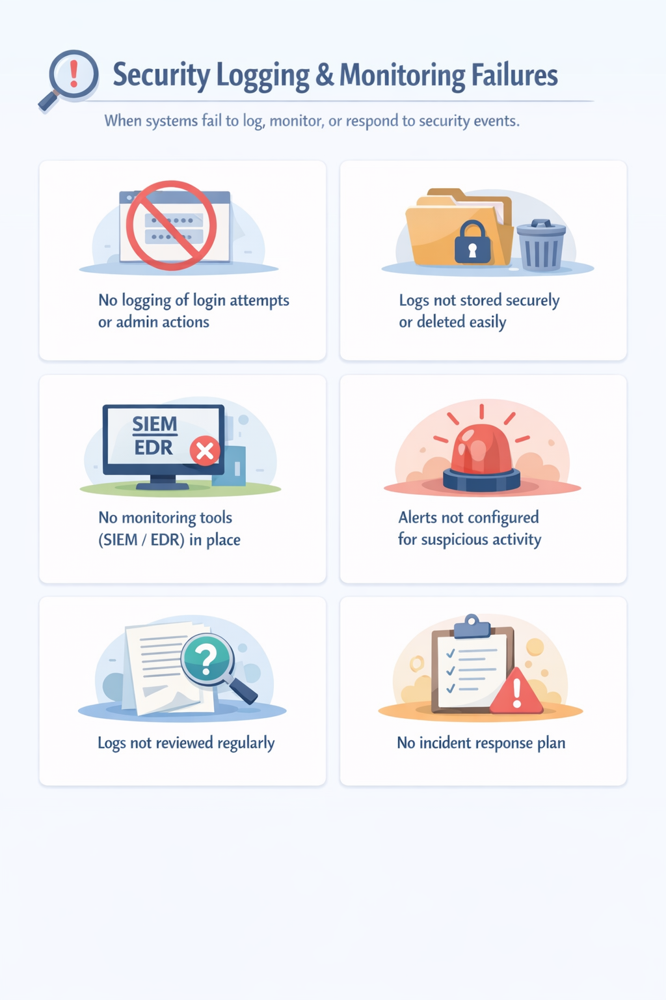
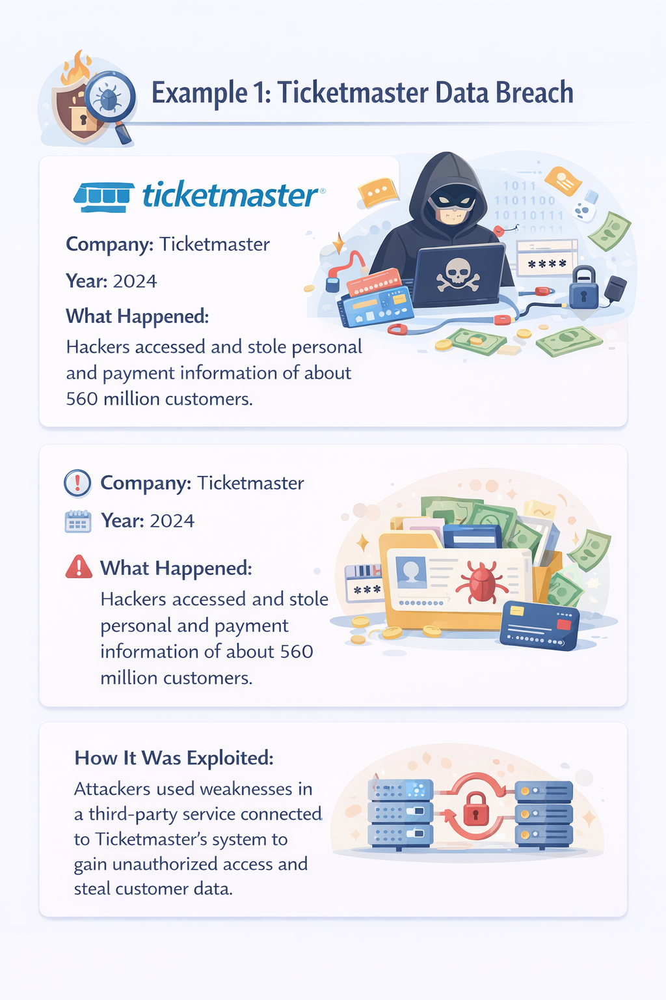
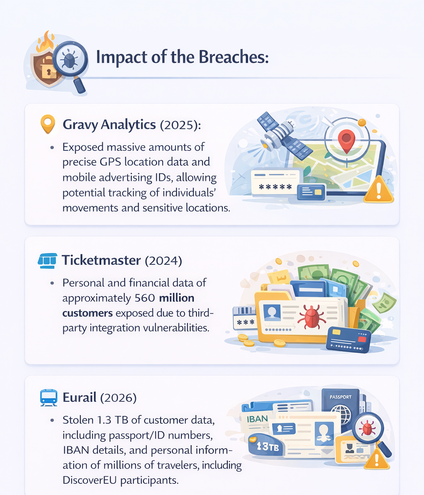
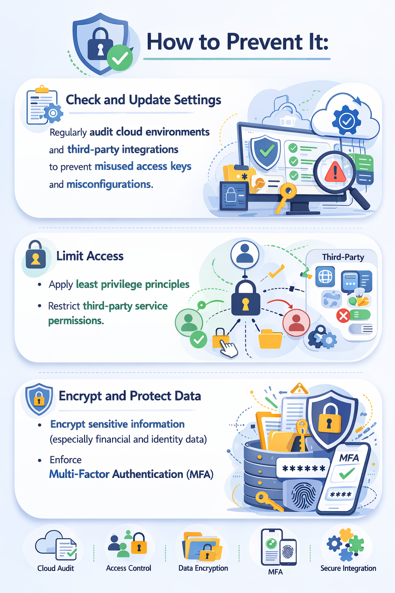

Day-66: Security Logging & Monitoring Failures

Case Study: Ticketmaster Data Breach (2024)

Impact:
~560 million customers’ personal and financial data exposed.

Root Cause Insight:
Weak third-party integration security
Insufficient monitoring visibility
Possible delayed detection of unauthorized access

Security Takeaways:
Implement centralized logging (SIEM)
Monitor third-party integrations continuously
Configure real-time alerts for abnormal behavior
Regular log reviews + incident response plan

Logging isn’t just record-keeping — it’s your early warning system.

Learning via Skills Uprise Mentored by Manoj Kumar                         

LinkedIn: https://www.linkedin.com/company/skills-uprise

CEO: https://www.linkedin.com/in/manoj-kumar

!
