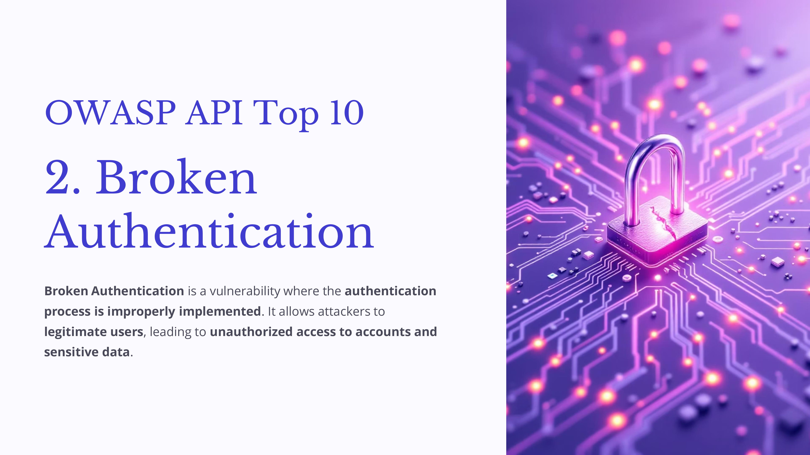
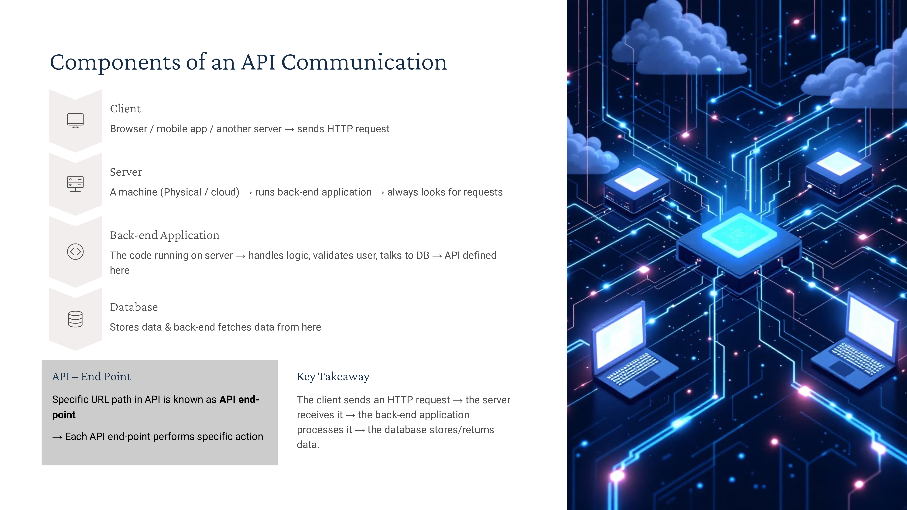
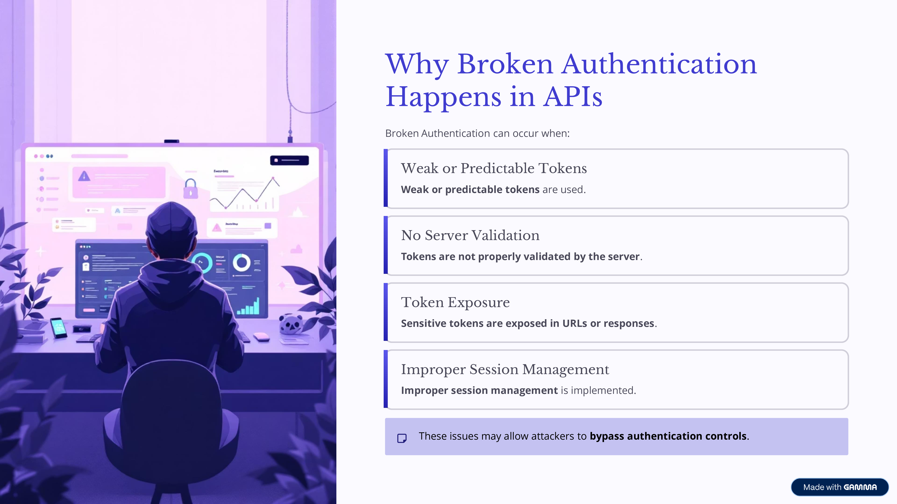
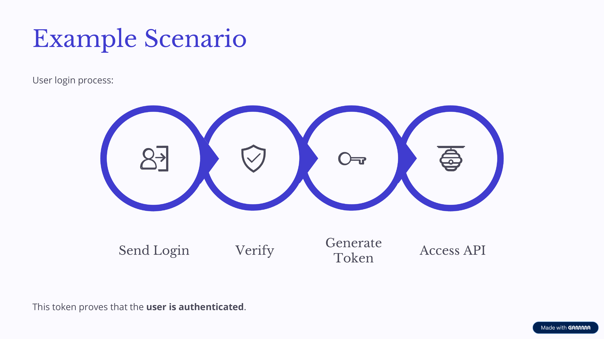
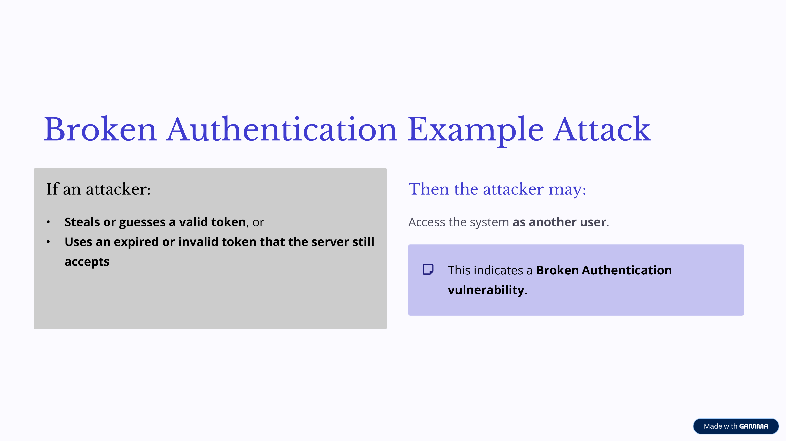
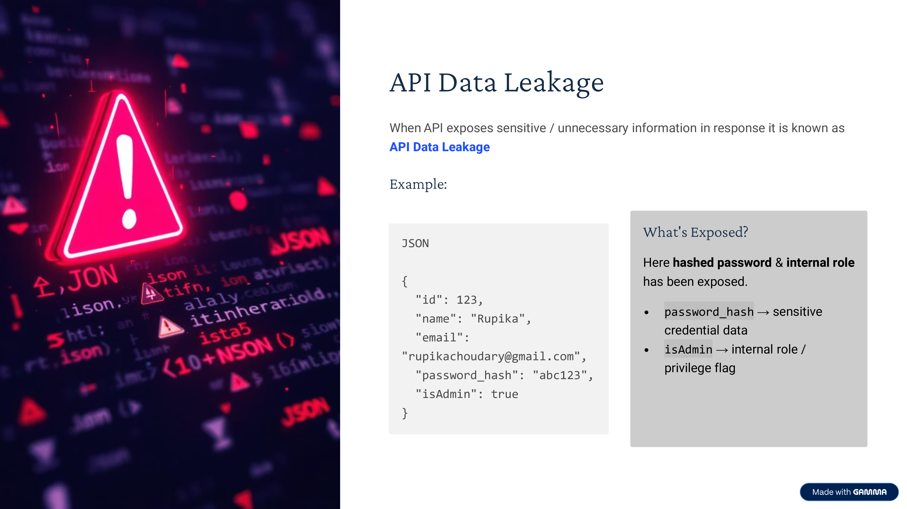
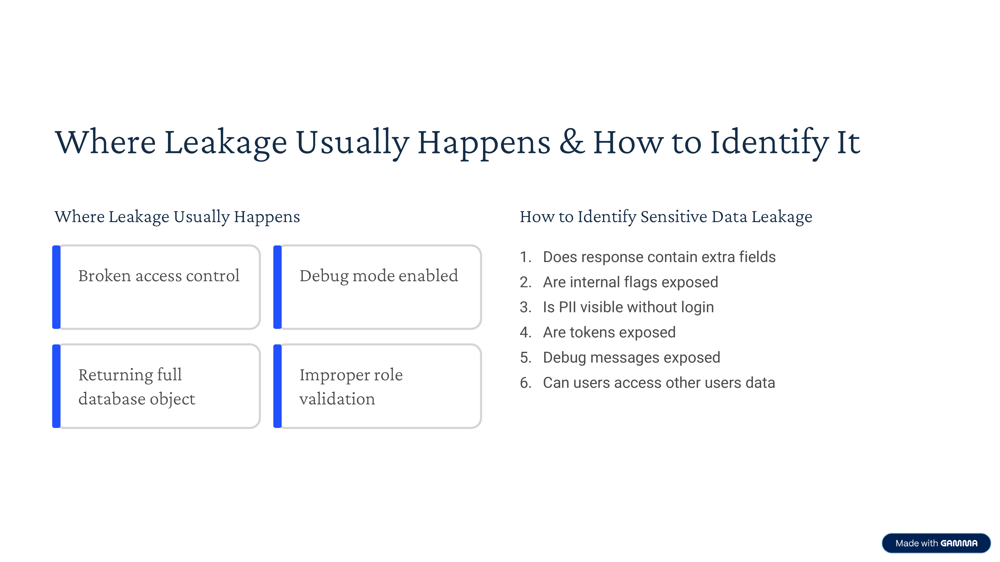
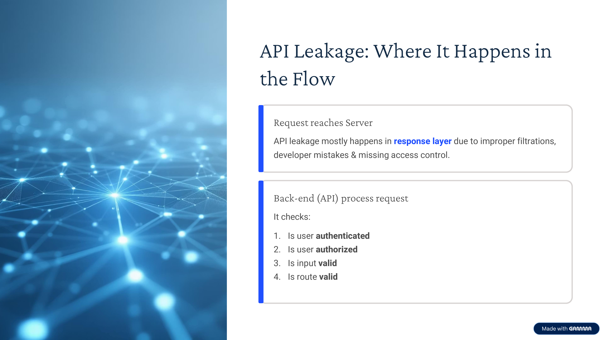
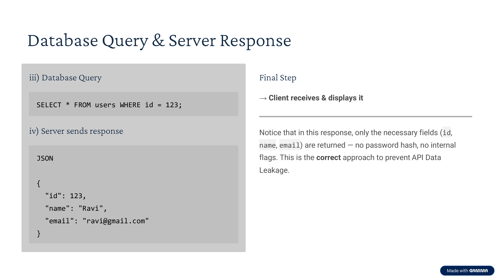

Day-68 – API Testing

Today I learned about API communication and sensitive data leakage.

APIs allow clients and servers to communicate through endpoints using HTTP methods like GET, POST, PUT, DELETE.

One common security issue is API Data Leakage, where responses expose unnecessary sensitive information such as emails, tokens, or password hashes.

Understanding API responses helps in identifying security misconfigurations and protecting user data.

#100DaysOfEthicalHacking

Learning via Skills Uprise Mentored by Manoj Kumar                         

LinkedIn: https://www.linkedin.com/company/skills-uprise

CEO: https://www.linkedin.com/in/manoj-kumar

