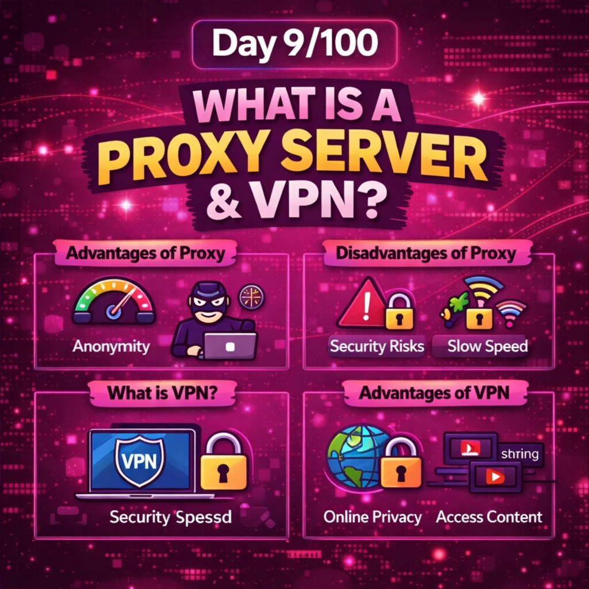
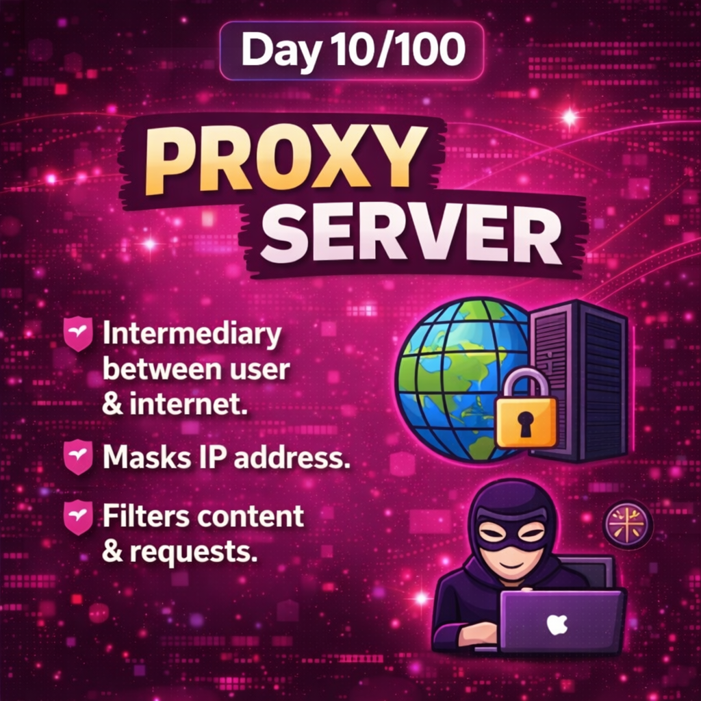
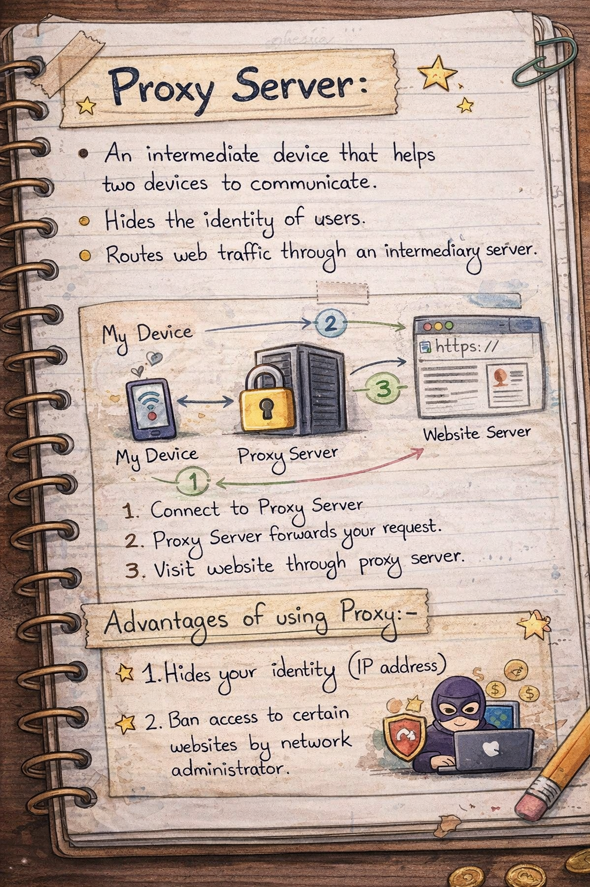
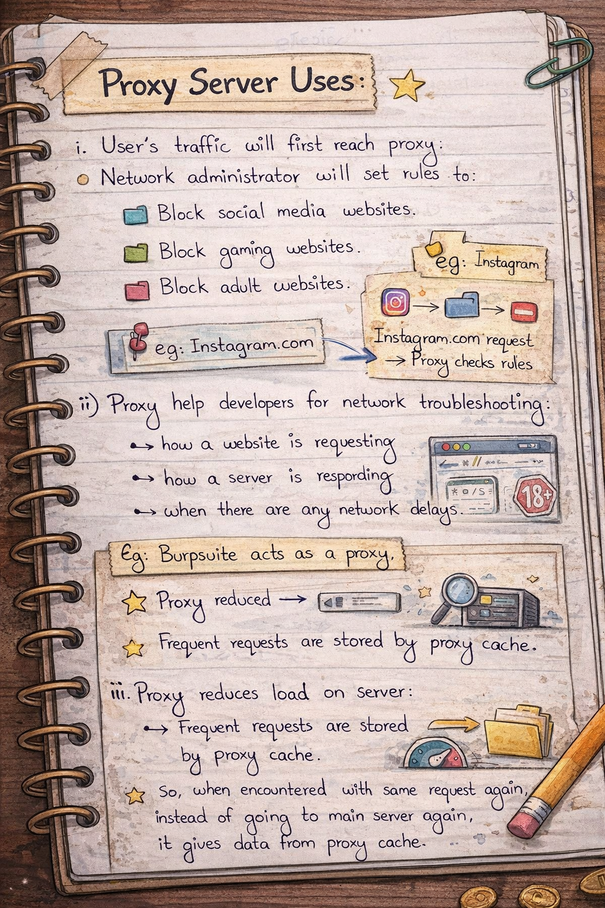
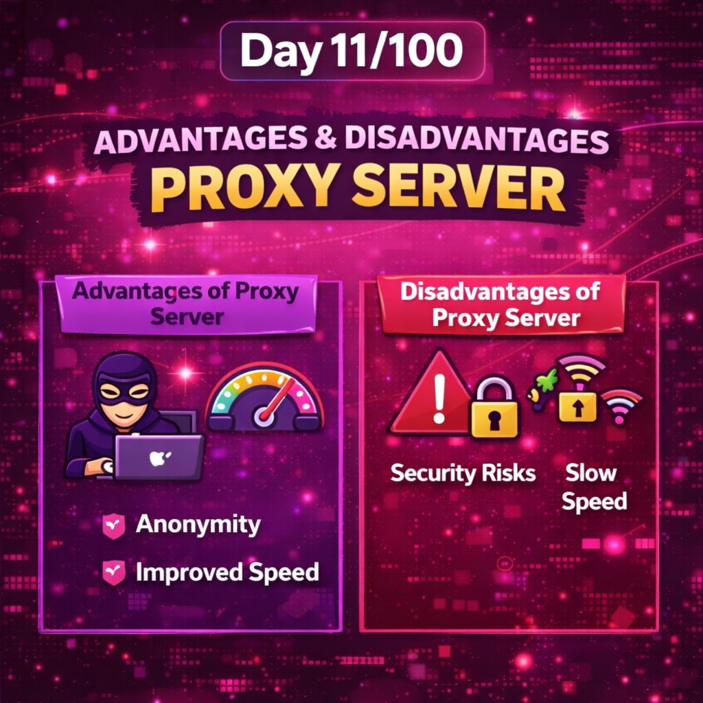
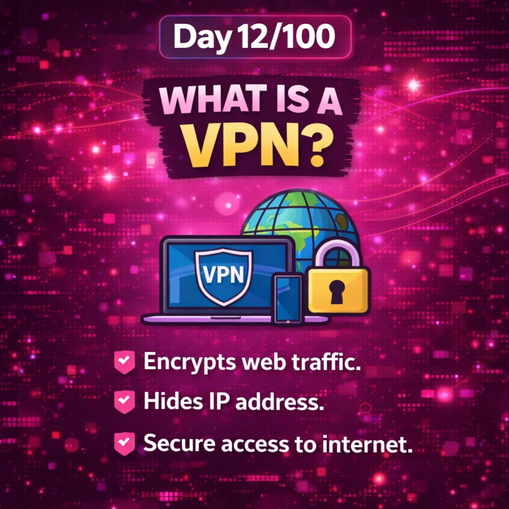
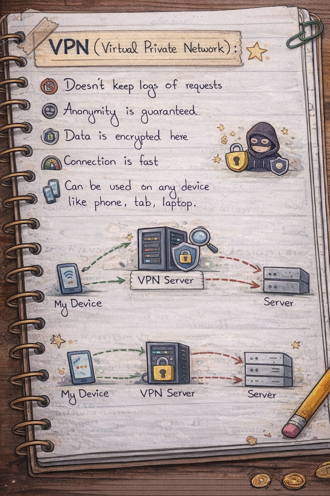
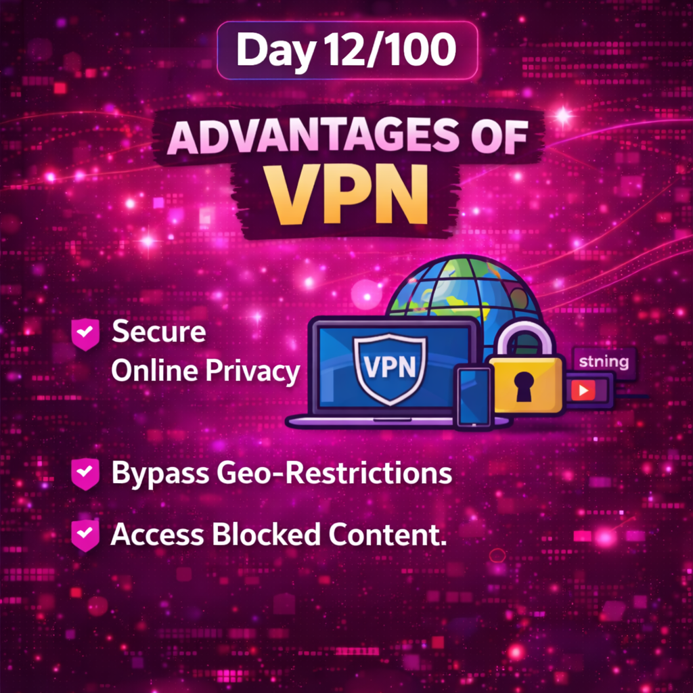
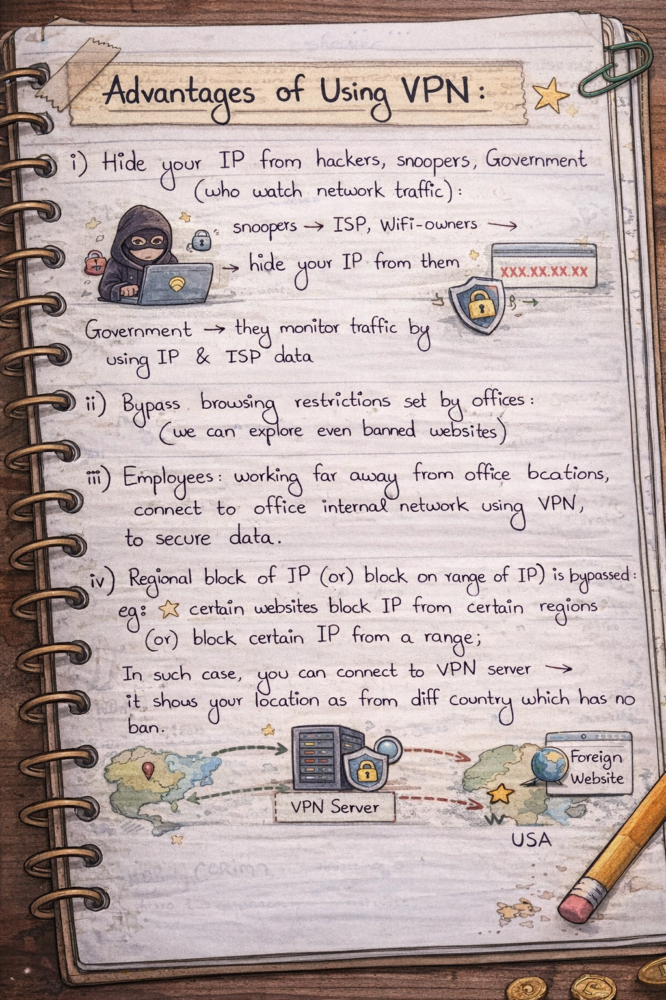

Day 9 – Proxy Servers & VPNs | 100 Days of Cybersecurity

-->Topics Covered
- What is a Proxy Server
- Advantages and Disadvantages of Proxy Servers
- What is VPN (Virtual Private Network)
- Advantages of Using VPN

-->What I Learned:-
On Day 9 of my 100 Days Cybersecurity Challenge, I explored how traffic flows through the internet using intermediary systems like proxies and VPNs.

A Proxy Server acts as an intermediary between the user and the server.  
It is commonly used for:
- Content filtering in offices
- Blocking specific websites
- Caching frequent requests
- Network debugging and monitoring
However, proxies often log user requests and do not encrypt data, which introduces privacy concerns.

A VPN, on the other hand, creates an encrypted tunnel between the user and the VPN server.
It provides:
- IP address masking
- Data encryption
- Secure remote access
- Bypassing regional and organizational restrictions

-->Key Cybersecurity Insight:-
Proxies and VPNs are used by attackers to hide identity and by investigators to protect privacy.  
Understanding both sides is crucial in cybersecurity.

This day helped me understand how the same technology can be used for:
- Offensive anonymity
- Defensive privacy and secure communication

-->Conclusion:-
Day 9 strengthened my understanding of network privacy, anonymity, and real-world cybersecurity use cases

Learning via Skills Uprise Mentored by Manoj Kumar

LinkedIn: https://www.linkedin.com/company/skills-uprise

CEO: https://www.linkedin.com/in/manoj-kumar

