ZIP Password Cracking using John the Ripper

This small practice project demonstrates how a password-protected ZIP file can be tested for password strength using John the Ripper.

Workflow
Create a sample secret file
Compress it into a password-protected ZIP archive
Extract the ZIP hash using zip2john
Run John the Ripper to attempt password cracking

For this experiment, a simple password was used so the cracking process could be demonstrated quickly.

Learning Outcome

This exercise helped understand:

ZIP encryption basics
Password hash extraction
Password auditing techniques
Future Work

Next experiments will involve:

Testing medium strength passwords
Testing strong passwords
Comparing cracking time and difficulty

All practical screenshots from the Kali Linux terminal are included in this repository.

Learning via Skills Uprise Mentored by Manoj Kumar                         

LinkedIn: https://www.linkedin.com/company/skills-uprise

CEO: https://www.linkedin.com/in/manoj-kumar

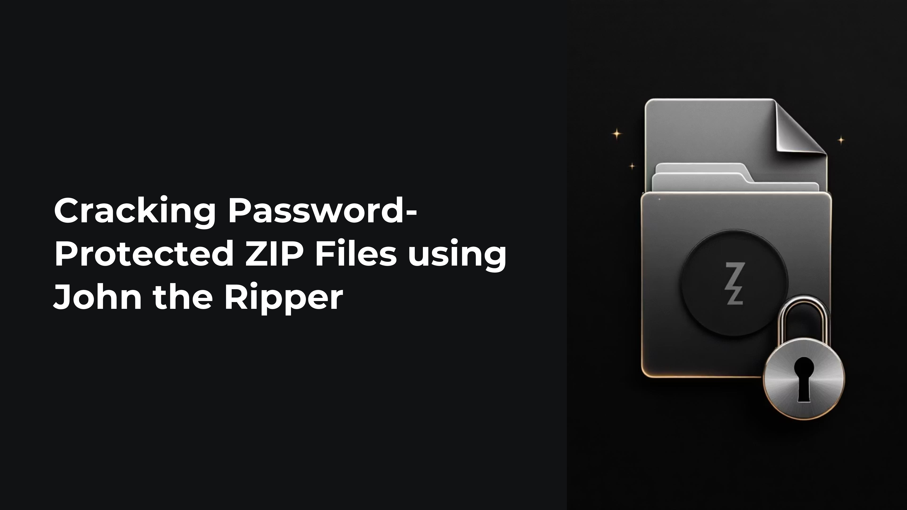
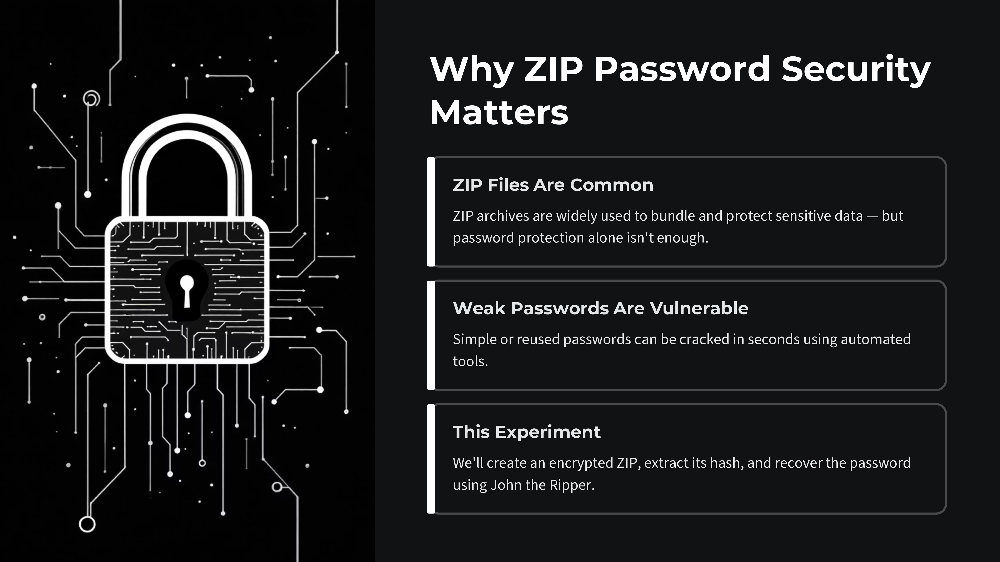

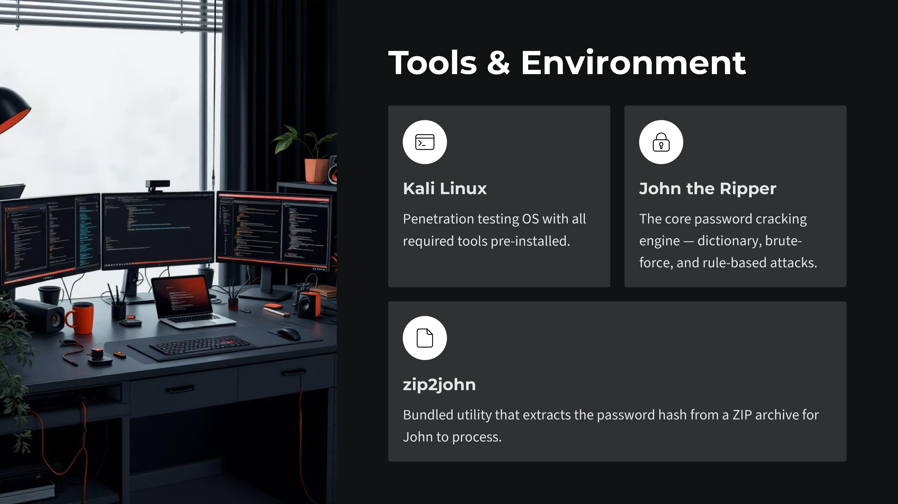
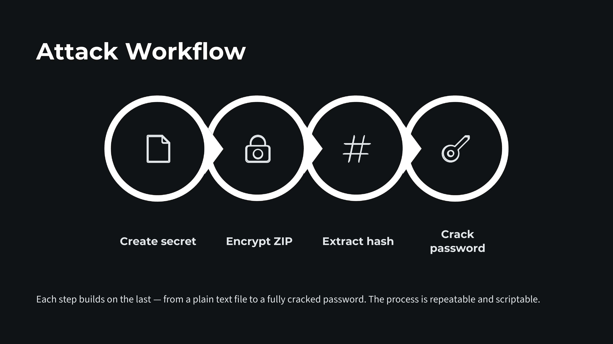
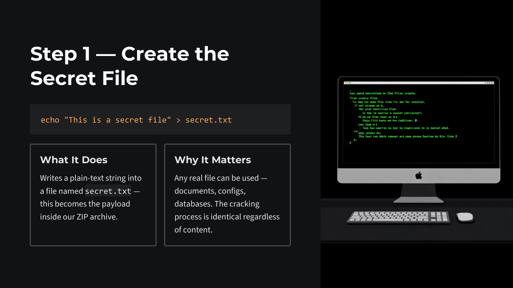
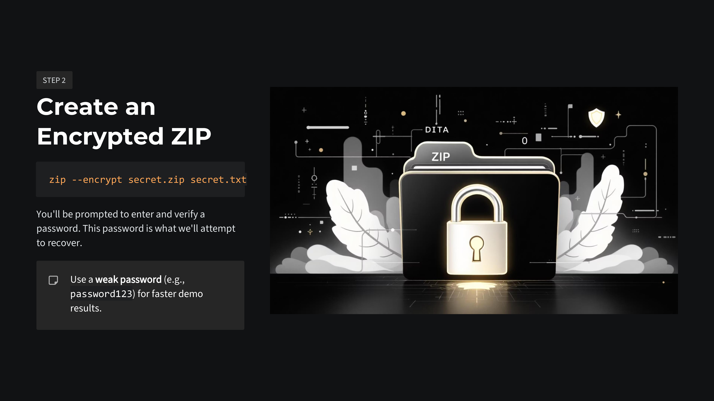
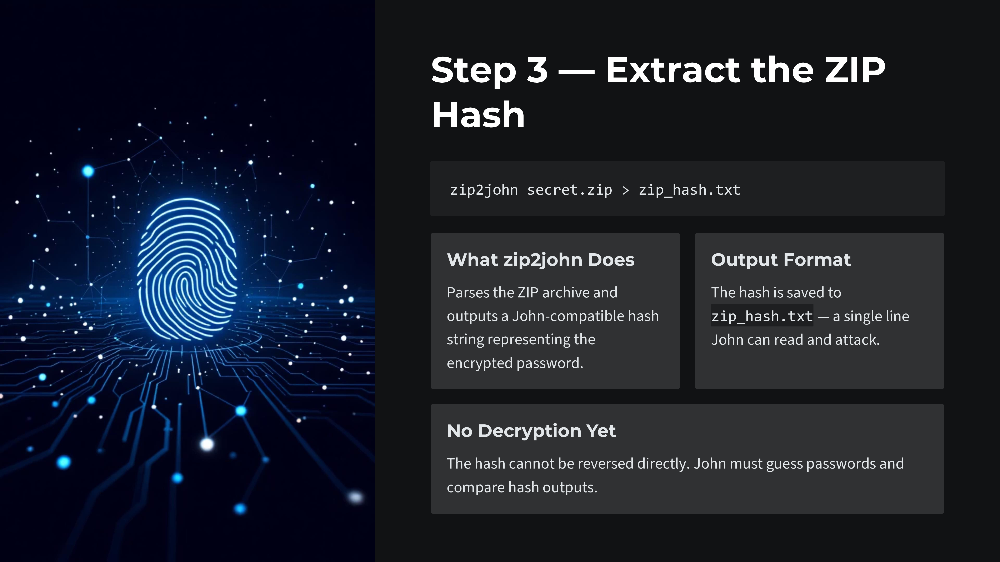
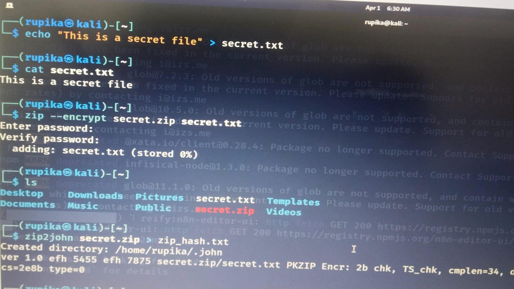
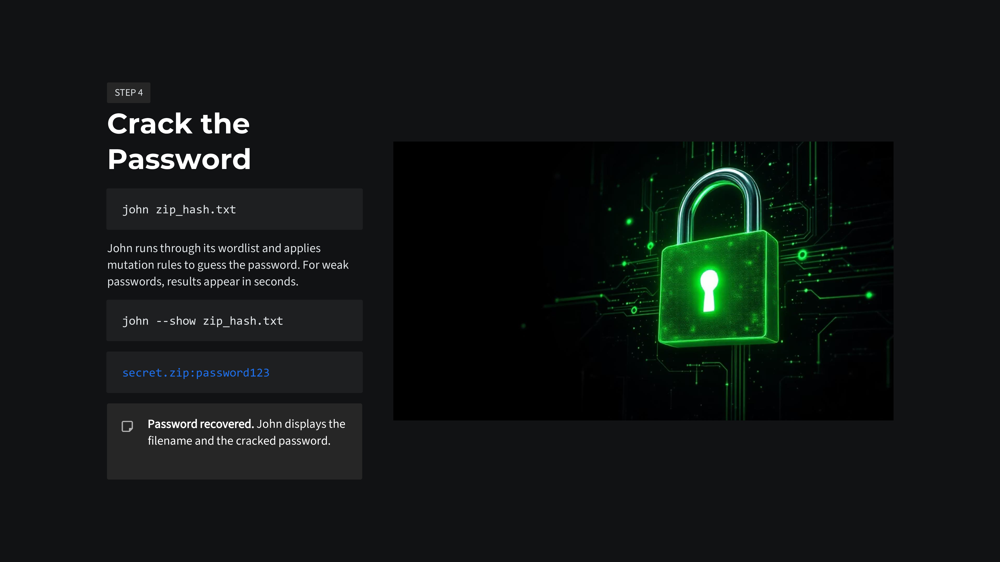
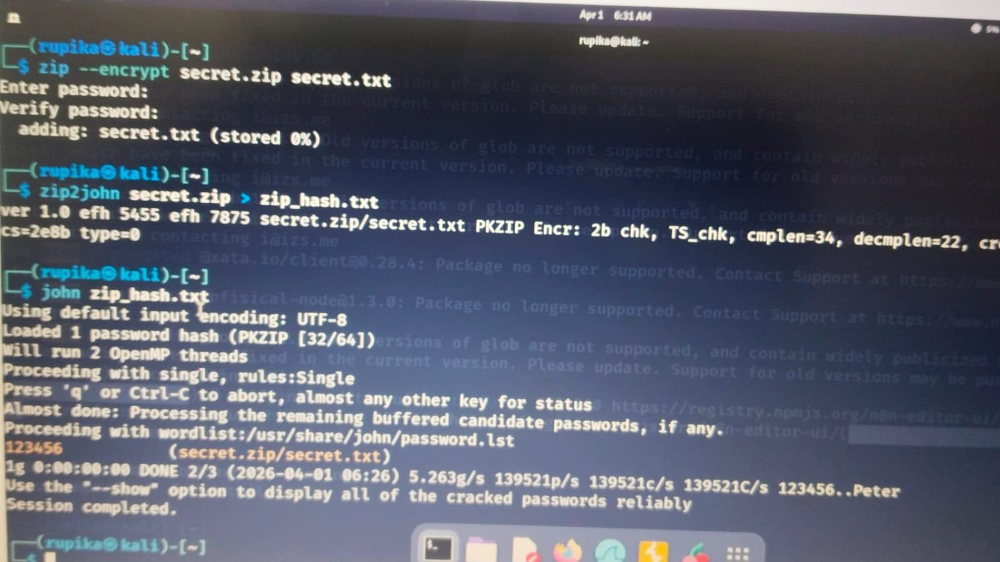
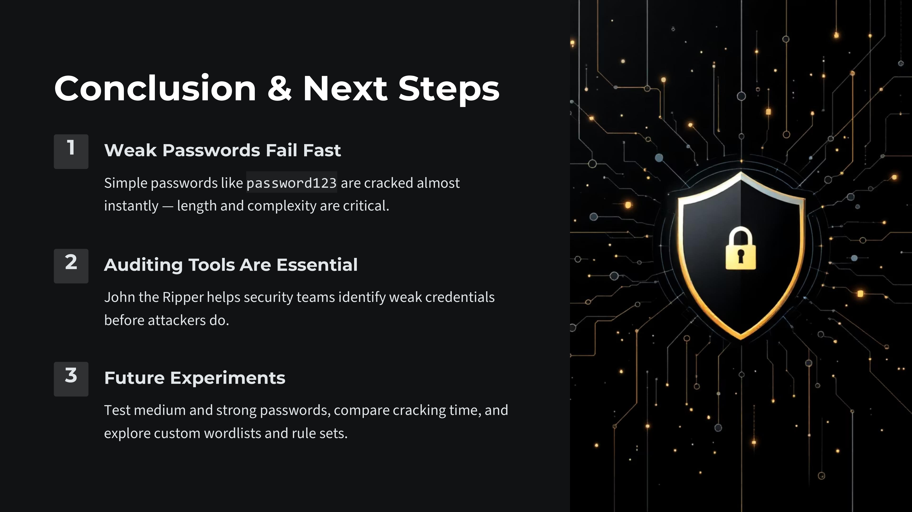

