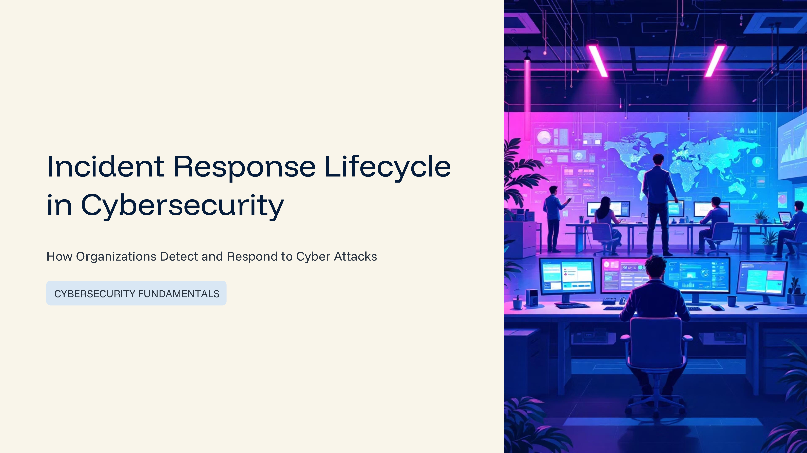
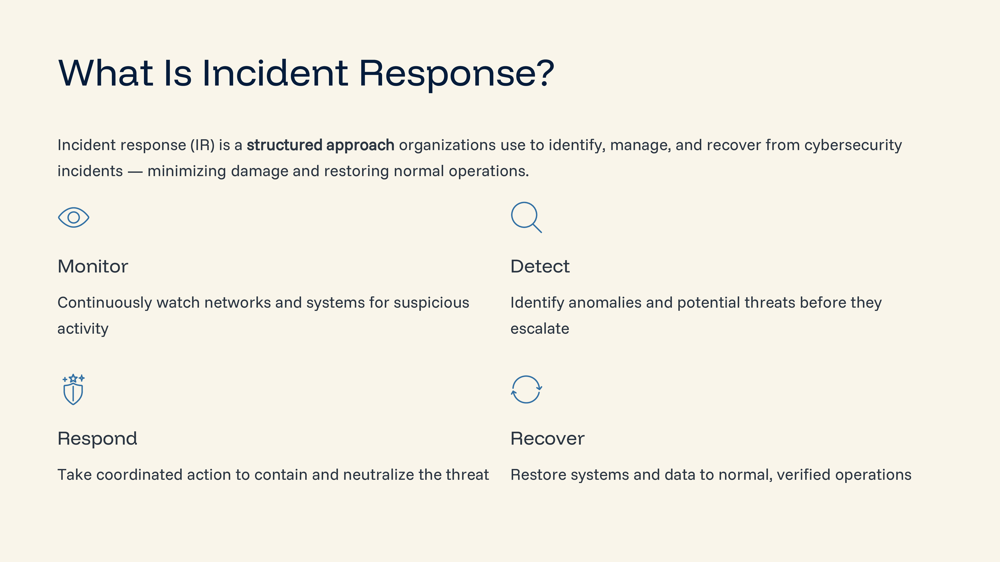
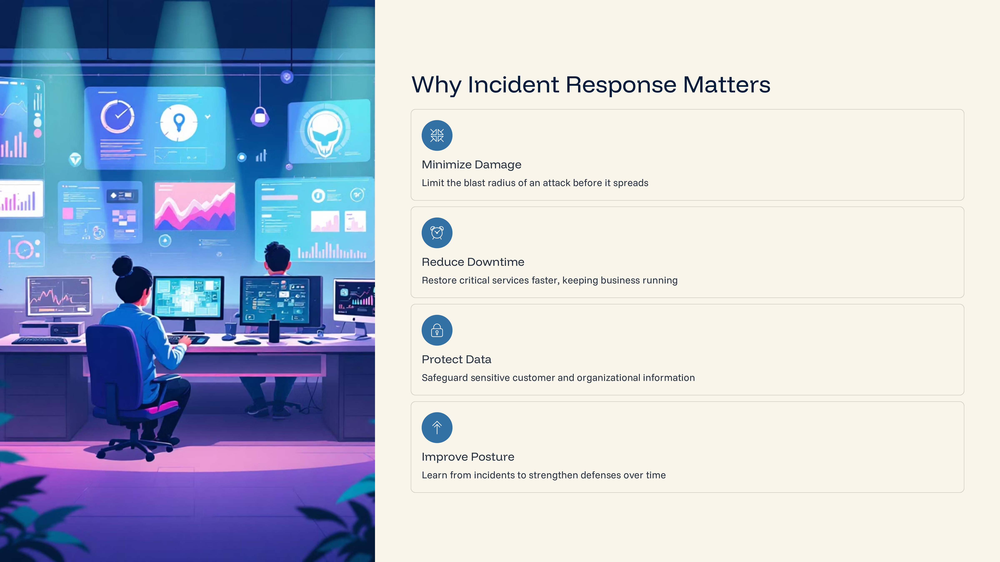
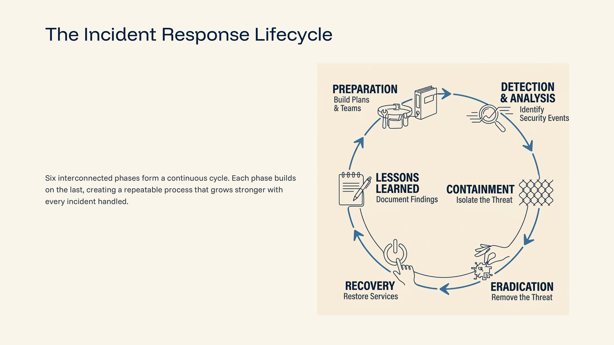
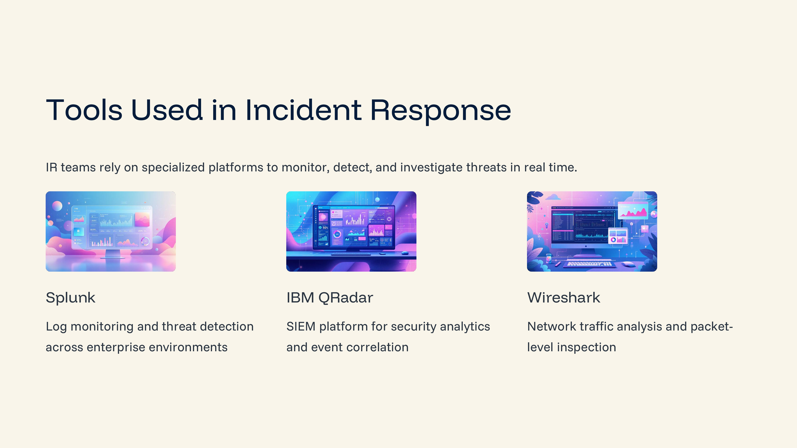
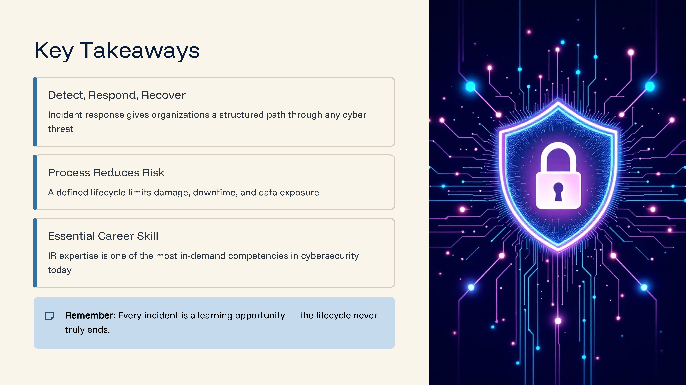

Day-99: Incident Response Lifecycle

Today I learned about the Incident Response Lifecycle, a structured approach used by security teams to detect, respond to, and recover from cyber attacks.

Key Phases:

Preparation
Detection & Analysis
Containment
Eradication
Recovery
Lessons Learned

Security teams use SIEM tools like Splunk and IBM QRadar to monitor logs, detect suspicious activity, and investigate incidents.

This knowledge is essential for understanding how organizations manage real-world security incidents.

Learning via Skills Uprise Mentored by Manoj Kumar                         

LinkedIn: https://www.linkedin.com/company/skills-uprise

CEO: https://www.linkedin.com/in/manoj-kumar

