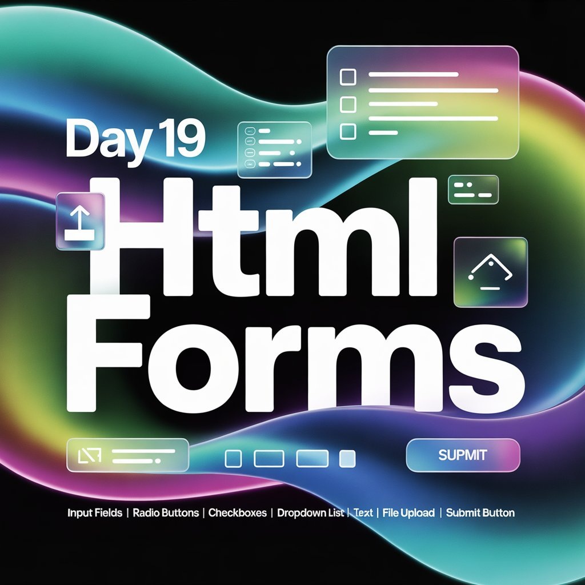
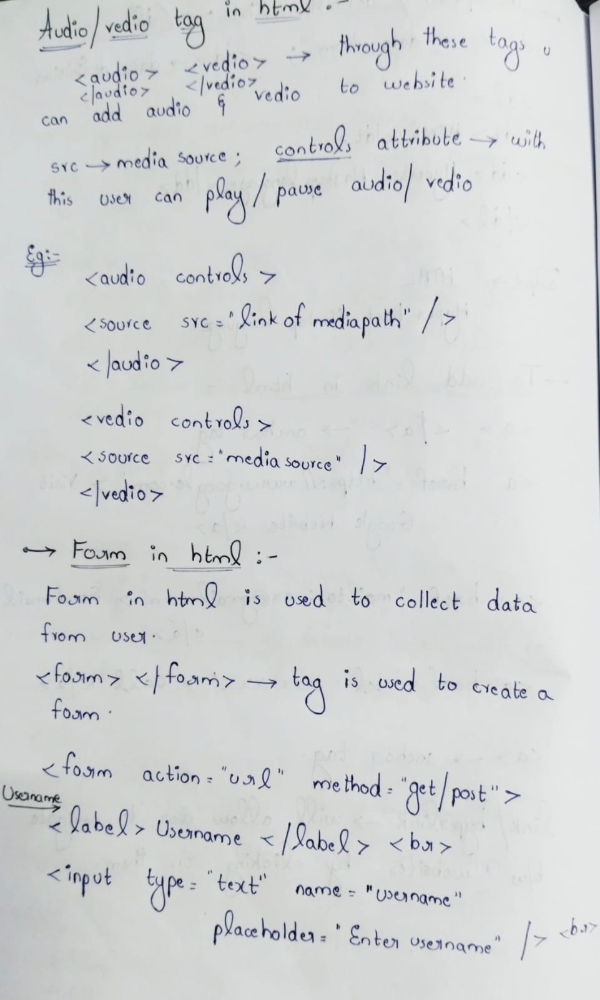
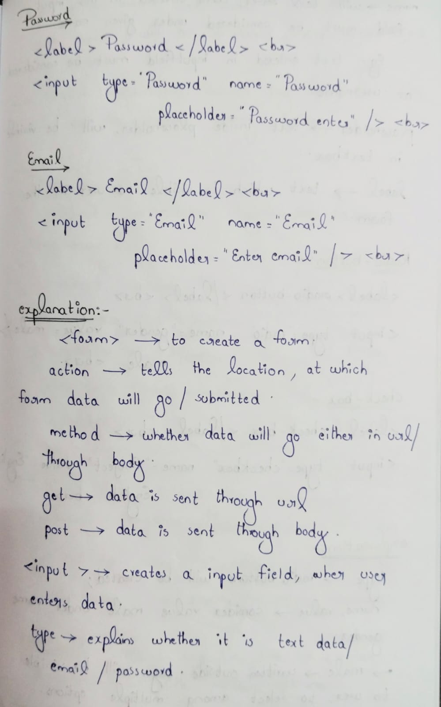
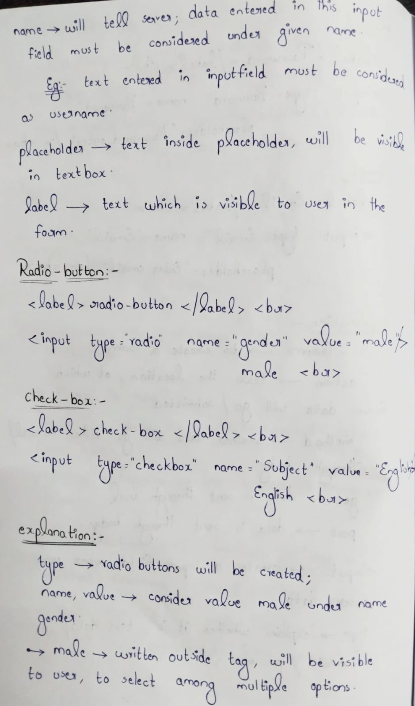
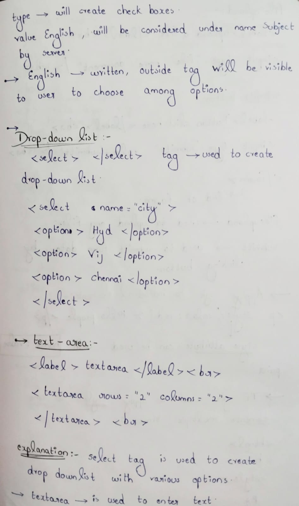
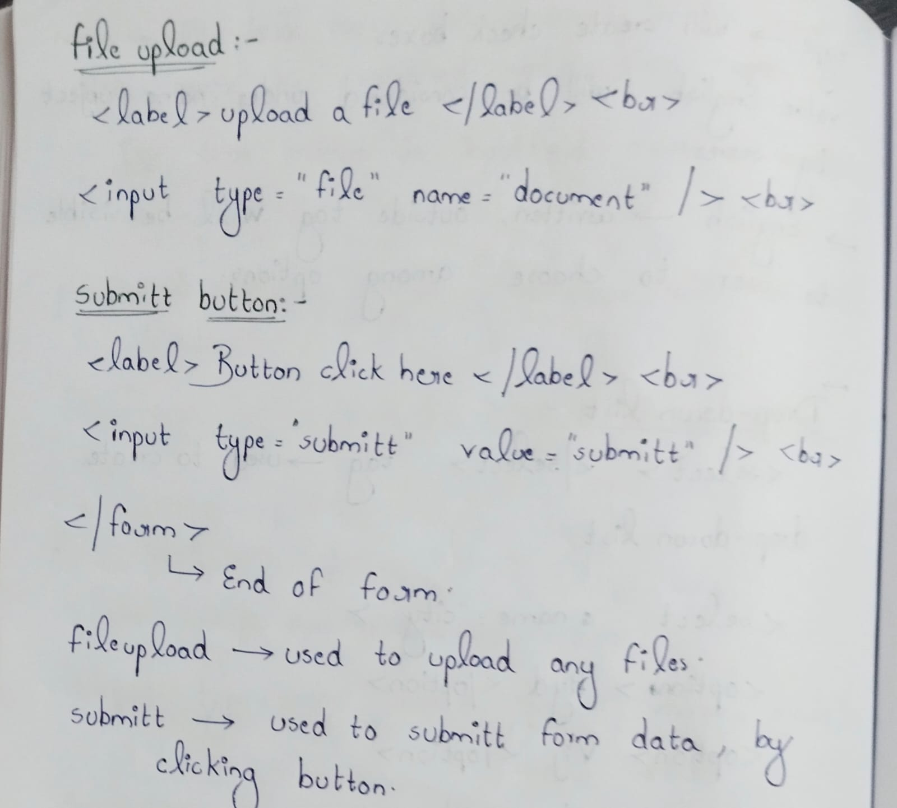
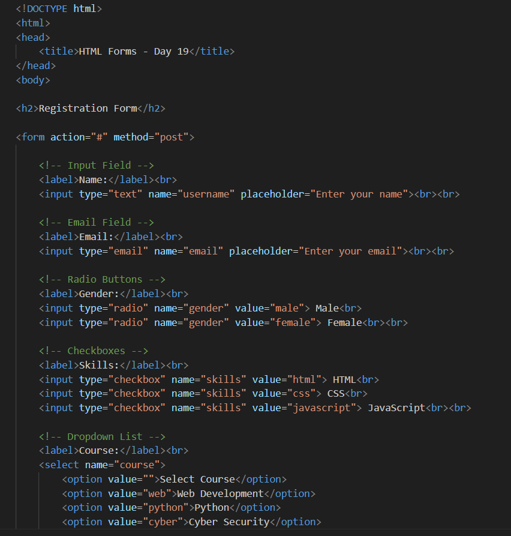
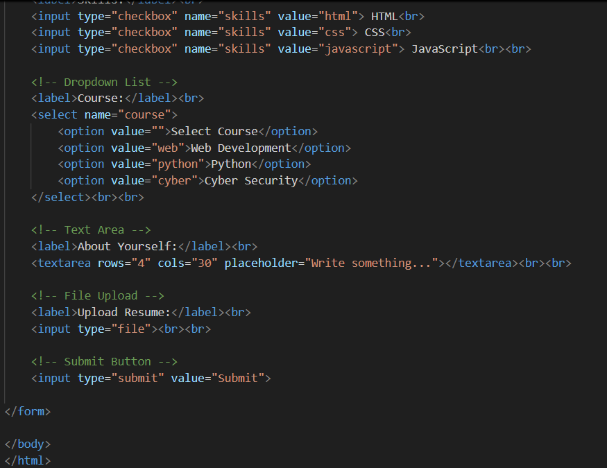
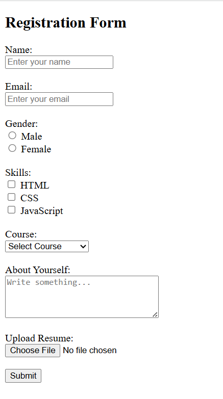

Day 19: HTML Forms & Form Elements

Today’s practice focused on creating HTML forms and understanding how user input is collected.

Covered elements:-
Input fields (text, email)
Radio buttons
Checkboxes
Dropdown list
Text area
File upload
Submit button

Input Fields (text, email): Used to collect basic user information like names and email addresses.

Radio Buttons: Allow users to select only one option from multiple choices.

Checkboxes: Allow users to select multiple options at the same time.

Dropdown List: Provides a list of options in a compact and organized way.

Text Area: Used to collect long, multi-line text from users.

File Upload: Allows users to upload files such as documents or images.

Submit Button: Sends the form data to the server for processing.

This helped me understand how front-end pages interact with users and send data for processing.

Learning via Skills Uprise Mentored by Manoj Kumar                         

LinkedIn: https://www.linkedin.com/company/skills-uprise

CEO: https://www.linkedin.com/in/manoj-kumar

